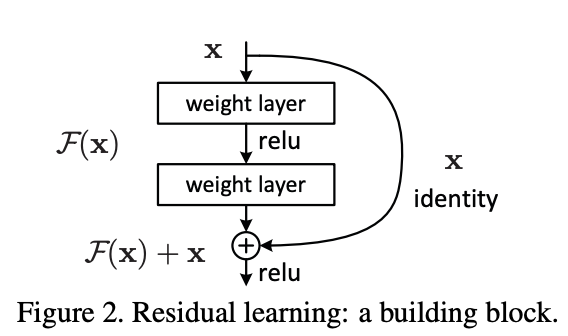
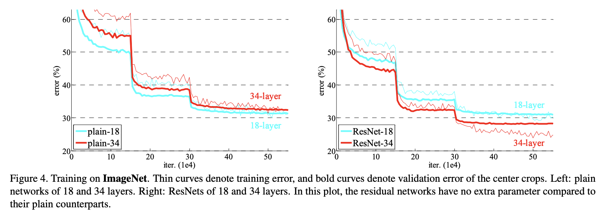

# ResNet

📜 [Deep Residual Learning for Image Recognition](https://arxiv.org/abs/1512.03385)

> We explicitly reformulate the layers as learning residual functions with reference to the layer inputs, instead of learning unreferenced functions. We provide comprehensive empirical evidence showing that these residual networks are easier to optimize, and can gain accuracy from considerably increased depth.

Residuals are the answer to enabling much deeper neural networks with many layers (which empirically has shown to be critical to improvement) while still enabling successful optimization.

> Driven by the significance of depth, a question arises: _Is learning better networks as easy as stacking more layers?_

The vanishing/exploding gradient problem has made it hard to answer this - but **normalized initialization** and **intermediate normalization layers** (like BatchNorm) have solved this problem.

However, while this has enabled deeper networks to converge, they suffer from _degradation_, where accuracy decreases after a certain point of increasing depth even on the training set.

> There exists a solution by construction to the deeper model: the added layers are identity mapping, and the other layers are copied from the learned shallower model.

Here, they provide a thought experiment to show that a deeper neural network is capable of modeling something at least as good as it’s shallower counter-part by simply turning any additional layers into identity mapping layers that just directly map their inputs to their outputs.

This is partly where the intuition for residuals comes from.

> Instead of hoping each few stacked layers directly fit a desired underlying mapping, we explicitly let these layers fit a residual mapping.

Here is the core intuition behind residuals.

Most feed-forward networks or layers attempt to learn some underlying desired function $H(x)$ by trying to learn the entire transformation $x → H(x)$ directly.

Instead, residuals allow the network to instead try to learn the necessary _residual_ instead, the different from the current output, or just the transformation $F(x)$ where $F(x) = H(x) - x$.

Then, the output of the layer computes $H(x) = F(x) + x$, adding back $x$ to the computed residual.

In the limit, this means that it’s very easy for the network to learn the identity function by making $F(x)$ effect converge to 0 where necessary.

Critically, this also propagates gradients back throughout the residual pathway effectively as the gradient from the output of the layer gets propagated back to the previous layer via $x$ due to the addition in $H(x)$.

These **shortcut connections** or **skip connections** provide no extra parameters to the network or training complexity, meaning SGD can still be used for the whole thing.

> We show that: 1) Our extremely deep residual nets are easy to optimize, but the counterpart “plain” nets (that simply stack layers) exhibit higher training error when the depth increases; 2) Our deep residual nets can easily enjoy accuracy gains from greatly increased depth, producing results substantially better than previous networks.

### Deep Residual Learning

> If one hypothesizes that multiple nonlinear layers can asymptotically approximate complicated functions, then it is equivalent to hypothesize that they can asymptotically approximate the residual functions, i.e., $H(x) − x$.

> So rather than expect stacked layers to approximate $H(x)$, we explicitly let these layers approximate a residual function $F(x) := H(x) − x$. The original function thus becomes $F(x)+x$.

> Although both forms should be able to asymptotically approximate the desired functions (as hypothesized), the ease of learning might be different.

> The degradation problem suggests that the solvers might have difficulties in approximating identity mappings by multiple nonlinear layers. With the residual learning reformulation, if identity mappings are optimal, the solvers may simply drive the weights of the multiple nonlinear layers toward zero to approach identity mappings.

Residuals make it easy for the network to drive certain layers down to the identity, meaning that even networks with too much depth for the actual problem should still be able to maintain high accuracy.

> The dimensions of $x$ and $F$ must be equal. If this is not the case (e.g., when changing the input/output channels), we can perform a linear projection $W_s$ by the shortcut connections to match the dimensions.

$y = F(x, {W_i}) + W_sx$

### Results

In the standard network, the 34-layer performs more poorly than the 18-layer in training, demonstrating degradation.

Meanwhile, the ResNet prevents degradation and the 34-layer actually performs better.

There are three important findings here:

> More importantly, the 34-layer ResNet exhibits considerably lower training error and is generalizable to the validation data. This indicates that the degradation problem is well addressed in this setting and we manage to obtain accuracy gains from increased depth.

> Compared to it’s plain counterpart, the 34-layer ResNet reduces the top-1 error by 3.5%, resulting from the successfully reduced training error. This comparison verifies the effectiveness of residual learning on extremely deep systems.

> Last, we also note that the 18-layer plain/residual net are comparably accurate, but the 18-layer ResNet converges faster (Fig. 4 right vs. left). When the net is “not overly deep” (18 layers here), the current SGD solver is still able to find good solutions to the plain net. In this case, the ResNet eases the optimization by providing faster convergence at the early stage.

Even when residuals aren’t necessary for the network to converge properly, residuals still make convergence significantly faster.

> But the small differences among A/B/C indicate that projection shortcuts are
> not essential for addressing the degradation problem.

In terms of identity vs. projection shortcuts ($W_s$ is the identity matrix or different), projection shortcuts make insignificant difference in the residuals. The only time projection shortcuts are necessary is when dimensions are different.
