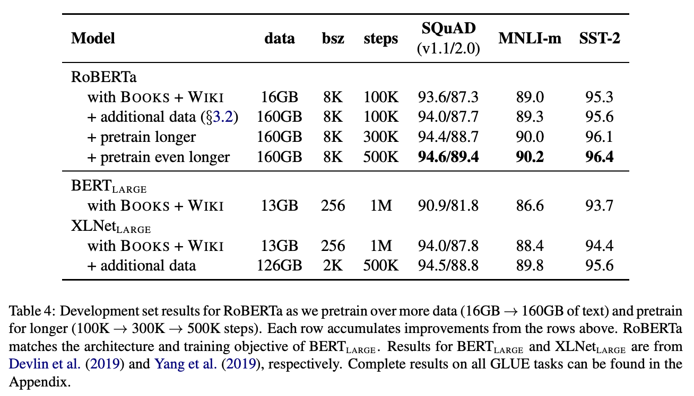
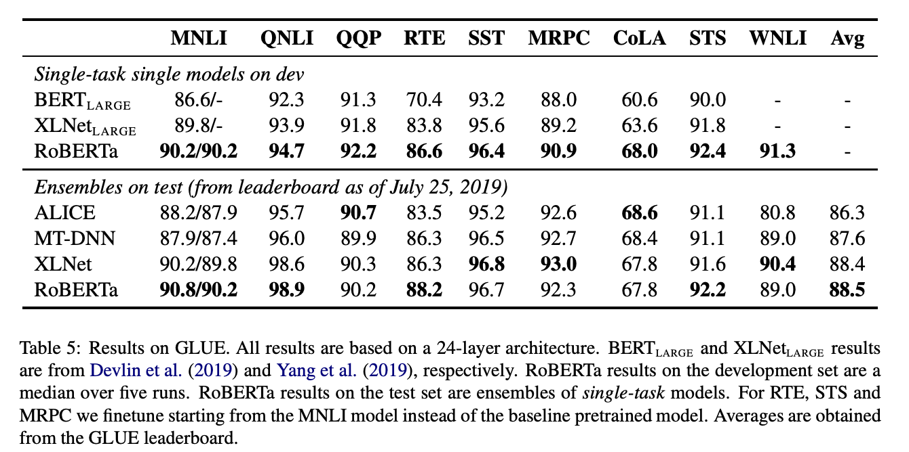

# RoBERTa

📜 [RoBERTa: A Robustly Optimized BERT Pre-training Approach](https://arxiv.org/pdf/1907.11692)

> We find that BERT was significantly undertrained, and can match or exceed the performance of every model published after it.

> These results highlight the importance of previously overlooked design choices, and raise questions about the source of recently reported improvements.

> Our modifications are simple, they include:
> (1) training the model longer, with bigger batches, over more data
> (2) removing the next sentence prediction objective
> (3) training on longer sequences
> (4) dynamically changing the masking pattern applied to the training data

> Our training improvements show that masked language model pre-training, under the right design choices, is competitive with all other recently published methods.

RoBERTa is about showing that the BERT architecture is actually capable of achieving state-of-the-art results, and questioning it’s design choices.

### Training Procedure Analysis

**1. Static vs. Dynamic Masking**

BERT uses static token masking where the masks are determined in advance. Instead, RoBERTa tries dynamic token masking which leads to slight improvements.

**2. Model Input Format and Next Sentence Prediction**

BERT uses next sentence prediction. RoBERTa finds that you can actually do better by eliminating this and just training on sequences of sentences from a single document.

**3. Training with Larger Batches**

RoBERTa uses a larger mini-batch size for training.

**4. Text Encoding**

> Using bytes [instead of unicode characters] makes it possible to learn a subword vocabulary of a modest size (50K units) that can still encode any input text without introducing any “unknown” tokens.

> Nevertheless, we believe the advantages of a universal encoding scheme outweighs the minor degradation in performance and use this encoding in
> the remainder of our experiments.

### RoBERTa

> Specifically, RoBERTa is trained with dynamic masking, FULL SENTENCES without NSP loss, large mini-batches and a larger byte-level BPE.

> Additionally, we investigate two other important factors that have been under-emphasized in previous work: (1) the data used for pre-training, and (2) the number of training passes through the data.

> Crucially, RoBERTa uses the same masked language modeling pre-training objective and architecture as $\textrm{BERT}_{\textrm{LARGE}}$, yet consistently outperforms both $\textrm{BERT}_{\textrm{LARGE}}$ and $\textrm{XLNet}_{\textrm{LARGE}}$.

> This raises questions about the relative importance of model architecture and pretraining objective, compared to more mundane details like dataset size and training time that we explore in this work.

### Conclusion

> These results illustrate the importance of these previously overlooked design decisions and suggest that BERT’s pre-training objective remains competitive with recently proposed alternatives.
