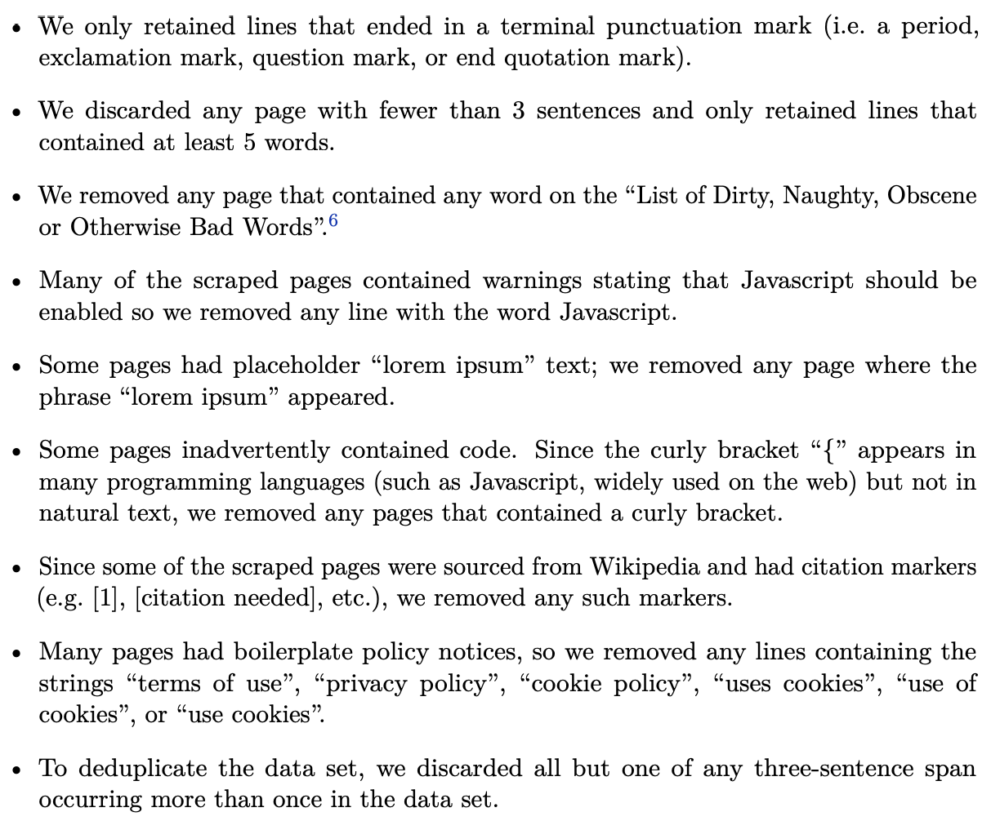

# T5

📜 [Exploring the Limits of Transfer Learning with a Unified Text-to-Text Transformer](https://arxiv.org/pdf/1910.10683)

> In this paper, we explore the landscape of transfer learning techniques for NLP by introducing a unified framework that converts all text-based language problems into a text-to-text format.

The approach of this paper is to deeply understand all research approaches to something important (the transfer learning for large language models set of research), and then to use what they learn to create state of the art models.

> This can be loosely viewed as developing general-purpose knowledge that allows the model to “understand” text.

Pre-training a model on a large amount of text before fine-tuning.

> Recently, it has become increasingly common to pre-train the entire model on a data-rich task. Ideally, this pre-training causes the model to develop general-purpose abilities and knowledge that can then be transferred to downstream tasks.

> Beyond its empirical strength, unsupervised pre-training for NLP is particularly attractive because unlabeled text data is available en masse thanks to the Internet.

This is the reason the transfer learning approach with a base-model and fine-tuning is so essential - we have large quantities of unlabeled data that can be used to develop general knowledge, and then we only have to use a small amount of labeled data (expensive and inconvenient to produce) in order to create good models.

> The basic idea underlying our work is to treat every text processing problem as a “text-to-text” problem, i.e. taking text as input and producing new text as output.

By converting everything into the same problem (not specific tasks with specific formats, but just everything is about mapping text-to-text), they can generalize and evaluate different approaches against each other.

> We emphasize that our goal is not to propose new methods but instead to provide a comprehensive perspective on where the field stands.

### Setup

**1. Model**

Most things are kept similar to the original Transformer paper. They want to explore different architectures for self-attention.

> While the original Transformer used a sinusoidal position signal or learned position embeddings, it has recently become more common to use relative position embeddings.

**2. The Colossal Clean Crawled Corpus**

> In this paper, we are interested in measuring the effect of the quality, characteristics, and size of this unlabeled data.

> To address these issues, we used the following heuristics for cleaning up Common Crawl’s web extracted text:
>
> 

These heuristics are the beginning of how large internet scale datasets can be produced from web-scraping that are safe and usable, without all the random noise of most of the internet.

**3. Downstream Tasks**

> Our goal in this paper is to measure general language learning abilities.

> As such, we study downstream performance on a diverse set of benchmarks, including machine translation, question answering, abstractive summarization, and text classification.

**4. Input and Output Format**

> In order to train a single model on the diverse set of tasks described above, we cast all of the tasks we consider into a “text-to-text” format—that is, a task where the model is fed some text for context or conditioning and is then asked to produce some output text.

### Reflection

> Having completed our systematic study, we wrap up by first recapping some of our most significant findings.

**1. Takeaways**

> **Text-to-text:** Our text-to-text framework provides a simple way to train a single model on a wide variety of text tasks using the same loss function and decoding procedure.

They take a generalized approach to text-to-text tasks and show how specific evaluations can be cast onto this general approach.

> **Architectures:** While some work on transfer learning for NLP has considered architectural variants of the Transformer, we found the original encoder-decoder form worked best in our text-to-text framework.

> **Unsupervised Objectives:** We suggest using objectives that produce short target sequences so that unsupervised pre-training is more computationally efficient.

> **Datasets:** This motivates the use of a large and diverse data set like C4 for generic language understanding tasks.

> **Training Strategies:** We found that the basic approach of updating all of a pre-trained model’s parameters during fine-tuning outperformed methods that are designed to update fewer parameters, although updating all parameters is most expensive.

> **Scaling:** We also showed an ensemble of models can provide substantially better results than a single model, which provides an orthogonal means of leveraging additional computation.

> **Pushing the limits:** We combined our above insights and trained substantially larger models (up to 11 billion parameters) to achieve state-of-the-art results across many of the benchmarks we considered.

**2. Outlook**

> An unsurprising but important result from our study is that larger models tend to perform better. The fact that the hardware used for running these models is continually getting cheaper and more powerful suggests that scaling up may continue to be a promising way to achieve better performance

An explicit discussion of scaling laws starting to seem like a very attractive bet to make for a company.

> To address these issues, we are interested in further investigating language-agnostic models, i.e. models that can perform a given NLP task with good performance regardless of the text’s language.
