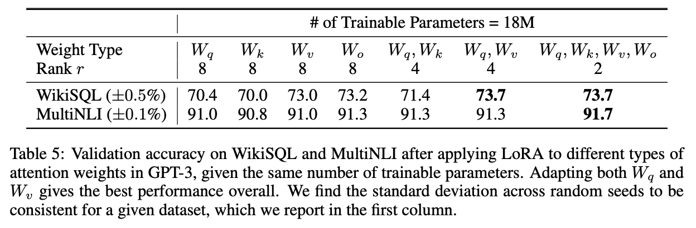
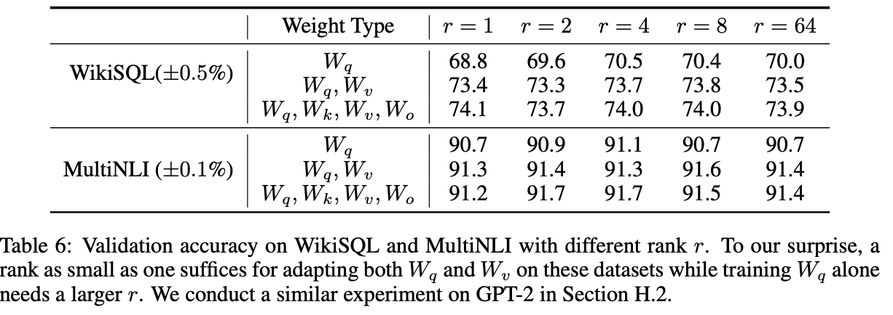

# LoRA

📜 [Low-Rank Adaptation of Large Language-Models](https://arxiv.org/pdf/2106.09685)

> As we pre-train larger models, full fine-tuning, which retrains all model parameters, becomes less feasible.

> We propose Low-Rank Adaptation, or LoRA, which freezes the pre-trained model weights and injects trainable rank decomposition matrices into each
> layer of the Transformer architecture, greatly reducing the number of trainable parameters for downstream tasks.

Seems to be building on adapters to make fine-tuning large models like GPT-3 feasible at scale.

> We also provide an empirical investigation into rank-deficiency in language model adaptation, which sheds light on the efficacy of LoRA.

> More importantly, these methods [of fine-tuning models by extending model depth or reducing the model’s usable sequence] often fail to match the fine-tuning baselines, posing a trade-off between efficiency and model quality.

> We hypothesize that the change in weights during model adaptation also has a low “intrinsic rank”, leading to our proposed Low-Rank Adaptation (LoRA) approach.

> LoRA allows us to train some dense layers in a neural network indirectly by optimizing rank decomposition matrices of the dense layers’ change during adaptation instead, while keeping the pre-trained weights frozen.

LoRA lets the same base model be used for different tasks, makes training more efficient, introduces no inference latency, and can be combined with many previous optimization methods like prefix-tuning.

### Problem Statement

> One of the main drawbacks for full fine-tuning is that for _each_ downstream task, we learn a _different_ set of parameters $\Delta \Phi$ whose dimension $|\Delta \Phi|$ equals $|\Phi_0|$. Thus, if the pre-trained model is large, storing and deploying many independent instances of fine-tuned models can be challenging, if at all feasible.

> In the subsequent sections, we propose to use a low-rank representation to encode $\Delta \Phi$ that is both compute- and memory-efficient.

### Aren’t Existing Solutions Good Enough?

> There is no direct ways to bypass the extra compute in adapter layers.

> We observe that prefix tuning is difficult to optimize and that its performance changes non-monotonically in trainable parameter.

### Our Method

**1. Low-Rank-Parameterized Update Matrices**

> For a pre-trained weight matrix $W_0 \in \mathbb{R}^{d \times k}$, we constrain its update by representing the latter with a low-rank de-composition $W_0 + \Delta W = W_0 + BA$, where $B \in \mathbb{R}^{d \times r}$, and the rank $r \ll \min(d, k)$.

> For $h = W_0x$, our modified forward pass yields:

```math
h = W_0x + \Delta Wx = W_0x + BAx
```

Instead of optimizing a completely new set of parameters $\Delta W$ with dimension $d \times d$ in order to adapt the parameters of the original matrix $W_0$, we can instead create a low-rank decomposition of matrix $\Delta W = BA$ where the dimensions of $B$ and $A$ are $d \times r$ and $r \times d$ respectively. Thus, if $r \ll d$, this decomposition still yields a matrix of dimension $d \times d$ while needing to optimize $2rd$ parameters instead of $d^2$ parameters, which is a massive optimization.

> LoRA takes a step further and does not require the accumulated gradient update to weight matrices to have full-rank during adaptation.

> In other words, as we increase the number of trainable parameters, training LoRA roughly converges to training the original model.

> When deployed in production, we can explicitly compute and store $W = W_0 + BA$.

> When we need to switch to another downstream task, we can recover $W_0$ by subtracting $BA$ and then adding a different $B'A'$, a quick operation with very little memory overhead.

> Critically, this guarantees that we do not introduce any additional latency during inference compared to a fine-tuned model by construction.

**2. Applying LoRA to Transformer**

> In principle, we can apply LoRA to any subset of weight matrices in a neural network to reduce the number of trainable parameters.

> We limit our study to only adapting the attention weights for downstream tasks and freeze the MLP modules (so they are not trained in downstream tasks) both for simplicity and parameter-efficiency.

> The most significant benefit comes from the reduction in memory and storage usage.

### Understanding the Low-Rank Updates

> (1) Given a parameter budget constraint, which subset of weight matrices in a pre-trained Transformer should we adapt to maximize downstream performance?
> (2) Is the “optimal” adaptation matrix $\Delta W$ _really rank-defficient?_ If so, what is a good rank to use in practice?
> (3) What is the connection between $\Delta W$ and W? Does $\Delta W$ highly correlate with W? How large is $\Delta W$ comparing to W?

**1. Which Weight Matrices in Transformer Should We Apply LoRA To?**



**2. What is the Optimal Rank $r$ for LoRA**



> We argue that increasing r does not cover a more meaningful subspace, which suggests that a low-rank adaptation matrix is sufficient.

**3. How Does the Adaptation Matrix $\Delta W$ Compare to W**

> This suggests that the low-rank adaptation matrix potentially _amplifies the important features for specific downstream tasks that were learned but not emphasized in the general pre-training model._

This is the core intuition behind why LoRA works. It’s an attempt at understanding why the transformation done by fine-tuning is inherently low rank.

In practice, when looking at the SVD of $W$, it appears that LoRA’s effect is to amplify the directions that are not already emphasized in $W$, potentially augmenting existing representations that already existed in $W$ which are particularly relevant to specific tasks but not emphasized in the original matrix.

### Conclusion

> We propose LoRA, an efficient adaptation strategy that neither introduces inference latency nor reduces input sequence length while retaining high model quality. Importantly, it allows for quick task-switching when deployed as a service by sharing the vast majority of the model parameters.

> While we focused on Transformer language models, the proposed principles are generally applicable to any neural networks with dense layers.

This discovery is actually generally valuable for all fine-tuning and transfer learning cases with neural networks.
