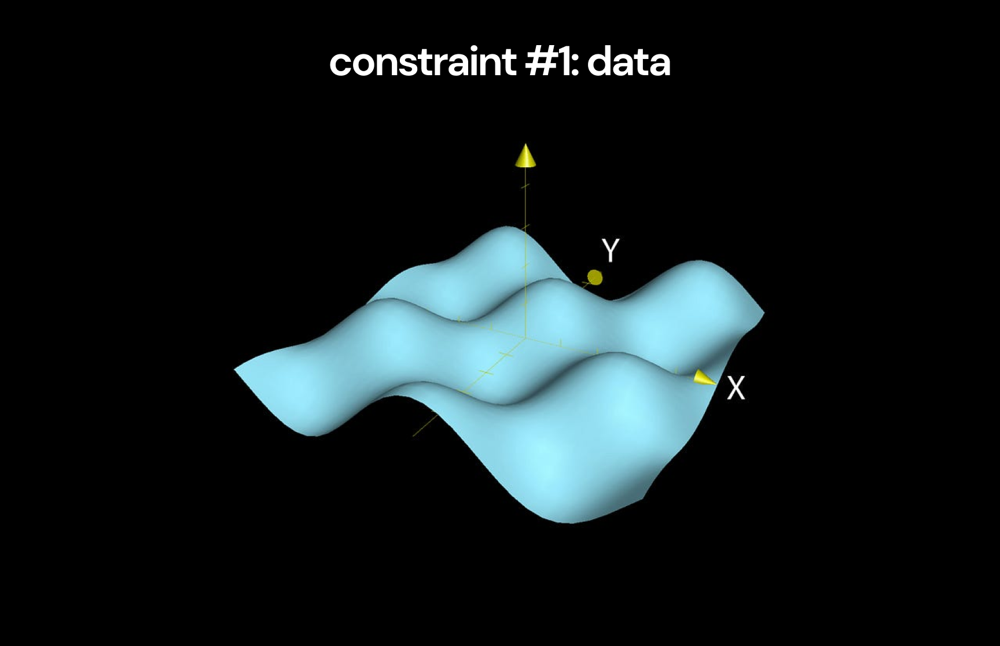
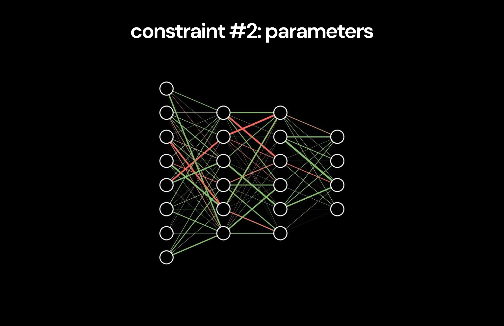
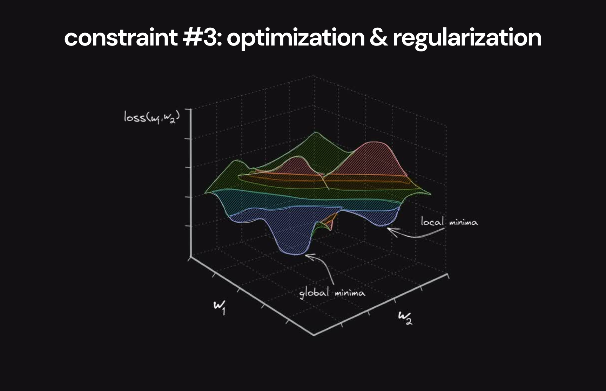
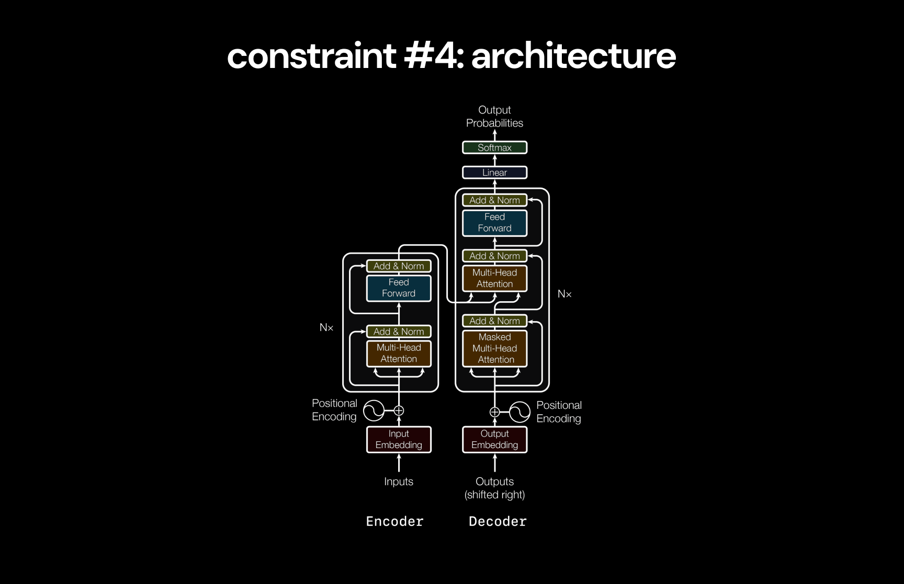
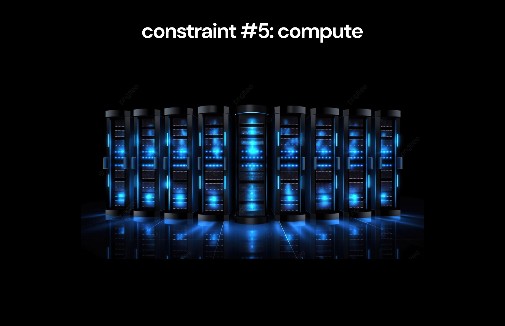
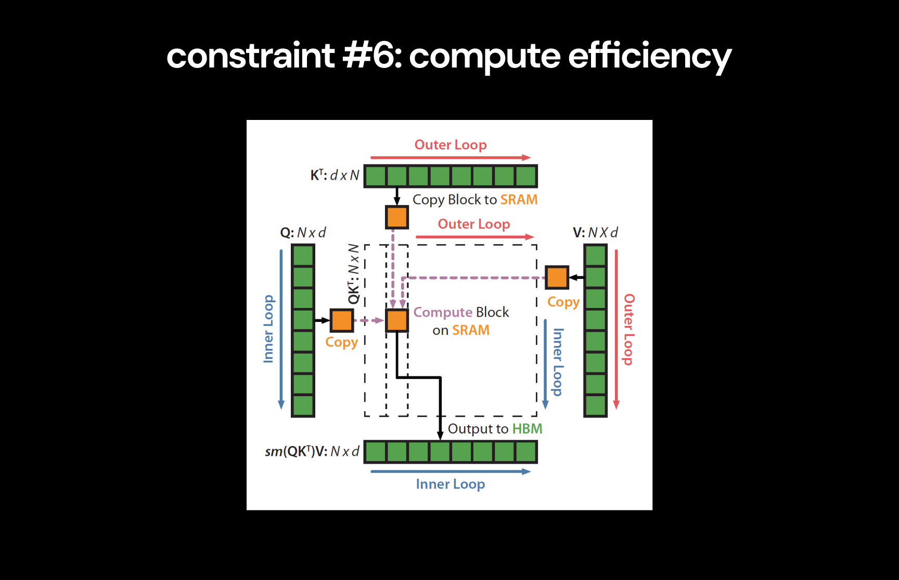
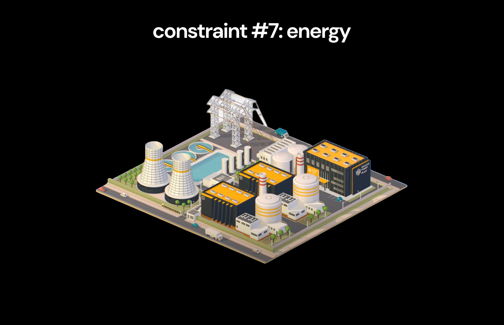

# deep-learning [WIP]

A deep-dive on the entire history of deep learning, highlighting the series of innovations that got us from simple feed-forward networks to GPT-4o.

For each key milestone, I've included the critical papers in this repository, along with my notes, my explanation of important intuitions & math, and a toy implementation in pytorch when relevant.

The rest of this page is my breakdown of everything we can learn from this history, and what it tells us about the future of deep learning, inspired by [_The Lessons of History_](https://www.amazon.com/Lessons-History-Will-Durant/dp/143914995X) by Will & Ariel Durant.

> [!IMPORTANT]
>
> **This project is designed so everyone can get most of the value by just reading my overview on the rest of this page.**
>
> Then, people curious to learn about the technical details of each innovation can explore the rest of the repository via the links in the [resources](#resources) section.

## Table of Contents

- [Overview](#overview)
  - [1. Constraints](#2-constraints)
    - [1.1. Data](#11-data)
    - [1.2. Parameters](#12-parameters)
    - [1.3. Optimization & Regularization](#13-optimization--regularization)
    - [1.4. Architecture](#14-architecture)
    - [1.5. Compute](#15-compute)
    - [1.6. Compute Efficiency](#16-compute-efficiency)
    - [1.7. Energy](#17-energy)
    - [1.8. Constraints & Leverage](#18-constraints--leverage)
  - [2. Narratives](#2-narratives)
  - [3. Inspiration](#3-inspiration)
  - [4. Intelligence](#4-intelligence)
  - [5. Future](#5-future)
- [Resources](#resources)
  - [Topics](#topics)
  - [Implementations](#implementations)
  - [Papers](#papers)

 

# Overview

The most interesting part of my deep-dive came from noticing a clear trend across all the key advancements, which has completely reframed how I understand deep learning:

> [!IMPORTANT]
>
> **There are 7 simple constraints that limit the capacity of digital intelligence:**
>
> 1. data
> 2. parameters
> 3. optimization & regularization
> 4. architecture
> 5. compute
> 6. compute efficiency
> 7. energy
>
> **The entire history of deep learning can be seen as the series of advancements that have gradually raised the ceiling on these constraints**, enabling the creation of increasingly intelligent systems.

It's impossible to understand where we're going without first understanding how we got here - and it's impossible to understand how we got here without understanding these constraints, which have always governed the rate of progress.

By understanding them, we can also explore a few related questions:

- How is progress made in deep learning?
- Where do the ideas that drive progress in deep learning come from?
- How have our narratives about digital intelligence changed over time?
- What does deep learning teach us about our own intelligence?
- Where is the future of deep learning headed?

So, let's start by understanding these constraints from first principles.

 

# 1. Constraints

We can define intelligence[^1] as the ability to accurately model reality[^2]. Practically, we're interested in models of reality that are useful for performing economically valuable tasks.

The goal of deep learning is to produce accurate models of reality for these useful tasks by:

1. Treating the true models that describe reality as complex probability distributions[^3]
2. Creating neural networks capable of modeling complex probability distributions
3. Training these networks to learn to model the probability distributions that underlie reality

In this view, creating intelligence with deep learning involves just two steps:

1. Collect useful information about reality (collect data)
2. Create a neural network that can effectively learn from this information (model data)

The only way to increase the intelligence of our model is to improve how well we accomplish each of these steps.

With this in mind, we can look at the constraints that govern this process. Let's start by understanding the constraint on data.

 

[^1]: Everyone has different definitions of intelligence, all of which are useful in different contexts, and none of which capture the full picture of what this word means. People may disagree with the specifics of this definition. I've chosen this one for the sake of simplicity to clearly frame what we're trying to achieve with deep learning from an economic perspective - I'm less concerned with it's philosophical implications here.
[^2]: Karl Friston's [Free Energy Principle](https://www.nature.com/articles/nrn2787) suggests that this definition of intelligence is also valid in the context of the brain (beware, the paper is explained with unnecessary mathematical complexity, but the core concept it describes is simple). Notably, intelligence systems create models of the world and then use those models to perform _active inference_ to modify their environments.
[^3]: This idea may seem unintuitive at first. But it's actually saying something very simple: (1) reality has a set of rules that govern what happens (2) we can model these rules by assigning probabilities to what's likely to happen, given what has already happened (3) thus, these models are probability distributions. Again, the [Free Energy Principle](https://www.nature.com/articles/nrn2787) supports this view of modeling reality.

## 1.1. Data

We've established that the goal of deep learning is to model the probability distributions that describe reality.

Let's call the distribution that we're trying to model for a specific task the _true distribution_. In order to learn about the true distribution, we collect many samples from it. These samples make up a _dataset_.

The dataset contains some information about the true distribution, but it doesn't contain _all_ information about the true distribution[^4]. Because of this, the dataset represents an approximation of the true distribution, which we'll call the _empirical distribution_.

**At best, we can expect our neural network to learn to model this empirical distribution[^5].**

However, our original goal was to model the true distribution. To account for this, we need the empirical distribution to be **a good approximation** of the true distribution. The quality of this approximation determines the cap of how good a model trained on the dataset can get.

This is the first constraint on the intelligence of a neural network.

> [!NOTE]
>
> **Constraint #1: A model can only be as good as the dataset it was trained on.**
>
> Specifically, the cap on how well a model can approximate the true distribution is determined by how much information about the true distribution is contained within the dataset.

 

[^4]: Assuming the true distribution we're trying to model is sufficiently complex to the point where including all information about it in the dataset would be intractable. This is almost always the case in deep learning.
[^5]: Assuming the model perfectly represents all information that exists within the dataset, which rarely happens.

### A Good Approximation

To make the empirical distribution a better approximation of the true distribution, we need to include more information about the true distribution in the dataset.

We can increase the total information in the dataset by the information in each individual sample (intuitively, this means using samples that are more informative for the relevant task).

We can also increase the information in the dataset by adding more samples that offer new information about the true distribution[^6].

**To simplify, there are two ways to improve the quality of the dataset:**

1. data quality
2. data quantity

This is not because more data is always good[^7], but because we want more information about the true distribution in the dataset so the model can learn a sufficient approximation of it.

With this understanding of the data constraint and how to improve the quality of datasets, we can look at how progress in this dimension has impacted the history of deep learning.

 

[^6]: This is analogous to how adding more terms to a Taylor series yields a function closer to the original. Approximations improve with more information about the true function.
[^7]: In fact, you can think of examples where more data makes no difference. For example adding the same image to a dataset (or two images similar to each other) doesn't improve the quality of the model created. It's because these new data points don't add much new information about the true distribution.

### Breakthrough #1: Large Labeled Datasets

Early machine learning relied on datasets collected by individual research teams. Despite the development of effective approaches to deep learning, datasets weren't large enough to prove their advantages.

The introduction of datasets like [MNIST](https://en.wikipedia.org/wiki/MNIST_database) and [ImageNet](https://en.wikipedia.org/wiki/ImageNet) drastically increased the availability of high quality datasets large enough to effectively train deep learning models.

Early [CNNs](/01-deep-neural-networks/02-cnn/03-cnn.ipynb) like [LeNet](/01-deep-neural-networks/02-cnn/02-le-net.pdf) and [AlexNet](/01-deep-neural-networks/03-alex-net/01-alex-net.pdf) used these datasets to show that deep neural networks could compete with the traditional machine learning approaches used at the time.

It's easy to take for granted the impact of these datasets now, as they have long been obselete - but they clearly had a huge impact on the field. Notably, AlexNet, which [completely changed the field of deep learning](/01-deep-neural-networks/03-alex-net/01-alex-net.pdf), could not have existed without the creation of the ImageNet dataset.

**The introduction of large labeled datasets can be seen as the first breakthrough in pushing the data constraint toward larger datasets.**

Though useful, these datasets were inherently unscalable due to the manual labeling process they rely on. In order to push the data constraint to the next level with even larger datasets, a new approach to data was needed.

 

### Breakthrough #2: Unlocking the Internet

The internet is the most obvious source of massive amounts of data that could plausibly be used for deep learning. However, it was initially unclear how to use this data to train a deep learning model.

Unlike labeled datasets, internet data is not created for a specific tasks, so it didn't appear to contain high quality data that could contribute to training a specific model. For this reason, internet data appeared to be unusable in deep learning for a long time[^8].

[BERT](/04-transformers/02-bert/03-bert.ipynb) completely changed this. BERT popularized the **transfer learning** paradigm now used by all large language models (including [GPTs](/04-transformers/04-gpt/03-gpt.ipynb)) - the model was _pre-trained_ on a large portion of the internet (high quantity, unpredictable quality), and then _fine-tuned_ on smaller datasets (high quantity, low quantity).

**For the first time ever, BERT showed that we could actually make internet-scale datasets useful.**

The results also shocked the broader tech community - for example, [causing a Google executive to express](https://x.com/TechEmails/status/1756765277478621620) that an AI system would inevitably replace Google search in the near future.

For those curious, the [LoRA](/04-transformers/05-lora/02-lora.ipynb) paper further developed on why the transfer learning paradigm developed by BERT and used by all modern LLMs may be so effective.

 

[^8]: There was not powerful enough compute or good enough architectures to process the scale of internet datasets effectively for a long time.

### Breakthrough #3: Training Assistants

[BERT](/04-transformers/02-bert/03-bert.ipynb) and the [GPTs](/04-transformers/04-gpt/03-gpt.ipynb) were technically impressive but didn't immediately reach the mainstream until the release of ChatGPT.

[InstructGPT](/04-transformers/06-rlhf/05-rlhf.ipynb) was the breakthrough that enabled this. It used [RLHF](/04-transformers/06-rlhf/) techniques to fine-tune the base GPT-3 model using a human generated dataset of question-answer pairs deemed good responses for a helpful assistant.

By learning to behave effectively as an assistant, InstructGPT created the practical communication style that enabled ChatGPT to succeed.

**The success of InstructGPT is an indication of how high-leverage data quality can be when fine-tuning language-models.** Though many fine-tuned models existed before the instruct series, InstructGPT was far preferred almost everything else at the time to the high quality data it was trained on.

 

### Beyond Internet Data

How much more can we improve the quality of the datasets deep learning models are trained on to improve the capacity for models to become intelligent?

The amount of data generated on the internet is increasing exponentially, which should continue to provide a source of increasingly large datasets to train on[^9].

However, there's another question about the quality of the data on internet-scale datasets. We want our systems to model reality - whereas the internet can be understood as a (highly) lossy compression of the true laws of reality[^10].

Because of this, the abundance of humanoid robots may present a new means of data collection for deep learning models that gives direct access to information about reality - which makes [OpenAI & Microsoft's investment and collaboration with Figure](https://www.reuters.com/technology/robotics-startup-figure-raises-675-mln-microsoft-nvidia-other-big-techs-2024-02-29/) particularly interesting.

Regardless, current scaling laws have shown that current models are far from reaching the capacity of the information available in internet-scale datasets, meaning we may be far away from the point where data becomes the constraint again.

 

[^9]: This may not actually be sufficient to keep increasing the quality of models, as a recent [analysis of zero-shot learning](https://arxiv.org/abs/2404.04125) shows that large language models ability to perform tasks increases logartihmically with the amount of relevant data in the dataset.
[^10]: The internet is a lossy compression of the entirety of human knowledge, with lot's of noise (complex and contrasting intentions behind different posts). Additionally, human knowledge itself is a very lossy (and partially inaccurate) compression of the laws of reality.

### Modeling Data

Now that we've understood the data constraint, we can explore what constrains how effectively the neural network can model the data.

This determines how close to modeling the empirical distribution the model will get, which corresponds with its intelligence.

The first constraint that determines the capacity for the model to learn the empirical distribution is the number of parameters in the neural network.

 

## 1.2. Parameters

The model needs to have enough _representational capacity_ to be able to learn the empirical distribution of the dataset.

This means the neural network needs to have parameters to provide enough degrees of freedom to accurately model the distribution. In practice, it's challenging to predict the minimal number of parameters needed to fully model a dataset.

However, when the amount of information in the dataset is far beyond what the network is capable of modeling, the easiest way to improve the network is to scale up the number of parameters - which can mean increasing the depth of the network and adding more parameters per layer.

With modern internet-scale datasets, the complexity is massive, so the approach of adding more parameters shows no signs of slowing down in terms of its efficacy at improving the intelligence of models.

> [!NOTE]
>
> **Constraint #2: The representational capacity of a model is bounded by the number of parameters it contains.**

In practice, we'll see that increasing the number of parameters in a neural network is actually a function of the other constraints.

Let's look at the times in the past where this constraint has been particularly relevant.

 

### Breakthrough #1: Increasing Depth

The earliest neural networks consisted of just a single input and output layer, heavily limiting their representational capacity.

The original [backpropagation paper](/01-deep-neural-networks/01-dnn/01-dnn.pdf) discussed the addition of a hidden layer, adding more parameters to the network which significantly increased it's ability to represent more complex problems (like shift-registers, the XOR gate, etc. - all very simple examples, but impressive at the time).

[AlexNet] is one of the clearest examples of increasing parameters leading to better models[^11] - the AlexNet architecture used 5 convolutional layers, far more than the previous largest CNN at the time, which enabled it to crush the previous best score in the ImageNet competition.

However, early on, size appeared to be one of many factors constraining the improvement of models, rather than the most important constraint.

 

[^11]: Although, AlexNet was the result of a large number of innovations that combined to make it so effective - the increase in network depth was complemented with a use of effective optimization & regularization methods and the use of GPUs for training which enabled this increase in size.

### Breakthrough #2: Scaling laws

The [GPT](/04-transformers/04-gpt/) series made it clear that for internet datasets, scaling parameters appears to be sufficient to significantly increase model quality.

The scaling laws show no sign of letting up, which has motivated the current continued attempts at training larger and larger models.

  

  <i>Scaling laws for model performance as a function of parameters</i>

**Importantly, the reason for this trend is not that increasing the number of parameters in a model always increases it's intelligence.** Instead, it's due to the fact that current models still don't have enough representational capacity to capture all the information in internet-scale datasets.

As mentioned previosly, increasing the number of parameters in a neural network is actually governed by the other constraints.

 

## 1.3. Optimization & Regularization

In reality, you can't keep scaling up the number of parameters in a model and expect quality to keep increasing.Scaling up a model (via increasing the depth or the number of parameters per layer) introduces two new classes of problems.

First, increasing the depth of a network can make the network take far longer to converge to an optimal solution, or in the worst cases, can prevent the network from converging.

**The process of ensuring models can converge effectively, even as they grow in depth, is known as optimization.**

Additionaly, when you scale up the number of parameters in a model so it's representational capacity exceeds to complexity of the empirical distribution, the model can start to learn to model trivial _noise_ in the distribution. This effect is known as _overfitting_.

**The process of regularization is used to ensure models learn useful _generalizations_ of the dataset and don't overfit to noise.**

In practice, the actual depth of a network is constrained by the efficacy of the optimization & regularization strategies used.

> [!NOTE]
>
> **Constraint #3: The efficacy of optimization & regularization approaches constrains the number of parameters a network can handle while still being able to converge and generalize.**

 

### Breakthrough #1: Taming Gradients

While training deeper neural networks with [backpropagation](/01-deep-neural-networks/01-dnn/02-dnn.ipynb), gradients start to get magnified or disappear, due to the compounding effects of multiplication by sequences of large or small weights[^12].

**This is known as the vanishing and exploding gradients problem.**

It's easy to forget how prohibitive this problem was - it completely prevented the effective training of networks beyond a few layers in depth, putting a significant constraint on the size of networks.

The introduction of [residuals](/02-optimization-and-regularization/03-residuals/02-residuals.ipynb) via the [ResNet](/02-optimization-and-regularization/03-residuals/01-residuals.pdf) architecture completely solved this problem by creating _residual pathways_ for gradients to flow effectively through networks of arbitrary depth.

This unlock removed a significant constraint on network depth, enabling much larger networks to be trained (which removed a cap on parameters that existed for a long time before this).

 

[^12]: Understanding this section relies on a basic understanding of the fundamentals of the backpropagation algorith. [3blue1brown's neural network series](https://www.youtube.com/playlist?list=PLZHQObOWTQDNU6R1_67000Dx_ZCJB-3pi) is an intuitive and interesting introduction for anyone who wants to learn.

### Breakthrough #2: Network of Networks

[Dropout](/02-optimization-and-regularization/04-dropout/) introduced a critical regularization strategy that has been used in most networks after it's creation, notably contributing to the success of [AlexNet](/01-deep-neural-networks/03-alex-net/02-alex-net.ipynb) which initially popularized it.

Conceptually, the ideal way to prevent a model from overfitting to a particular problem would be to train a variety of neural networks on the same problem and then take the average of their predictions. This process would cancel out the noise fitted by each network, leaving only the true representations.

However, this naive approach was prohibitively expensive.

Dropout enabled a computationally effective equivalent approach involving by randomly blocking out the effects of a subset of neurons in each training run[^13], effectively training an exponential number of sub-networks within a neural network and averaging their predictions together.

 

[^13]: This effect forces individual neurons to learn general representations useful in collaboration with a variety of other neurons, rather than co-adapting with neighboring neurons, which allows large groups of neurons to fit to noise.

### Breakthrough #3: Taming Activations

Another problem when training deep networks is that later layers suffer from improving while the activations of earlier layers change, potentially rendering their early stages of training useless.

**This problem is known as internal covariate shift**, and also prohibitted the training of deeper networks.

The introduction of [Batch Normalization](/02-optimization-and-regularization/05-batch-norm/) and [Layer Normalization](/02-optimization-and-regularization/06-layer-norm/) solved this by forcing neuron activations into predictable distributions, preventing the covariate shift problem.

This breakthrough, combined with residuals, provided the basis for building much deeper networks. Layer Normalization in particular enabled the training of deeper reccurent models like [RNNs](/03-sequence-modeling/01-rnn/02-rnn.ipynb) and [LSTMs](/03-sequence-modeling/02-lstm/02-lstm.ipynb)'s that led to the innovations eventually resulting in the [Transformer](/04-transformers/01-transformer/02-transformer.ipynb).

 

### Breakthrough #4: Momentum

The initial optimization algorithm, _stochastic gradient-descent_, involves taking a pre-determined step to update the parameters at each time-step.

In practice, this can be highly inefficient and hurt convergence[^14].

The [Adam](/02-optimization-and-regularization/08-adam/02-adam.ipynb) optimizer introduced an efficient algorith to keep track of **adaptive moments** tracking the history of gradients throughout the optimization process. This allowed the optimizer to adjust step-sizes based on past information, often leading to much faster convergence.

[^14]: Specifically in parameter spaces with large variance in the gradients, a certain step-size may cause over-adjustments in certain parts of the landscape, and result in painfully slow changes in other cases.

 

### The Forgotten Constraint

The advancements mentioned above (and related developments) are all used in most models to date. For example, the [Transformer](/04-transformers/01-transformer/02-transformer.ipynb) architecture uses [Dropout](/02-optimization-and-regularization/04-dropout/), [Layer Normalization](/02-optimization-and-regularization/06-layer-norm/02-layer-norm.ipynb), and[Residuals](/02-optimization-and-regularization/03-residuals/02-residuals.ipynb) throughout it's architecture, and was trained using the [Adam](/02-optimization-and-regularization/08-adam/) optimizer.

Because of how effective they've been completely removing prior problems, optimization & regularization appear to be largely solved now.

This is especially augmented by the fact that we're far from reaching the peak of the scaling laws on current internet-scale datasets, so overfitting is not a concern.

**Despite this, it's important to remember that optimization & regularization are still real constraints on the size of neural networks**, although they no longer effect models in their current state.

 

## 1.4. Architecture

Good optimization & regularization enables us to make larger and deeper models.

Are all models of the same size created equal in their capacity to model distributions effectively? Certaintly not.

We want our models to learn “useful representations” that efficiently model the apparent distribution. ie. they learn true information and ignore all the “noise” that comes from random sampling.

If we know a good way the model can capture this “useful information,” and ignore the “noise” using less parameters, we can help it learn more efficiently.

We are telling the model “learn like this.” This is adding _inductive bias_.

Architecture is about more useful representations per group of parameters, which translates to better modeling of apparent distribution, with fewer parameters, meaning more room for parameters, meaning larger effective size again (more useful representations in the mode, more intelligence).

Technically, a DNN with non-linearities can model any distribution, given sufficient scale [Link to justification].

But in practicality, we know there are distributions with so much noise and complexity (like images) that we need some inductive bias beyond basic DNNs to be able to form any useful representations.

 

### Breakthrough #1: Learning features unlocks images

**CNN** - The first inductive bias or unique representation really introduced by an architecture [CNN, LeNet, AlexNet], and it's still used today in state of the art generative models [U-Net].

These are about _compression_. They give the model a way to explicitly learn to ignore a lot of noise by only paying attention to specific _features_.

This maps directly to the manual feature engineering that ML engineers did before deep-learning, but with a more deep-learning twist, since it allows the model to learn the best features itself.

 

### Breakthrough #2: Memory unlocks sequence modeling

**RNNs -> LSTMs** [RNN, LSTM, Learning to Forget, Encoder-Decoder, Seq2Seq] - First introduces the ability to understand relationships across time & space via memories (because of the introduction of gates).

We enable the model to think about what parts of the data are important to other parts.

The LSTM made the RNN actually viable, and sequence-modeling actually viable. This is the start of the trajectory that led us to where we are now.

However, the LSTM was constrained on time.

 

### Breakthrough #3: Attention is all you need

**Attention & Transformers** - [Attention, Transformer] Understand relationships across space without being blocked by time. This enabled parallelization, which increase compute efficiency and model size.

Attention enables every part of an input to learn about every other part of it. Everything is able to enhance the meaning of everything else within context.

The title "Attention Is All You Need" makes the most sense in contrast to previous papers [Encoder-Decoder, Seq2Seq, Attention] that achieved success with RNNs. This paper shows that the _only_ inductive bias you need is attention. This suggests something important about it regarding intelligence.

 

### Breakthrough #4: Taming randomness

**Generative Models** - By far the most conceptually complex of all the models.

We’ve talked about how we understand samples from complex distributions (with information and noise).

How do we synthesize complex data? It appears we would have to understand not just the information (what we’ve been doing so far), but also the details? The details are extremely complex.

The sum of complex random variables is noise. So we synthesize images by learning to create both features + noise (which adds details).

VAEs create a bottleneck that forces the model to use useful representations. Then add back noise on top of these representations. So we start by creating information, then add noise to it to create our synthesized data.

Diffusion, instead, starts with noise, and learns to add back information to it slowly.

Without these designs, models could never synthesize data.

 

### Breakthrough #5: Embeddings

**Embeddings** - [Word2Vec, VAEs, CLIP] Force models to learn an interesting representation space with semantic and syntactic meaning.

The classic example of this is that the embeddings allow "King" - "Man" + "Woman" = "Queen"

Embeddings show us the composability of concepts. Transformers use this to soak information into words.

 

### Creativity & Engineering

U-Net, embeddings, diffusion, etc. Even the transformer design.

 

### "Don't touch the architecture"

Combining Models - [DALL E, DALL E 2, Stable Diffusion, etc.] - using U-Net, Transformer, CLIP, VAE, Feed-forward, Diffusion all in one.

Many state of the art models combine pieces from many of the different architectures in different sections to work together to do larger tasks like condition images with text, etc.

GPT-4o is the most obvious example of complete multi-modality, which involves stitching together lots of different types of models.

[8] "Don't touch the architecture" [Clip of Karpathy talking about not changing architectures]

 

## 1.5. Compute

With an efficient architecture and effective optimization & regularization, the remaining constraint on the size of the model is compute.

During training, specifically back-propagation, the gradient for each parameter needs to be computed, and then each parameter updated. This takes compute, which takes time. So with more parameters, there are more computations during back-propagation, which is the limitting step.

So we can train a certain number of parameters per device. And then we need to get more devices. And if there's a limit on how many devices we can use together, we've hit a constraint on compute.

 

### Breakthrough #1: Letting compute communicate

**GPU communication** - Using 1 GPU was useful at first, but with larger models, you need to be able to use multiple GPUs at once.

You can't do this by just splitting up the work. The GPUs need to communicate with each other - as little as possible, but still at some points, to synchronize weights/pass data to each other, since this is all one model.

Due to gaming, NVIDIA released GPUs that could communicate with each other, which was used by [AlexNet] to train larger model more effectively.

 

### Breakthrough #2: Riding tailwinds

**Gaming tailwinds improve compute** - For most of its time, deep learning was not large enough to justify large companies building dedicated compute for it, especially given how expensive/difficult to execute compute companies are.

Deep learning was lucky that the tailwinds of gaming drove increasing compute quality which deep learning benefitted from on the side. [AlexNet, Transformer, etc.]

 

### Breakthrough #3: AI becomes a priority

**AI-first GPUs** - Finally, AI becomes a bet worth taking, NVIDIA releases A100, H100, and now B100 focused on MIG, AI tensor cores, mixed-precision, more FLOPS (smaller floating point numbers).

> [Graphic] - B100

> [Graphic] - Jensen Huang handing OpenAI a GPU

 

### Breakthrough #4: BERT & the compute arms race

**The compute arms race** - It wasn't always obvious that compute was going to become a huge constraint at a point in time when the AI narrative was also becoming highly consequential, and garnering large power over capital flows.

This trend was first crafted and visible by OpenAI with [BERT, GPT-2, GPT-3], [SoRA example is another nice example].

They saw this before other people. Sam Altman says "compute is the bottleneck" [Link and correct quote]

Zuck unrelated buys a lot of GPUs because he sees they could be useful, and now they're in a great position because of that. [Link to clip] [Antifragile (redundancy/optionality)]

The arms race really begins - NVIDIA, TSMC, ASML, etc. semi-conductor supply chain prices sky-rocket.

> [Graphic] - Stock prices of all the semi-conductor supply chain companies rising

 

### Adjusting supply chains

**Adjusting supply chains:** The current constraint on compute is not about people not having funding to buy compute. It's about the compute supply chains not creating enough supply.

Because compute supply chains have a long production cycle (a few months), they rely on predictions. These supply chains did not predict the boom in demand for compute that came from the AI cycle, so they got constrained.

These supply chains will soon adjust to demand, and the constraint on compute will no longer be due to constrained supply chains - instead it will become a resource problem.

 

### AI ASICs

[7] **AI-accelerator ASICs:** Another wave that may impact compute - in the recent cycles, many companies have raised large amounts of money to built ASICs for AI inference, and now AI training [links? Tenstorrent? etc.]

There's a heuristic that you get 10x boost from chip to FPGA, then another 10x from FPGA to ASIC. This is not exactly accurate in this case since GPU is the benchmark - but the question is, will ASICs really be able to accelerate training (better than NVIDIA, who's already doubling down on AI)?

 

## 1.6. Compute Efficiency

Making effective use of compute (training parameters most efficiently) is not a gaurantee. This is a software problem and takes active effort and optimization.

Examples like [FlashAttention] show us that there are large compute breakthroughs that accelerate things waiting to happen.

 

### Breakthrough #1: CUDA

**CUDA** - The first challenge with compute was just being able to work with GPUs. GPUs require a completely different programming paradigm unfamiliar to most people, and was challenging to get right.

NVIDIA built CUDA for this, a programming pattern native to C which devs were more used to.

We see in [AlexNet] they write their own GPU code manually (and in other places).

 

### Breakthrough #2: Kernel libraries

**Kernel Libraries** - People stopped having to write their own kernels as frequently dropping the barrier to entry - solved both by NVIDIAs on kernels and libaries like [TensorFlow], [PyTorch], [JAX] that handle compute side for you.

 

### Improvement never ends

**Efficient Implementations** - Even past the point where people write kernels, now that kernel libraries are all available, there are still compute efficiency optimizations lying around. [FlashAttention] notably increased the performance of the Transformer by a huge margin.

> [Graphic] - Sam Altman talking about compute efficiency being good too

 

## 1.7. Energy

Finally, even if we have infinite resources to purchase compute, and more importantly, the supply chain can support any demand, there is still a constraint on compute - energy.

In practice, compute has to be clustered together since it all needs to communicate with each other. Communicating over network is impractical - it has to be much faster - over local InfiniBand.

So compute must all be clustered together in data centers, and the data center will need to have sufficient electricity to keep the compute running.

But with amounts of compute being discussed right now in data centers, the data centers may not actually be able to supply this energy.

> [Graphic] - Microsoft & OpenAI data center

This is because the available energy you can draw from the grid at once place is actually limited to [X GW]. The grid capacity will have to adjust over time to increase this constraint.

> [Graphic] - [Zuck clip about energy](https://www.youtube.com/watch?v=i-o5YbNfmh0)

 

## 1.8. Fixed Constraints & Leverage

So we can now consider all these constraints together.

The first constraint is the data (specifically, the quantity and quality of data we have), which determines the empirical distribution. The empirical distribution sets the cap on how well we can model the true distribution based on how well it approximates the true distribution.

The remaining constraints determine how well we can train a model to fit to this empirical distribution. The most immediate is the size of the model, which is actually capped by the amount of compute we have, assuming good architecture, optimization/regularization, and compute efficiency.

And compute can be constrained by energy.

We can conceptually divide these constraints into "hard constraints" and "leverage constraints."

The hard constraints are "data," "compute," "energy." These are much slower to move and are the result of much larger effects - the quality of data determined by the scale of the internet, the amount of compute rate limited by slow moving supply chains and a boom in demand, and energy constraints determined by the slow moving process of increasing available energy from the grid (infrastructural challenge).

Given these hard constraints, we can maximize how effectively we use them via the "leverage constraints" - "size," "architecture," "optimization / regularization," "compute efficiency." These are all easily adjustable (software) and have massive effects [FlashAttention, Residuals, Transformer, GPT-2, etc. etc.].

So you can think of these constraints as offering leverage on the compute/data. With the same compute/data, you can accomplish much more by improving architectures, efficiency, etc.

 

# 2. Narratives

Now that we've explored the constraints in detail, we can look back at the history of progress in deep learning through the lens of constraints.

With this perspective, a few key milestones stand out above the rest that completely shifted the paradigm of constraints, and each came with significant shifts in narratives about deep learning.

These narrative shifts alone had a big impact on progress in the industry [Narrative Distillation, Mimetics].

 

### Narrative #1: Deep learning works

[1] **AlexNet: deep learning is pointless -> deep learning is viable** - For a long time, machine learning community viewed deep learning as naive. The idea of feature engineering and logic-based ML appealed much more to the narratives we liked about intelligence (logic).

> [Graphic] - AlphaGo, early opinions on deep learning

Papers like [DNN, CNN, LeNet] shifted the narrative of the viability of deep learning. Then, especially [AlexNet] showed people that it should be taken seriously, and really shifted the narrative.

These also demonstrated the first arhictectural breakthrough, and as we saw above, AlexNet appears in innovations in always every single section. They pushed constraints in every direction.

 

### Narrative #2: Sequence modeling works

**LSTMs make sequence modeling interesting, and unlock new data** - RNNs were the subject of much effort [RNN] but due to the vanishing/exploding gradients by nature of how RNNs work, they were thought to be completley impractical.

LSTMs made recurrence and sequence modeling viable again [LSTM, Learning to Forget] (results), also creating a large line of work in sequence modeling which eventually led us in the direction of GPTs [Encoder/Decoder, Seq2Seq, Attention].

> [Graphic] - Ilya quote on LSTMs being scalable

Importantly, this shift to sequence modeling as a viable problem now unlocks the first internet scale dataset as a viable data source - all web pages/text on the internet. But, it was initially unclear how this could be used effectively, and the recurrence of the LSTM architecture makes it less efficient training on this data.

 

### Narrative #3: Unlocking more data

[3] **Attention is all you need, can process data** - [Attention, Attention is All You Need] Massive architectural breakthrough that has great results, and most importantly, removes the bottleneck of LSTMs to increase parallelization, meaning we can scale up more and use compute more efficiently.

Contrary to what may seem true, this paper alone is not what caused the biggest narrative shifts. It was still unclear how internet scale data could be used.

 

### Narrative #4: Scaling laws dominate

[4] **The shift to transfer learning unlocks internet scale data, scaling laws begin** - This may be the biggest recent shift. The pre-training and fine-tuning paradigm introduced by [BERT, RoBERTa, GPT-2, GPT-3, InstructGPT] unlock internet-scale data for the first time ever.

The results from BERT alone cause a narrative shift - these things start to look way more powerful.

> [Graphic] - Google executive thoughts on BERT

Then, GPT-2, GPT-3 start to reveal scaling laws. We finally have a dataset complex enough but useful enough to reveal the nature of scaling laws empirically.

OpenAI noticed this early and takes a bet on it. We see this bet playing out over the papers.

"What's one thing you believe that no one else does" - OpenAI's secret was scaling laws. A few years ago, people used to look down on it. OpenAI turned out to be right.

This narrative in particular highlights the power of narratives in fundraising [Narrative Distillation]. This cycle single-handedly revives SF, billions dumped into AI.

> [Graphic] - Graph of funding in AI, Sam Altman $7T

 

# 3. Inspiration

Where do the ideas that have led to breakthroughs in deep learning come from? By looking at the history, we can see a few common sources of inspiration that appear frequently.

 

### Neuroscience

**Similar Solutions**

The most common source of apparent inspiration is neuroscience.

The [CNN] is the most obvious architecture directly inspired by neuroscience, as it maps directly to the functinos of the visual system.

Other systems like [LSTM, Attention] appear to draw from neuroscience ideas (memory, attention), although looking at their development, in many ways they may be derived empirically, and then fit onto neuroscience after.

For example, LSTM design is perfectly made to address the vanishing/exploding gradients problem in RNNs, rather than specifically with the goal of modeling memory.

This pattern suggests that rather than taking direct inspiration from neuroscience, deep learning has converged on similar approaches to how nature has built the brain partly through first principles.

**Overfitting**

In early papers, there seems to be an attempt to fit ideas to neuroscience as a justification for their relevance [?, Dropout], which we don't see anymore at all. This reflects on early ideas about deep learning (which have now changed to be less anthropomorphic).

[Dropout] struck me as the most blatant example of this potential overfitting, as they explain "one possible motivation" for dropout as a mapping to animal sexual behavior, despite their prior explanation in the paper of dropout following from a rather logical line of thinking around regularization.

This seems to be an ex-post rationalization of the architecture in an attempt to make it correspond with biology, rather than it actually serving as a source for inspiration (of course, I could be wrong).

 

### Linear Algebra & Calculus

Most notably, [back-propagation/DNN] and [LoRA] are directly inspired by the math behind neural networks.

[LoRA] (low-rank adaptation) is directly a manipulation on how models are trained by taking advantage of a feature of linear-algebra (decomposing parameters into lower dimensionality matrices).

 

### Physics & Information Theory

Most notably, [VAEs], [Diffusion], [Score-Models], [Flow-Models] all take inspiration from physics - especially Langevin dynamics.

These are systems involving noisy sampling.

 

### Nature

In general, all these sources of inspiration are engineering / sources where nature has solved the problem of modeling data in different ways, and we can take ideas from these places.

As mentioned before though, it's very easy to rationalize reasoning for things ex-post that fit into nice narratives.

In reality, the majority of change (though maybe inspired from many places) is heavily grounded in engineering [ie. LayerNorm/BatchNorm, LoRA, Residuals, LSTM from RNN, etc.] - patching errors in things we see, especially using math as the tool for engineering in the context of neural networks.

 

# 4. Intelligence

What does this progression tell us about intelligence? I'll try to be very empirical here, because dipping into philosophizing with this topic is very easy if not careful.

One way to view intelligence is a measure of our ability to model complex distributions (about reality), then run active inference using these models to accomplish goals in the world [Free Energy Principle].

This frames [The Cook and the Chef] particularly well - constant update based on the world, constantly improve your own frameworks.

It appears data representing reality (dataset vs. senses) + compute (transistors vs. neurons) + energy (grid vs. food) + scale (params in DNN vs. neurons in brain), we get intelligence

As we’ve defined it, intelligence is certainly emergent from complex systems [Integrated Information Theory] - clearly, there's nothing inherently human about it.

What can architectures teach us about intelligence - maybe more effective representations / parameters is something fundamental. It appears, out of the giant graveyard of stuff tried, that some formats of convolution/compression [visual system], memory [LSTM/forget], attention [attention system] have been tried.

Maybe our brain converged on good ways to model data - the same thing AI is trying to do, and so happens to converge on similar answers over time.

Embeddings mean something in the brain too, and show us something about representations.

And, if intelligence really is just about data + compute + energy, it seems inevitable that digital intelligence will surpass us at some point (to many people this seems inevitable, many disagree, many don’t like it) - this is explored in the next section.

 

# 5. Future

We've now reframed the history of progress as a series of break-throughs on the constraints limiting intelligence.

Everything in the past that has contributed to progress has been determined by the constraints discussed above.

And nothing changes in the future - these same constraints will always determine where we're headed, how close we get to AGI, etc.

We've now solved the _theoretical_ problem of AGI for a long time. We know that we need compute, data, and energy and if we keep scaling these, intelligence will increase. This was not obvious until the past 1-2 decades of history (only to some people). It has really only become obvious in the past 3 years - this was a contrarian bet for OpenAI.

The question is now can we solve the _engineering_ problem of AGI. Can we continue pushing on all the constraints to keep increasing intelligence?

It appears optimization/regularization doesn't need to increase too much, and the transformer may be the dominant architecture for a long-time before architecture becomes a plausible constraint again (if ever) [Karpathy saying to keep architecture the same].

We will continue pushing the frontiers on compute efficiency, compute supply chains will adjust, and energy will also adjust slowly (over medium term time horizons). This means we will continue to produce larger and larger parameter models, and intelligence will certainly increase.

How far does this go? It depends how far the scaling laws go. In this context, we see that the scaling laws are not a universal truth. They're a local truth - scale is all we need for now because the data we're training on is far more complex than what current networks are modeling.

This may scale to the point where we achieve intelligence that can improve itself, especially as we unlock access to collect data about the world directly via humanoid robots.

Or, we may cap out at some point and need to figure out new ways to push the data constraint. Either way, given the current trajectory, models by that point will be far more intelligent than they are now, and it's unclear how they'll impact society in the mean time.

 

# Resources

## Topics

> [!IMPORTANT]
>
> Each topic highlighted in this repository is covered in a folder linked below.
>
> In each folder, you'll find a copy of the critical papers related to the topic (`.pdf` files), along with my own breakdown of intuitions, math, and my implementation when relevant (all in the `.ipynb` file).

**1. Deep Neural Networks**

- [1.1. DNN](/01-deep-neural-networks/01-dnn/)
- [1.2. CNN](/01-deep-neural-networks/02-cnn/)
- [1.3. AlexNet](/01-deep-neural-networks/03-alex-net/)
- [1.4. UNet](/01-deep-neural-networks/04-u-net/)

**2. Optimization & Regularization**

- [2.1. Weight Decay](/02-optimization-and-regularization/01-weight-decay/)
- [2.2. ReLU](/02-optimization-and-regularization/02-relu/)
- [2.3. Residuals](/02-optimization-and-regularization/03-residuals/)
- [2.4. Dropout](/02-optimization-and-regularization/04-dropout/)
- [2.5. Batch Normalization](/02-optimization-and-regularization/05-batch-norm/)
- [2.6. Layer Normalization](/02-optimization-and-regularization/06-layer-norm/)
- [2.7. GELU](/02-optimization-and-regularization/07-gelu/)
- [2.8. Adam](/02-optimization-and-regularization/08-adam/)

**3. Sequence Modeling**

- [3.1. RNN](/03-sequence-modeling/01-rnn/)
- [3.2. LSTM](/03-sequence-modeling/02-lstm/)
- [3.3. Learning to Forget](/03-sequence-modeling/03-learning-to-forget/)
- [3.4. Word2Vec & Phrase2Vec](/03-sequence-modeling/04-word2vec/)
- [3.5. Seq2Seq](/03-sequence-modeling/05-seq2seq/)
- [3.6. Attention](/03-sequence-modeling/06-attention/)
- [3.7. Mixture of Experts](/03-sequence-modeling/07-mixture-of-experts/)

**4. Transformers**

- [4.1. Transformer](/04-transformers/01-transformer/)
- [4.2. BERT](/04-transformers/02-bert/)
- [4.3. T5](/04-transformers/03-t5)
- [4.4. GPT-2 & GPT-3](/04-transformers/04-gpt)
- [4.5. LoRA](/04-transformers/05-lora)
- [4.8. RLHF & InstructGPT](/04-transformers/06-rlhf)
- [4.9. Vision Transformer](/04-transformers/07-vision-transformer)

**5. Image Generation**

- [5.1. GANs](/05-image-generation/01-gan/)
- [5.2. VAEs](/05-image-generation/02-vae/)
- [5.3. Diffusion](/05-image-generation/03-diffusion/)
- [5.4. CLIP](/05-image-generation/05-clip/)
- [5.5. DALL E & DALL E 2](/05-image-generation/06-dall-e/)

 

## Implementations

I've provided my minimal implementations for many of the core topics in this repository in the `.ipynb` files for each topic.

Generally, you can find good implementations of most papers online, which means the challenge isn't figuring out reimplementation. I've included these to collect them in one place for convenience, and also to highlight simple implementations that demonstrate each concept and I've gotten trained.

I used A100's to train most of the larger models.

- [DNN](/01-deep-neural-networks/01-dnn/02-dnn.ipynb)
- [CNN](/01-deep-neural-networks/02-cnn/03-cnn.ipynb)
- [Transformer](/04-transformers/01-transformer/02-transformer.ipynb)
- [LoRA](/04-transformers/05-lora/02-lora.ipynb)
- [Vision Transformer](/04-transformers/07-vision-transformer/02-vision-transformer.ipynb)
- [GAN](/05-image-generation/01-gan/02-gan.ipynb)
- [VAE](/05-image-generation/02-vae/04-vae.ipynb)
- [Diffusion](/05-image-generation/03-diffusion/05-diffusion.ipynb)

 

## Papers

**Deep Neural Networks**

- **DNN** - Learning Internal Representations by Error Propagation (1987), D. E. Rumelhart et al. [[PDF]](https://stanford.edu/~jlmcc/papers/PDP/Volume%201/Chap8_PDP86.pdf)
- **CNN** - Backpropagation Applied to Handwritten Zip Code Recognition (1989), Y. Lecun et al. [[PDF]](http://yann.lecun.com/exdb/publis/pdf/lecun-89e.pdf)
- **LeNet** - Gradient-Based Learning Applied to Document Recognition (1998), Y. Lecun et al. [[PDF]](http://vision.stanford.edu/cs598_spring07/papers/Lecun98.pdf)
- **AlexNet** - ImageNet Classification with Deep Convolutional Networks (2012), A. Krizhevsky et al. [[PDF]](https://papers.nips.cc/paper_files/paper/2012/file/c399862d3b9d6b76c8436e924a68c45b-Paper.pdf)
- **U-Net** - U-Net: Convolutional Networks for Biomedical Image Segmentation (2015), O. Ronneberger et al. [[PDF]](https://arxiv.org/abs/1505.04597)

**Optimization & Regularization**

- **Weight Decay** - A Simple Weight Decay Can Improve Generalization (1991), A. Krogh and J. Hertz [[PDF]](https://proceedings.neurips.cc/paper/1991/file/8eefcfdf5990e441f0fb6f3fad709e21-Paper.pdf)
- **ReLU** - Deep Sparse Rectified Neural Networks (2011), X. Glorot et al. [[PDF]](https://www.researchgate.net/publication/215616967_Deep_Sparse_Rectifier_Neural_Networks)
- **Residuals** - Deep Residual Learning for Image Recognition (2015), K. He et al. [[PDF]](https://arxiv.org/pdf/1512.03385)
- **Dropout** - Dropout: A Simple Way to Prevent Neural Networks from Overfitting (2014), N. Strivastava et al. [[PDF]](https://www.cs.toronto.edu/~rsalakhu/papers/srivastava14a.pdf)
- **BatchNorm** - Batch Normalization: Accelerating Deep Network Training by Reducing Internal Covariate Shift (2015), S. Ioffe and C. Szegedy [[PDF]](https://arxiv.org/pdf/1502.03167)
- **LayerNorm** - Layer Normalization (2016), J. Lei Ba et al. [[PDF]](https://arxiv.org/pdf/1607.06450)
- **GELU** - Gaussian Error Linear Units (GELUs) (2016), D. Hendrycks and K. Gimpel [[PDF]](https://arxiv.org/pdf/1606.08415)
- **Adam** - Adam: A Method for Stochastic Optimization (2014), D. P. Kingma and J. Ba [[PDF]](https://arxiv.org/pdf/1412.6980)

**Sequence Modeling**

- **RNN** - A Learning Algorithm for Continually Running Fully Recurrent Neural Networks (1989), R. J. Williams [[PDF]](https://gwern.net/doc/ai/nn/rnn/1989-williams-2.pdf)
- **LSTM** - Long-Short Term Memory (1997), S. Hochreiter and J. Schmidhuber [[PDF]](https://www.bioinf.jku.at/publications/older/2604.pdf)
- **Learning to Forget** - Learning to Forget: Continual Prediction with LSTM (2000), F. A. Gers et al. [[PDF]](https://citeseerx.ist.psu.edu/document?repid=rep1&type=pdf&doi=e10f98b86797ebf6c8caea6f54cacbc5a50e8b34)
- **Word2Vec** - Efficient Estimation of Word Representations in Vector Space (2013), T. Mikolov et al. [[PDF]](https://arxiv.org/pdf/1301.3781)
- **Phrase2Vec** - Distributed Representations of Words and Phrases and their Compositionality (2013), T. Mikolov et al. [[PDF]](https://arxiv.org/pdf/1310.4546)
- **Encoder-Decoder** - Learning Phrase Representations using RNN Encoder-Decoder for Statistical Machine Translation (2014), K. Cho et al. [[PDF]](https://arxiv.org/pdf/1406.1078)
- **Seq2Seq** - Sequence to Sequence Learning with Neural Networks (2014), I. Sutskever et al. [[PDF]](https://arxiv.org/pdf/1409.3215)
- **Attention** - Neural Machine Translation by Jointly Learning to Align and Translate (2014), D. Bahdanau et al. [[PDF]](https://arxiv.org/pdf/1409.0473)
- **Mixture of Experts** - Outrageously Large Neural Networks: The Sparsely-Gated Mixture-of-Experts Layer (2017), N. Shazeer et al. [[PDF]](https://arxiv.org/pdf/1701.06538)

**Transformers**

- **Transformer** - Attention Is All You Need (2017), A. Vaswani et al. [[PDF]](https://arxiv.org/pdf/1706.03762)
- **BERT** - BERT: Pre-training of Deep Bidirectional Transformers for Language Understanding (2018), J. Devlin et al. [[PDF]](https://arxiv.org/pdf/1810.04805)
- **RoBERTa** - RoBERTa: A Robustly Optimized BERT Pretraining Approach (2019), Y. Liu et al. [[PDF]](https://arxiv.org/pdf/1907.11692)
- **T5** - Exploring the Limits of Transfer Learning with a Unified Text-to-Text Transformer (2019), C. Raffel et al. [[PDF]](https://arxiv.org/pdf/1910.10683)
- **GPT-2** - Language Models are Unsupervised Multitask Learners (2018), A. Radford et al. [[PDF]](https://d4mucfpksywv.cloudfront.net/better-language-models/language_models_are_unsupervised_multitask_learners.pdf)
- **GPT-3** - Language Models are Few-Shot Learners (2020) T. B. Brown et al. [[PDF]](https://arxiv.org/pdf/2005.14165)
- **LoRA -** LoRA: Low-Rank Adaptation of Large Language Models (2021), E. J. Hu et al. [[PDF]](https://arxiv.org/pdf/2106.09685)
- **RLHF** - Fine-Tuning Language Models From Human Preferences (2019), D. Ziegler et al. [[PDF]](https://arxiv.org/pdf/1909.08593)
- **PPO** - Proximal Policy Optimization Algorithms (2017), J. Schulman et al. [[PDF]](https://arxiv.org/pdf/1707.06347)
- **InstructGPT** - Training language models to follow instructions with human feedback (2022), L. Ouyang et al. [[PDF]](https://arxiv.org/pdf/2203.02155)
- **Helpful & Harmless** - Training a Helpful and Harmless Assistant with Reinforcement Learning from Human Feedback (2022), Y. Bai et al. [[PDF]](https://arxiv.org/pdf/2204.05862)
- **Vision Transformer** - An Image is Worth 16x16 Words: Transformers for Image Recognition at Scale (2020), A. Dosovitskiy et al. [[PDF]](https://arxiv.org/pdf/2010.11929)

**Generative Models**

- **GAN** - Generative Adversarial Networks (2014), I. J. Goodfellow et al. [[PDF]](https://arxiv.org/pdf/1406.2661)
- **VAE** - Auto-Encoding Variational Bayes (2013), D. Kingma and M. Welling [[PDF]](https://arxiv.org/pdf/1312.6114)
- **VQ VAE** - Neural Discrete Representation Learning (2017), A. Oord et al. [[PDF]](https://arxiv.org/pdf/1711.00937)
- **VQ VAE 2** - Generating Diverse High-Fidelity Images with VQ-VAE-2 (2019), A. Razavi et al. [[PDF]](https://arxiv.org/pdf/1906.00446)
- **Diffusion** - Deep Unsupervised Learning using Nonequilibrium Thermodynamics (2015), J. Sohl-Dickstein et al. [[PDF]](https://arxiv.org/pdf/1503.03585)
- **Denoising Diffusion** - Denoising Diffusion Probabilistic Models (2020), J. Ho. et al. [[PDF]](https://arxiv.org/pdf/2006.11239)
- **Denoising Diffusion 2** - Improved Denoising Diffusion Probabilistic Models (2021), A. Nichol and P. Dhariwal [[PDF]](https://arxiv.org/pdf/2102.09672)
- **Diffusion Beats GANs** - Diffusion Models Beat GANs on Image Synthesis, P. Dhariwal and A. Nichol [[PDF]](https://arxiv.org/pdf/2105.05233)
- **CLIP** - Learning Transferable Visual Models From Natural Language Supervision (2021), A. Radford et al. [[PDF]](https://arxiv.org/pdf/2103.00020)
- **DALL E** - Zero-Shot Text-to-Image Generation (2021), A. Ramesh et al. [[PDF]](https://arxiv.org/pdf/2102.12092)
- **DALL E 2** - Hierarchical Text-Conditional Image Generation with CLIP Latents (2022), A. Ramesh et al. [[PDF]](https://arxiv.org/pdf/2204.06125)
