# Papers

Created: May 9, 2024 9:26 AM

# Table of Contents

# LeNet

📜 [Back-propagation Applied to Handwritten Zip Code Recognition](http://yann.lecun.com/exdb/publis/pdf/lecun-89e.pdf)

> The ability of learning networks to generalize can be greatly enhanced by providing constraints from the task domain.

> Previous work performed on recognizing simple digit images showed that good generalization on complex tasks can be obtained by designing a network architecture that contains a certain amount of a priori knowledge about the task.

Adding priors and inductive bias is how to design architectures to make them better for specific tasks.

> The basic design principle is to reduce the number of free parameters in the network as much as possible without overly reducing its computational power.

> Application of this principle increases the probability of correct generalization because it results in a specialized network architecture that has a reduced entropy, and a reduced Vapnik-Chervonenkis dimensionality.

Reducing parameters (and providing similar computation power through architecture) makes the model more generalized and prevents it from overfitting to noise.

The images are cut into 16x16 images of numbers, with varying grayscale pixel values form -1 to 1.

### Network Design

**1. Input and Output**

> All the connections in the network are adaptive, although heavily constrained, and are trained using back-propagation.

Unlike previous implementations, no layers (including feature layers) are manual. They all are optimized via back-propagation.

Here is an early intuition that manually picking features is almost always worse than letting compute optimize the parameters for us.

> The input of the network is a 16 by 16 normalized image. The output is composed of 10 units (one per class) and uses place coding.

We see that the output is to predict which number has been detected.

**2. Feature Maps and Weight Sharing**

> Classical work in visual pattern recognition has demonstrated the advantage of extracting local features and combining them to form higher order features.

> Such knowledge can be easily built into the network by forcing the hidden units to combine only local sources of information.

We can build a feature detection system into the neural network.

> Distinctive features of an object can appear at various locations on the input image. Therefore it seems judicious to have a set of feature detectors that can detect a particular instance of a feature anywhere on the input plane.

> Since the _precise_ location of a feature is not relevant to the classification, we can afford to lose some position information in the process. Nevertheless, _approximate_ position information must be preserved, to allow the next levels to detect higher order, more complex features.

We want a sufficient level of invariance. Features a few pixels a part should be treated similarly, but we still want to distinguish between a specific feature in the top-left vs. bottom-right, especially to be able to combine smaller features into larger ones.

So, we want to create invariance across small changes, but preserve information about large differences - effectively compressing the starting image down to only useful information.

> The detection of a particular feature at any location on the input can be easily done using the “weight sharing” technique.

> Weight sharing not only greatly reduces the number of free parameters in the network but also can express information about the geometry and topology of the task.

We use weight sharing to allow individual **kernels** to be created by the neural network that can recognize specific features across the entire network. These kernels are “shared” across all locations in the input.

> In our case, the first hidden layer is composed of several planes that we call _feature maps_. All units in a plane share the same set of weights, thereby detecting the same feature at different locations.

Feature maps use the same set of weights and multiply them by different input values from different locations to extract the same feature across the image.

> Since the exact position of the feature is not important, the feature maps need not have as many units as the input.

**3. Network Architecture**

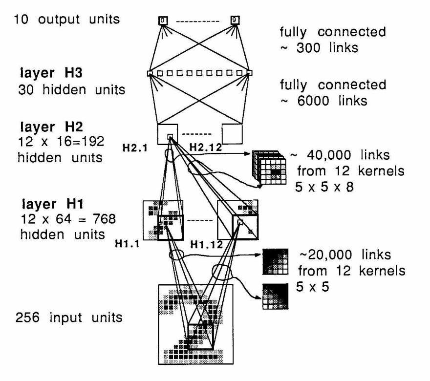

The network has three hidden layers H1, H2, and H3.

> Connections entering H1 and H2 are local and are heavily constrained.

H1 has 12 groups of 64 units arranged as 12 independent 8x8 feature maps. Each unit in a feature map has a 5x5 pixel input from the input plane.

> For units in layer H1 that are one unit apart, their receptive fields (in the input layer) are two pixels apart. Thus, the input image is _undersampled_ and some position information is eliminated.

Units of the same type of feature share weights across the image, whereas units across different features obviously don’t. Also, units don’t share their biases (even within a feature)

### Results

> Some kernels synthesized by the network can be interpreted as feature detectors remarkably similar to those found to exist in biological vision systems and/or designed into previous artificial character recognizers, such as spatial derivative estimators or off-center/on-surround type feature detectors.

Features that the network automatically converges to detecting match some feature times similar to how the brain operates or that were previously designed by humans.

> The first several stages of processing in our previous system involved convolutions in which the coefficients had been laboriously hand designed.

> In the present system, the first two layers of the network are constrained to be convolutional, but the system automatically learns the coefficients that make up the kernels.

> This “constrained back-propagation” is the key to success of the present system: it not only builds in shift-invariance, but vastly reduces the entropy, the Vapnik-Cervonenkis dimensionality, and the number of free parameters, thereby proportionately reducing the amount of training data required to achieve a given level of generalization performance.

Adding these constraints/priors into the network architecture significantly reduces the computational complexity of the problem, increases generalization, and completely eliminates the need to have humans laboriously craft individual features (and performs better).

### Conclusion

> We have successfully applied back-propagation learning to a large, real-world task.

> This work points out the necessity of having flexible “network design” software tools that ease the design of complex, specialized network architectures.

# AlexNet

📜 [ImageNet Classification with Deep Convolutional Neural Networks](https://proceedings.neurips.cc/paper_files/paper/2012/file/c399862d3b9d6b76c8436e924a68c45b-Paper.pdf)

> Despite the attractive qualities of CNNs, and despite the relative efficiency of their local architecture, they have still been prohibitively expensive to apply in large scale to high-resolution images.

> Luckily, current GPUs, paired with a highly-optimized implementation of 2D convolution, are powerful enough to facilitate the training of interestingly-large CNNs, and recent datasets such as ImageNet contain enough labeled examples to train such models without severe overfitting.

Efficient use of compute has always been critical to practically pushing the boundaries on deep learning effectively.

> In the end, the network’s size is limited mainly by the amount of memory available on current GPUs and by the amount of training time that we are willing to tolerate.

> All of our experiments suggest that our results can be improved simply by waiting for faster GPUs and bigger datasets to become available.

> ImageNet is a dataset of over 15 million labeled high-resolution images belonging to roughly 22,000 categories. The images were collected from the web and labeled by human labelers using Amazon’s Mechanical Turk crowd-sourcing tool.

### **Architecture**

**1. ReLU**

8 layers total - 5 convolutional layers, 3 fully-connected feed-forward layers

> Deep convolutional neural networks with ReLUs train several times faster than their equivalents with tanh units.

ReLU trains way faster than tanh because of the simplicity of differentiating it, which actually meaningfully contributes to the constraints.

Also importantly, it is a non-saturating nonlinearity - functions like sigmoid and tanh (saturating) compress inputs into [0,1], which means at large magnitudes, their gradient approaches 0. This causes the _vanishing gradient problem_. Meanwhile, ReLU never runs into this problem.

**2. Multiple GPUs**

> A single GTX 580 GPU has only 3GB of memory, which limits the maximum size of the network that can be trained on it. It turns out that 1.2 million training examples are enough to train networks which are too big to fit on one GPU. Therefore we spread the net across two GPUs.

> Current GPUs are particularly well-suited to cross-GPU parallelization, as they are able to read from and write to one another’s memory directly, without going through host machine memory.

> The parallelization scheme that we employ essentially puts half of the kernels (or neurons) on each GPU, with one additional trick: the GPUs communicate only in certain layers.

Communication between GPUs is tuned to be sensible for the amount of available compute (they were only using 2 GPUs). This was one of the first times someone really used multiple GPUs for training.

**3. Local Response Normalization**

> ReLUs have the desirable property that they do not require input normalization to prevent them from saturating.

Normalization is not a necessity to prevent saturation (whereas it is necessary with tanh and sigmoid because of their vanishing gradients at large values).

However, normalization still provides advantages.

> This sort of response normalization implements a form of lateral inhibition
> inspired by the type found in real neurons, creating competition for big activities amongst neuron outputs computed using different kernels.

They implement **local response normalization**. This prevents many kernels from firing on the same pixel, forcing more prominent features to stand out, and weaker features to be de-emphasized.

**4. Overlapping Pooling**

> Pooling layers in CNNs summarize the outputs of neighboring groups of neurons in the same kernel map. Traditionally, the neighborhoods summarized by adjacent pooling units do not overlap.

Instead, AlexNet uses overlapping pooling layers which improves regularization (less overfitting) and decreases loss.

**5. Overall Architecture**

> The first convolutional layer filters the 224×224×3 input image with 96 kernels of size 11×11×3 with a stride of 4 pixels.

> The second convolutional layer takes as input the (response-normalized and pooled) output of the first convolutional layer and filters it with 256 kernels of size 5 × 5 × 48.

> The third, fourth, and fifth convolutional layers are connected to one another without any intervening pooling or normalization layers.

> The third convolutional layer has 384 kernels of size 3 × 3 × 256 connected to the (normalized, pooled) outputs of the second convolutional layer. The fourth convolutional layer has 384 kernels of size 3 × 3 × 192 , and the fifth convolutional layer has 256 kernels of size 3 × 3 × 192.

### Regularization

**1. Dataset Augmentation**

> The easiest and most common method to reduce overfitting on image data is to artificially enlarge the dataset using label-preserving transformations

They train the model on 224 x 224 chunks of the 256 x 256 pixel images, and augment the intensities of the RGB channels to regularize.

**2. Dropout**

> Combining the predictions of many different models is a very successful way to reduce test errors, but it appears to be too expensive for big neural networks that already take several days to train.

We already know here the intuition behind multi-headed attention! Having multiple separate models run and develop their own intuitions, then combining their outputs is great where you can afford to do it.

> There is, however, a very efficient version of model combination that only costs about a factor of two during training. The recently-introduced technique, called “dropout”, consists of setting to zero the output of each hidden neuron with probability 0.5.

> This technique reduces complex co-adaptations of neurons, since a neuron cannot rely on the presence of particular other neurons.

Neurons can’t co-adapt with each other by becoming highly interdependent on other neurons to process (higher dimensional) features.

> It is, therefore, forced to learn more robust features that are useful in conjunction with many different random subsets of the other neurons.

Instead, dropout compels individual neurons to learn more broadly useful features that can be useful with any group of neurons.

> At test time, we use all the neurons but multiply their outputs by 0.5, which is a reasonable approximation to taking the geometric mean of the predictive distributions produced by the exponentially-many dropout networks.

Since the network was trained with 50% of the neurons active at one time, we expect to have 2x the total contributions at test time since all neurons are active, so we scale the outputs by 0.5.

> Without dropout, our network exhibits substantial overfitting. Dropout roughly doubles the number of iterations required to converge.

### Results & Discussion

> Our network achieves top-1 and top-5 test set error rates of 37.5% and 17.0%. The best performance achieved during the ILSVRC2010 competition was 47.1% and 28.2%.

Their model beats state of the art by far.

> The kernels on GPU 1 are largely color-agnostic, while the kernels
> on on GPU 2 are largely color-specific.

Each GPU (part of the network on each GPU, which you actually need to think about) tends to specialize to different types of kernels as they are isolated.

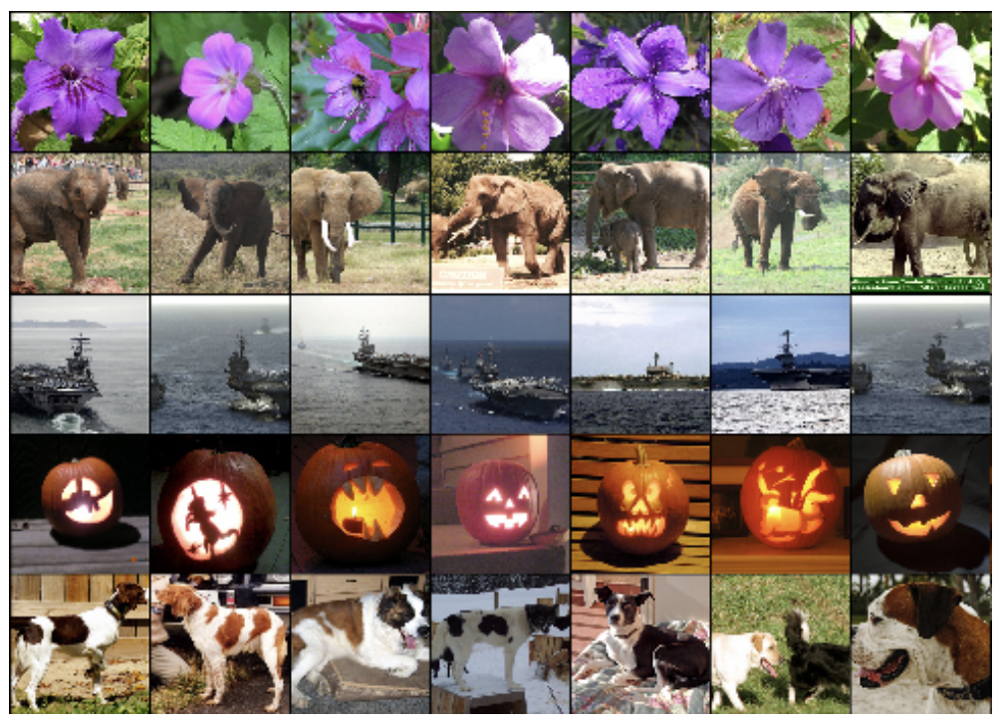

5 images in the training set with the 6 images closest to them based on the euclidian distance of the activations in the last layer (showing that later layers have combined data to form similarity calls between images).

> Our results show that a large, deep convolutional neural network is capable of achieving record-breaking results on a highly challenging dataset using purely supervised learning.

> It is notable that our network’s performance degrades if a single convolutional layer is removed. For example, removing any of the middle layers results in a loss of about 2% for the top-1 performance of the network. So the depth really is important for achieving our results.

Depth is critical for the network to work effectively.

# ResNet

📜 [Deep Residual Learning for Image Recognition](https://arxiv.org/abs/1512.03385)

> We explicitly reformulate the layers as learning residual functions with reference to the layer inputs, instead of learning unreferenced functions. We provide comprehensive empirical evidence showing that these residual networks are easier to optimize, and can gain accuracy from considerably increased depth.

Residuals are the answer to enabling much deeper neural networks with many layers (which empirically has shown to be critical to improvement) while still enabling successful optimization.

> Driven by the significance of depth, a question arises: _Is learning better networks as easy as stacking more layers?_

The vanishing/exploding gradient problem has made it hard to answer this - but **normalized initialization** and **intermediate normalization layers** (like BatchNorm) have solved this problem.

However, while this has enabled deeper networks to converge, they suffer from _degradation_, where accuracy decreases after a certain point of increasing depth even on the training set.

> There exists a solution by construction to the deeper model: the added layers are identity mapping, and the other layers are copied from the learned shallower model.

Here, they provide a thought experiment to show that a deeper neural network is capable of modeling something at least as good as it’s shallower counter-part by simply turning any additional layers into identity mapping layers that just directly map their inputs to their outputs.

This is partly where the intuition for residuals comes from.

> Instead of hoping each few stacked layers directly fit a desired underlying mapping, we explicitly let these layers fit a residual mapping.

Here is the core intuition behind residuals.

Most feed-forward networks or layers attempt to learn some underlying desired function $H(x)$ by trying to learn the entire transformation $x → H(x)$ directly.


Instead, residuals allow the network to instead try to learn the necessary _residual_ instead, the different from the current output, or just the transformation $F(x)$ where $F(x) = H(x) - x$.

Then, the output of the layer computes $H(x) = F(x) + x$, adding back $x$ to the computed residual.

In the limit, this means that it’s very easy for the network to learn the identity function by making $F(x)$ effect converge to 0 where necessary.

Critically, this also propagates gradients back throughout the residual pathway effectively as the gradient from the output of the layer gets propagated back to the previous layer via $x$ due to the addition in $H(x)$.

These **shortcut connections** or **skip connections** provide no extra parameters to the network or training complexity, meaning SGD can still be used for the whole thing.

> We show that: 1) Our extremely deep residual nets are easy to optimize, but the counterpart “plain” nets (that simply stack layers) exhibit higher training error when the depth increases; 2) Our deep residual nets can easily enjoy accuracy gains from greatly increased depth, producing results substantially better than previous networks.

### Deep Residual Learning

> If one hypothesizes that multiple nonlinear layers can asymptotically approximate complicated functions, then it is equivalent to hypothesize that they can asymptotically approximate the residual functions, i.e., $H(x) − x$.

> So rather than expect stacked layers to approximate $H(x)$, we explicitly let these layers approximate a residual function $F(x) := H(x) − x$. The original function thus becomes $F(x)+x$.

> Although both forms should be able to asymptotically approximate the desired functions (as hypothesized), the ease of learning might be different.

> The degradation problem suggests that the solvers might have difficulties in approximating identity mappings by multiple nonlinear layers. With the residual learning reformulation, if identity mappings are optimal, the solvers may simply drive the weights of the multiple nonlinear layers toward zero to approach identity mappings.

Residuals make it easy for the network to drive certain layers down to the identity, meaning that even networks with too much depth for the actual problem should still be able to maintain high accuracy.

> The dimensions of $x$ and $F$ must be equal. If this is not the case (e.g., when changing the input/output channels), we can perform a linear projection $W_s$ by the shortcut connections to match the dimensions.

$y = F(x, {W_i}) + W_sx$

### Results


In the standard network, the 34-layer performs more poorly than the 18-layer in training, demonstrating degradation.

Meanwhile, the ResNet prevents degradation and the 34-layer actually performs better.

There are three important findings here:

> More importantly, the 34-layer ResNet exhibits considerably lower training error and is generalizable to the validation data. This indicates that the degradation problem is well addressed in this setting and we manage to obtain accuracy gains from increased depth.

> Compared to it’s plain counterpart, the 34-layer ResNet reduces the top-1 error by 3.5%, resulting from the successfully reduced training error. This comparison verifies the effectiveness of residual learning on extremely deep systems.

> Last, we also note that the 18-layer plain/residual net are comparably accurate, but the 18-layer ResNet converges faster (Fig. 4 right vs. left). When the net is “not overly deep” (18 layers here), the current SGD solver is still able to find good solutions to the plain net. In this case, the ResNet eases the optimization by providing faster convergence at the early stage.

Even when residuals aren’t necessary for the network to converge properly, residuals still make convergence significantly faster.

> But the small differences among A/B/C indicate that projection shortcuts are
> not essential for addressing the degradation problem.

In terms of identity vs. projection shortcuts ($W_s$ is the identity matrix or different), projection shortcuts make insignificant difference in the residuals. The only time projection shortcuts are necessary is when dimensions are different.

# ReLU

📜 [Deep Sparse Rectified Neural Networks](https://www.researchgate.net/publication/215616967_Deep_Sparse_Rectifier_Neural_Networks)

> Many differences exist between the neural network models used by machine learning researchers and those used by computational neuroscientists.

This paper highlights the importance of areas where both neuroscience and machine learning researches are both interested, which point toward “computationally motivated principles of operation in the brain that can also enhance research in artificial intelligence”

ReLU apparently bridges two of the gaps between neuroscience and practical ML.

The backdrop of this paper is a world where an unsupervised pre-training step for all supervised learning tasks helped with weight initialization in regularization and these networks (like deep belief networks) performed significantly better on supervised learning tasks than networks without this step.

ReLU is an attempt to close this gap in performance.

### Background

**1. Neuroscience Observations**

> Studies on brain energy expense suggest that neurons encode information in a sparse and distributed way.

Only around 1-4% of neurons are active at a time. This is a trade-off between “richness of representation” and low energy expenditure for action potentials.

The sigmoid activation does not enable this, as it has a “steady-state regime around 1/2,” (small inputs get squashed to around 0.5) so all neurons fire at their saturation, which is biologically implausible and hurts optimization.

Meanwhile, a common biological neuron activation function is the leaky integrate-and-fire which has a zero threshold.

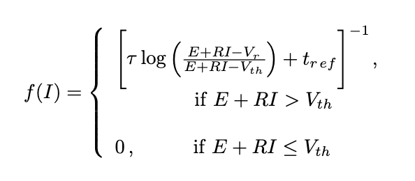

**2. Sparsity**

> We show here that using a rectifying non-linearity gives rise to real zeros of activations and thus truly sparse representations.

This has the following benefits:

(1) Information disentangling

> One of the claimed objectives of deep learning algorithms is to disentangle the factors explaining the variations in the data.

Without zeroing weights, any change in input modifies all parts of the representation. If the representation is instead sparse and robust to small input changes, the set of non-zero features is mostly conserved for small changes.

(2) Efficient variable-size representation

> Varying the number of active neurons allows a model to control the effective dimensionality of the representation for a given input and the required precision.

Different inputs may contain a different about of information and should be represented by a variable size vector. Sparse coding allows the network to adapt to this need.

(3) Linear separability

> Sparse representations are also more likely to be linearly separable

Which is good because linear separation is computationally simpler of a decision function to learn

(4) Distributed but sparse

> Dense distributed representations are the richest representations, being potentially exponentially more efficient than purely local ones. Sparse representations’ efficiency is still exponentially greater, with the power of the exponent being the number of non-zero features.

Less activations to compute in feed-forward means less computation. But more importantly, more zeroed values means tons of values don’t need to be computed in back-propagation which is efficient.

> Nevertheless, forcing too much sparsity may hurt predictive performance for an equal number of neurons, because it reduces the effective capacity of the model.

### Deep Rectifier Networks

**1. Advantages of Rectifier Neurons**

The rectifier activation function $\textrm{rectifier}(x) = \textrm{max}(0,x)$ allows a network to easily obtain sparse representations.

For example, on initialization ~50% of the hidden units output values will be zeroes.

> Apart from being more biologically plausible, sparsity also leads to mathematical advantages.

> For a given input, only a subset of neurons are active. Computation is. linear on this subset. Once the subset of neurons is selected, the output is a linear function of the input.

> We can see the model as an _exponential number of linear models that share parameters_.

> Because of this linearity, gradients flow well on the active paths of neurons (there is no gradient vanishing effect due to the activation non-linearities of sigmoid or tanh units).

> Computations are also cheaper: there is no need for computing the exponential function in activations, and sparsity can be exploited.

ie. the derivative of ReLU is computationally cheaper than tanh and sigmoid when you do have to calculate it, and most of the outputs are zeroed anyway so you don’t even have to calculate them.

**2. Potential Problems**

> One may hypothesize that the hard saturation at 0 may hurt optimization by blocking gradient back-propagation

They tried soft-plus as a way to test this. It’s not an issue - hard zeros actually help supervised training.

> We hypothesize that the hard non-linearities do not hurt _so long as the gradient can propagate along some paths_.

> With the _credit and blame assigned to these ON units_ rather than distributed more evenly, we hypothesize that optimization is easier.

> Another problem could arise due to the unbounded behavior of activations; one may thus want to use a regularizer to prevent potential numerical problems.

So they use the $L_1$ penalty on the activation values which also promotes additional sparsity.

### Conclusion

> Sparsity and neurons operating mostly in a linear regime can be brought together in more biologically plausible deep neural networks

> Rectifier units help to bridge the gap between unsupervised pre-training and no pre-training, which suggests that they may help in finding better minima during training.

> Furthermore, rectifier activation functions have shown to be remarkably adapted to sentiment analysis, a text-based task with a very large degree of data sparsity.

# Batch Normalization

📜 [Batch Normalization: Accelerating Deep Network Training by Reducing Internal Covariate Shift](https://arxiv.org/pdf/1502.03167)

> Training Deep Neural Networks is complicated by the fact that the distribution of each layer’s inputs changes during training, as the parameters of the previous layers change.

> This slows down the training by requiring lower learning rates and careful parameter initialization, and makes it notoriously hard to train models with saturating non-linearities.

Later layers depend on previous layers for their inputs, meaning the input distribution changes very quickly for later layers as earlier layers learn - potentially rendering much of their earlier learning useless.

This means models require lower learning rates so small changes can be made over time.

> We refer to this phenomenon as **internal covariate shift**, and address the problem by normalizing layer inputs. Our method draws its strength from making normalization a part of the model architecture and performing the normalization for each training mini-batch.

Normalization is part of the actual model rather than just a weight decay penalty on the cost function.

> **Batch Normalization** allows us to use much higher learning rates and
> be less careful about initialization. It also acts as a regularizer, in some cases eliminating the need for Dropout.

Deep learning using SGD with mini-batches has become popular, as approximating gradient steps across batches is more efficient than individual examples due to parallelization and better estimation of correct gradients for the whole dataset (which increases with batch size)

However, the internal covariate shift problem strikes here, forcing us to use low learning rates.

Additionally, the distribution of nonlinearities can easily get stuck in the high saturation regime (weight decay helps with this somewhat).

> If, however, we could ensure that the distribution of nonlinearity inputs remains more stable as the network trains, then the optimizer would be less likely to get stuck in the saturated regime, and the training would accelerate.

> Eliminating [internal covariate shift] offers a promise of faster training.

This is because you can use higher learning rates since there’s less overshooting and incorrect optimization due to shifting input distributions.

> **Batch normalization** dramatically accelerates the training of deep neural nets. It accomplishes this via a normalization step that fixes the means and variances of layer inputs.

> Batch normalization also has a beneficial effect on the gradient flow through the network, by reducing the dependence of gradients on the scale of parameters or of their initial values. This allow us to use much higher learning rates without the risk of divergence.

Scaling to the same input distribution means that parameter scales don’t vary too much, meaning gradients don’t get outsized affects to parameter scales as much as they do to the relative importance of features.

> Furthermore, batch normalization regularizes the model and reduces the need for Dropout

> Finally, Batch Normalization makes it possible to use saturating nonlinearities by preventing the network from getting stuck in the saturated modes.

### Towards Reducing Internal Covariate Shift

> We would like to ensure that, for any parameter values, the network _always_ produces activations with the desired distribution.

We could propose a normalization $\hat{x} = \textrm{Norm}(x, X)$ that normalizes not just based on the current input but normalizes it relative to the entire dataset, meaning gradients would need to be computed against the entire dataset.

> We want to preserve the information in the network, by normalizing the activations in a training example relative to the statistics of the entire training data.

### Normalization via Mini-Batch Statistics

Since normalizing across each layer’s inputs across the entire dataset is costly, we make two simplifications.

> The first is that instead of whitening the features in layer inputs and outputs jointly, we will normalize each scalar feature independently, by making it have the mean of zero and variance of 1.

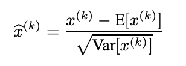

Here, we normalize the inputs to each layer at the level of each neuron, across training examples from the entire dataset.

> Note that simply normalizing each input of a layer may change what the layer can represent.

This is because squashing the input values to the activation function to a limited range can limit expression of activation functions to only specific features - for example in sigmoid, squashing would “constrain activations to the linear regime of the nonlinearity.”

> To address this, we make sure that _the transformation in the network can represent the identity transform._

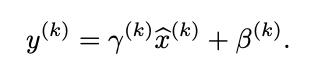

So the model can learn some transform back on the batch normalized inputs before passing through activation that can eventually rescale them back to their original values if necessary, by setting $\gamma^{(k)} = \sqrt{\textrm{Var}[x^{(k)}]}$ and $\beta^{(k)} = \textrm{E}[x^{(k)}]$ to reverse the effect of the normalization.

Additionally, doing this entire normalization across the whole dataset would be expensive.

> Therefore, we make the second simplification: since we use mini-batches in stochastic gradient training, _each mini-batch produces estimates of the mean and variance_ of each activation.

In contrast to previous normalization work, this approach does _not_ use joint covariance matrices, which is convenient since the mini-batch size is usually smaller than the number of neurons in a layer, which would cause issues in the calculation of the inverse.

> $\textrm{BN}_{\gamma, \beta}(x)$ depends on the training example and the other examples in the mini-batch.

> This ensures that as the model is training, layers can continue learning on input distributions that exhibit less internal covariate shift, thus accelerating the training.

**1. Training and Inference with Batch Normalized Networks**

> The normalization of activations that depends on the mini-batch allows efficient training, but is neither necessary nor desirable during inference.

Once training is complete, we just use normalization across the entire population, rather than mini-batch statistics.

> Since the means and variances are fixed during inference, the normalization is simply a linear transform applied to each activation.

**3. Batch Normalization Enables Higher Learning Rates**

> By normalizing activations throughout the network, it prevents small changes to the parameters from amplifying into larger and suboptimal changes in activations and gradients.

> Batch normalization also makes training more resilient to the parameter scale. Normally, learning rates may increase the scale of layer parameters, which then amplify the gradient back-propagation and lead to the model explosion.

Batch normalization does not do this, as scaling parameters does not affect it’s outputs $\textrm{BN}(Wu) = \textrm{BN}((aW)u)$.

**4. Batch Normalization Regularizes the Model**

> When training with Batch Normalization, a training example is seen in conjunction with other examples in the mini-batch, and the training network no longer producing deterministic values for a given training example

The outputs for a single input in training are non-deterministic on the model weights because the other inputs in their batch affect their activations - this helps with regularization.

> Whereas Dropout is typically used to reduce overfitting, in a batch-normalized network, we found that it can be either removed or reduced in strength.

### Experiments

**1. Activations Over Time**

Batch normalization networks for MNIST converged far faster, and have higher test accuracy overall.

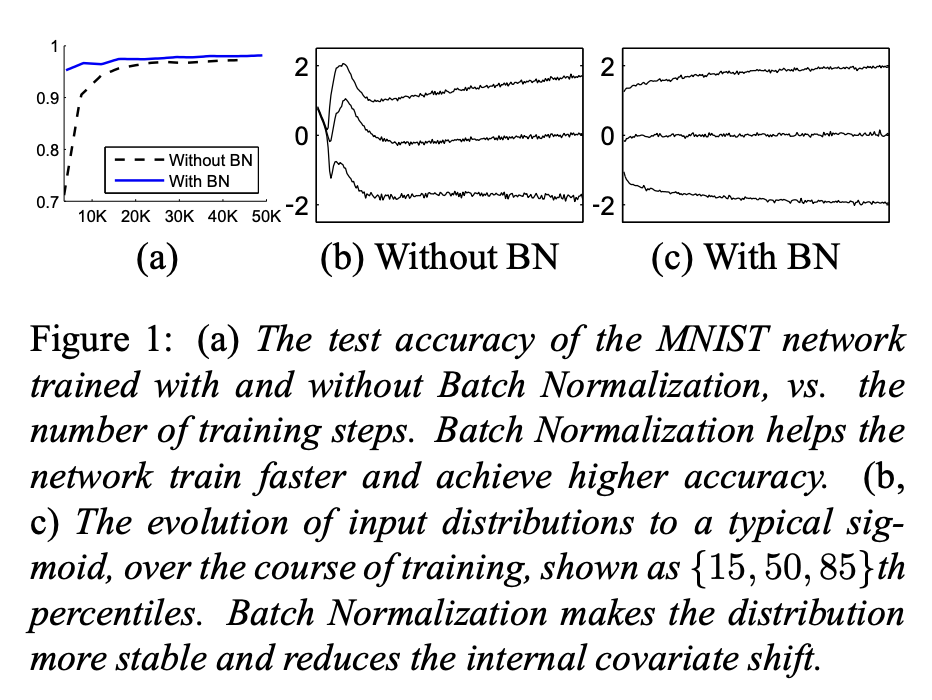

**2. Accelerating BN networks**

Just adding Batch Normalization to a network does not take full advantage of what it has to offer. To maximize improvements and efficiency, the following steps were taken:

(1) _Increase learning rate with no ill side effects_

(2) _Remove dropout_ - BN speeds up training without increasing overfitting

(3) _Reduce the $L_{2}$ weight regularization\_ - since weight decay isn’t needed as much since activations are already scaled to be low

(4) _Accelerate the learning rate decay_

(5) R*emove local response normalization* - in CNNs, can reduce local response normalization (lateral inhibition) as normalization already accomplishes this.

(6) _Shuffle training examples more thoroughly_ - this is consistent with the model of BN as a regularizer.

(7) _Reduce the photometric distortions_ - since BN allows the networks to train faster and observe each training example fewer times, we let the model focus more on real images and don’t distort them as much.

### Conclusion

> We have presented a novel mechanism for dramatically accelerating the training of deep networks. It is based on the premise that covariate shift, which is known to complicate the training of machine learning systems, also applies to sub-networks and layers, and removing it from internal activations of the network may aid in training.

> Our proposed method draws its power from normalizing activations, and from incorporating this normalization in the network architecture itself. This ensures that the normalization is appropriately handled by any optimization method that is being used to train the network.

Important that the normalization is part of the network so back-propagation has access to optimizing it’s parameters.

> Batch Normalization adds only two extra parameters per activation, and in doing so preserves the representation ability of the network.

> Merely adding Batch Normalization to a state-of-the art image classification model yields a substantial speedup in training.

> By further increasing the learning rates, removing Dropout, and applying other modifications afforded by Batch Normalization, we reach the previous state of the art with only a small fraction of training steps - and then beat the state of the art in single-network image classification.

> Furthermore, by combining multiple models trained with Batch Normalization, we perform better than the best known system on ImageNet, by a significant margin.

# Layer Normalization

📜 [Layer Normalization](https://arxiv.org/pdf/1607.06450)

> The effect of batch normalization is dependent on the mini-batch size and it is not obvious how to apply it to recurrent neural networks.

> Unlike batch normalization, layer normalization performs exactly the same computation at training and test times.

> It is also straightforward to apply to recurrent neural networks by computing the normalization statistics separately at each time step.

> It is possible to speed-up the learning by computing gradients for different subsets of the training cases on different machines or splitting the neural network itself over many machines.

> An orthogonal approach is to modify the computations performed in
> the forward pass of the neural net to make learning easier.

Work hard vs. work smart. You can throw more compute at your current architecture, but you can also improve your architecture to make training more efficient. Architectural efficiency increases the leverage on your compute.

> The summed inputs to the recurrent neurons in a recurrent neural network (RNN) often vary with the length of the sequence so applying batch normalization to RNNs appears to require different statistics for different time-steps.

For RNNs, you can’t normalize across the entire input space, as inputs at each time-step are completely different.

Batch normalization requires normalizing across an input space where normalization is actually statistically coherent. Normalizing across all inputs in RNNs does not make sense.

> Furthermore, batch normalization cannot be applied to online learning tasks or to extremely large distributed models where the mini-batches have to be small.

Batch normalization doesn’t work in _online learning_ cases where data isn’t processed in batches, and also in distributed models where mini-batches are kept small due to limited memory, which affects the statistical accuracy of normalizing across a mini-batch as an approximation for the distribution of the whole dataset.

### Layer Normalization

> We now consider the layer normalization method which is designed to overcome the drawbacks of batch normalization.

> The “covariate shift” problem can be reduced by fixing the mean and the variance of the summed inputs within each layer.

As this also acts as an equivalent way to make sure that the input distributions of the next layer are more consistent, which is the real end goal.

**1. Layer normalized recurrent neural networks**

Batch normalization in recurrent networks cause problems since sequences of different sentence lengths are often used for different training cases.

> Layer normalization does not have such problem because its normalization terms depend only on the summed inputs to a layer at the current time-step.

Layer normalization doesn’t face these issues and makes normalization compatible with recurrence.

> In a standard RNN, there is a tendency for the average magnitude of the summed inputs to the recurrent units to either grow or shrink at every time-step, leading to exploding or vanishing gradients.

> In a layer normalized RNN, the normalization terms make it invariant to re-scaling all of the summed inputs to a layer, which results in much more stable hidden-to-hidden dynamics.

### Analysis

**1. Invariance under weights and data transformations**

> [All normalizations] can be summarized as normalizing the summed inputs $a_i$ to a neuron through the two scalars $\mu$ and $\sigma$. They also learn an adaptive bias $b$ and gain $g$ for each neuron after the normalization.

The final model of a neurons activation is $h_i = f(\frac{g_i}{\sigma_i}(a_i - \mu_i) + b_i)$ where $f$ is the activation function.

In layer normalization and batch normalization, $\mu$ and $\sigma$ are computed as mean and variance. In weight normalization, $\mu = 0$ and $\sigma$ is the $L_2$ norm of the weights.

**2. Weight re-scaling and re-centering**

> First, observe that under batch normalization and weight normalization, any re-scaling to the incoming weights $w_i$ of a single neuron has no effect on the normalized summed inputs to a neuron.

Scaling incoming weights has no effect due to the fact that individual neurons are normalized across examples in batch normalization, so changes in weights have an equivalent effect on all inputs to normalization.

> Layer normalization, on the other hand, is not invariant to the individual scaling of the single weight vectors.

This is because as weights of one neuron change, the activations get relatively larger, causing them to be scaled differently.

> Instead, layer normalization is invariant to scaling of the entire weight matrix and invariant to a shift to all of the incoming weights in the weight matrix.

Absolute weight changes don’t matter, but relative weight changes do.

> Notice that if normalization is only applied to the input before the weights, the model will not be invariant to re-scaling and re-centering of the weights.

**3. Data re-scaling and re-centering**

> All the normalization methods are invariant to re-scaling the dataset.

**3. Geometry of parameter space during learning**

> We show that the normalization scalar $\sigma$ can implicitly reduce learning rate and makes learning more stable.

> The normalization methods, therefore, have an implicit “early stopping” effect on the weight vectors and help to stabilize learning towards convergence.

> Learning the magnitude of incoming weights in the normalized model is therefore, more robust to the scaling of the input and its parameters than in the standard model.

### Experimental Results

> Unless otherwise noted, the default initialization of layer normalization is to set the adaptive gains to 1 and the biases to 0 in the experiments.

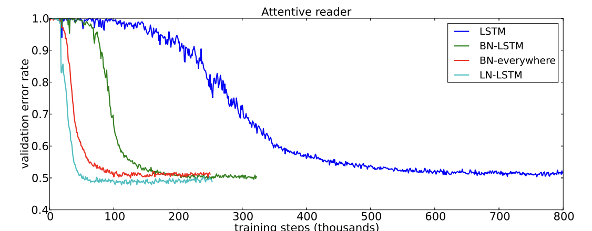

Here we see LN more efficient than BN and base model in converging.

They proceed to cove many language experiments where Layer Normalization is empirically the best approach.

> We have also experimented with convolutional neural networks. In our preliminary experiments, we observed that layer normalization offers a speedup over the baseline model without normalization, but batch normalization outperforms the other methods.

For now, it appears that Layer Normalization is more effective than Batch Normalization primarily in sequence-based language-modeling tasks.

### Conclusion

> We provided a theoretical analysis that compared the invariance properties of layer normalization with batch normalization and weight normalization.

> We showed that layer normalization is invariant to per training-case feature shifting and scaling.

> Empirically, we showed that recurrent neural networks benefit the most from the proposed method especially for long sequences and small mini-batches.

# Dropout

📜 [Dropout: A Simple Way to Prevent Neural Networks from Overfitting](https://jmlr.org/papers/volume15/srivastava14a/srivastava14a.pdf)

> With limited training data, however, many of these complicated relationships will be the result of sampling noise, so they will exist in the training set but not in real test data even if it is drawn from the same distribution. This leads to overfitting and many methods have been developed for reducing it.

A deep neural network will learn complex relationships observed within the training data, but many of these relationships will be due to noise and not true behaviors in the data-generating distribution, leading to overfitting.

> With unlimited computation, the best way to “regularize” a fixed-sized model is to average the predictions of all possible settings of the parameters, weighting each setting by its posterior probability given the training data.

If we had infinite computation, the best possible way to achieve regularization would be to average the predictions of every possible configuration of the parameters of the model weighted by how accurate the predictions of each model are with the training set.

In practice, this means that averaging the predictions of all the configurations of the model that actually accurately predict the results in the training set (all possible interpretations of the training data).

The commonalities between these models would be the actual properties of the data generating distribution, and the differences (cancelled out by the averages) represent the degrees of freedom/inaccuracies that come from noise.

> We would like to approach the performance of the Bayesian gold standard using considerably less computation. We propose to do this by approximating an equally weighted geometric mean of the predictions of an exponential number of learned models that share parameters.

A far more computationally efficient method than creating a large amount of separate models, trained separately, and then using this “ensemble” approach for prediction.

> Model combination nearly always improves the performance of machine learning methods.

> With large neural networks, however, the obvious idea of averaging the outputs of many separately trained nets is prohibitively expensive.

Having many models is the gold-standard (shows up in multi-headed attention), but the real constraint here is compute.

> Combining several models is most helpful when the individual models are different from each other and in order to make neural net models different, they should either have different architectures or be trained on different data.

A design philosophy. Seems like this does not correspond with multi-headed attention though.

> Training many different architectures is hard because finding optimal
> hyper-parameters for each architecture is a daunting task and training each large network requires a lot of computation.

> Moreover, large networks normally require large amounts of
> training data and there may not be enough data available to train different networks on different subsets of the data.

In practice, training multiple models is hard because there isn’t enough data, and hyper-parameter tuning all of them to be sufficiently different is hard.

> Dropout is a technique that addresses both these issues. It prevents overfitting and provides a way of approximately combining exponentially many different neural network architectures efficiently.

> Applying dropout to a neural network amounts to sampling a “thinned” network from it.

Dropout just involves killing some percentage of the neurons on each training step (turning them off).

> The idea is to use a single neural net at test time without dropout. The weights of this network are scaled-down versions of the trained weights. If a unit is retained with probability p during training, the outgoing weights of that unit are multiplied by p at test time.

All neurons are used at test time, just scaling the weights down by the same factor as the percentage of neurons dropped out during training.

### Motivation

> A motivation for dropout comes from a theory of the role of sex in evolution.

> One possible explanation for the superiority of sexual reproduction is that, over the long term, the criterion for natural selection may not be individual fitness but rather mix-ability of genes. The ability of a set of genes to be able to work well with another random set of genes makes them more robust. Since a gene cannot rely on a large set of partners to be present at all times, it must learn to do something useful on its own or in collaboration with a small number of other genes.

> Similarly, each hidden unit in a neural network trained with dropout must learn to work with a randomly chosen sample of other
> units. This should make each hidden unit more robust and drive it towards creating useful features on its own without relying on other hidden units to correct its mistakes.

> However, the hidden units within a layer will still learn to do different things from each other

Cool, and interesting - but these all look like a post-rationalization of the strategy that worked empirically. Was this actually even what led to the idea? Or is this just a narrative added onto it retrospectively?

### Related Work

> Our work extends this idea by showing that dropout can be effectively
> applied in the hidden layers as well and that it can be interpreted as a form of model averaging.

> In dropout, we minimize the loss function stochastically under a noise distribution. This can be seen as minimizing an expected loss function.

### Model Description

In dropout, you just sample from a distribution to decide whether each neuron will actually contribute its output to the next layer.

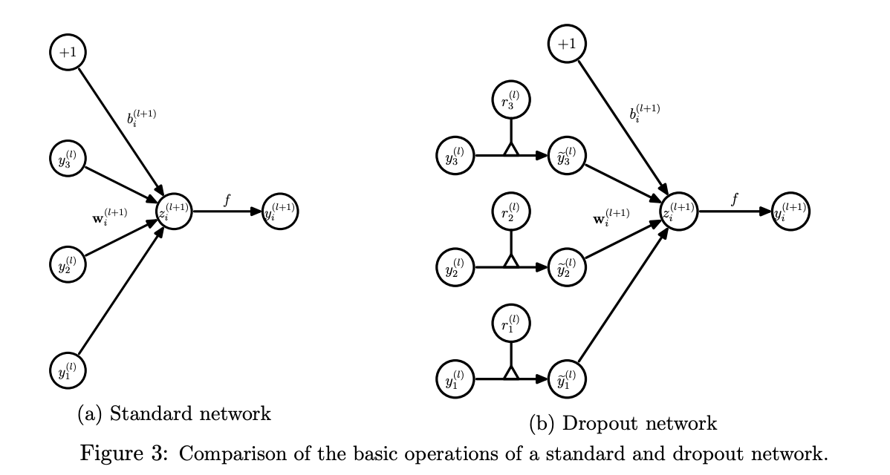

### Learning Dropout Nets

**1. Backpropagation**

> Dropout neural networks can be trained using stochastic gradient descent in a manner similar to standard neural nets. The only difference is that for each training case in a mini-batch, we sample a thinned network by dropping out units. Forward and backpropagation for that training case are done only on this thinned network.

> One particular form of regularization was found to be especially useful for dropout—constraining the norm of the incoming weight vector at each hidden unit to be upper bounded by a fixed constant c.

While dropout only selects a subset of input neurons as its input, the max-norm constraint makes sure that the remaining active inputs don’t have inputs of too large a magnitude by making sure they’re scaled below a certain max constant.

> Although dropout alone gives significant improvements, using dropout along with max-norm regularization, large decaying learning rates and high momentum provides a significant boost over just using dropout.

### Experimental Results

> We found that dropout improved generalization performance on all data sets compared to neural networks that did not use dropout.

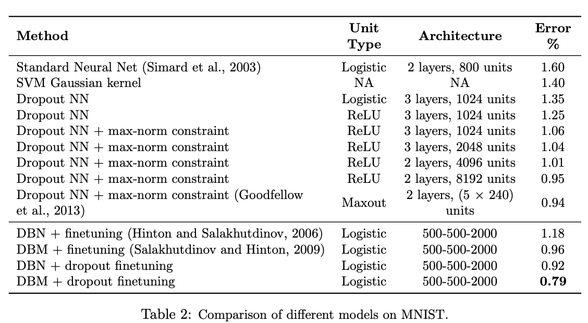

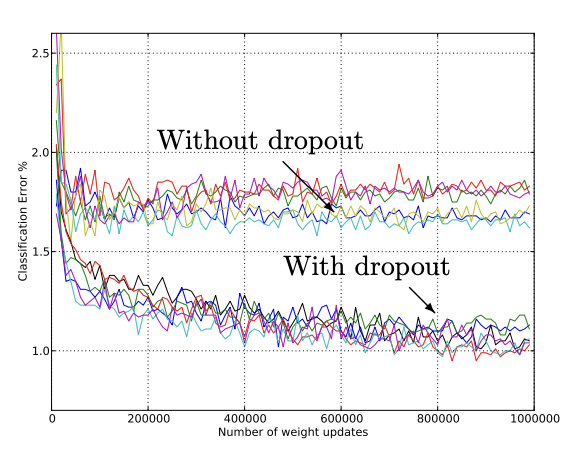

### Salient Features

> The advantages obtained from dropout vary with the probability of retaining units, size of the network, and the size of the training set.

**1. Effect on Features**

> Therefore, units may change in a way that they fix up the mistakes of the other units. This may lead to complex co-adaptations. This in turn leads to overfitting because these co-adaptations do not generalize to unseen data.

Units can co-adapt with each others predictions, which we don’t want because they are ungeneralized (they fix issues in the training set, but aren’t necessarily learning individually robust features).

> We hypothesize that for each hidden unit, dropout prevents co-adaptation by making the presence of other hidden units unreliable.

Hidden units have to perform well on their own in a wide variety of context since they can’t depend on the presence of any other specific neurons.

The results of the below chart are insane. The level of robustness and specificity of features promoted by dropout is so clear.

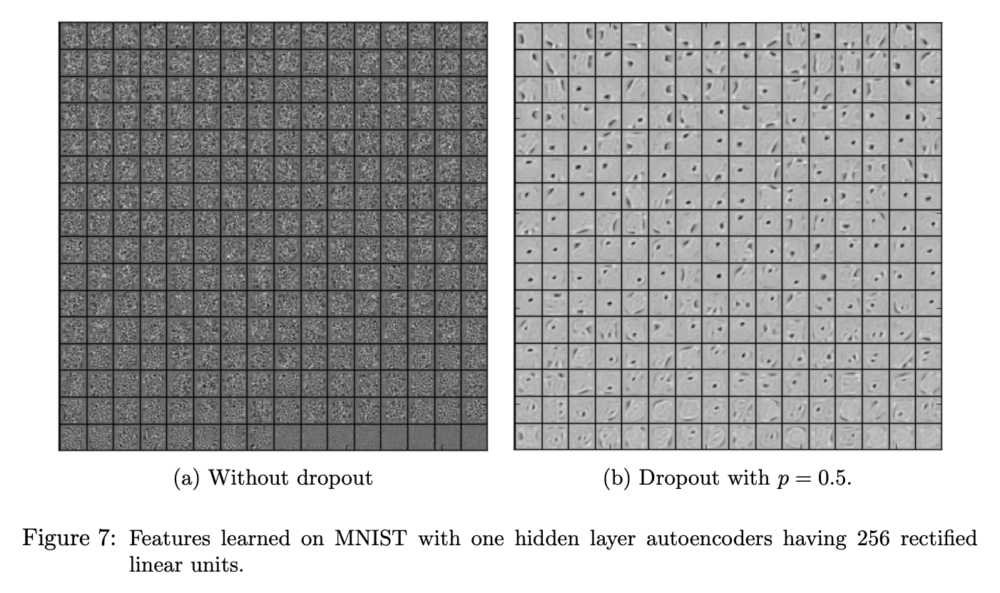

**2. Effect on Sparsity**

> We found that as a side-effect of doing dropout, the activations of the hidden units become sparse, even when no sparsity inducing regularizers are present. Thus, dropout automatically leads to sparse representations.

> In a good sparse model, there should only be a few highly activated units for any data case.

You want different neurons/groups of neurons to learn independent features, and have them fire separately (sparsity & linear separability).

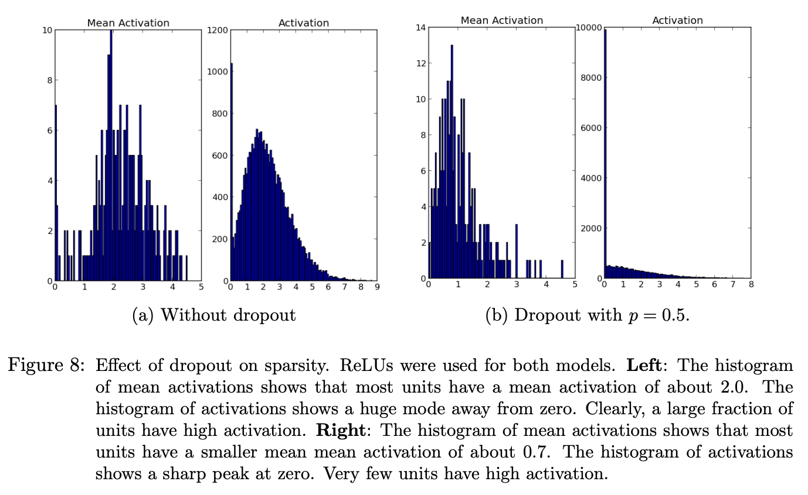

**3. Effect of Dropout Rate**

It appears that $0.4 \leq p \leq 0.8$ appears to be optimal. Factoring in scaling the network size to be appropriate for different $p$ values, it appears that $p = 0.6$ is around optimal.

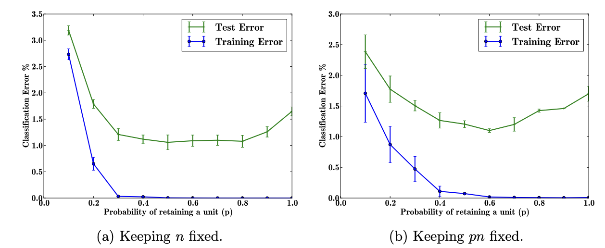

**4. Effect of Data Set Size**

> One test of a good regularizer is that it should make it possible to get good generalization error from models with a large number of parameters trained on small data sets.

Good regularization should mean that even a large model with a lot of capacity to potentially overfit, still does not actually overfit.

> As the size of the data set is increased, the gain from doing dropout increases up to a point and then declines.

> This suggests that for any given architecture and dropout rate, there is a “sweet spot” corresponding to some amount of data that is large enough to not be memorized in spite of the noise but not so large that overfitting is not a problem anyways.

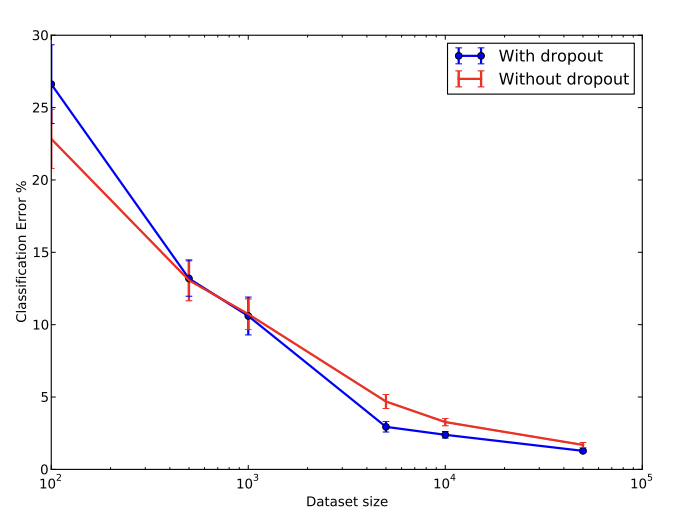

### Multiplicative Gaussian Noise

> Dropout involves multiplying hidden activations by Bernoulli distributed random variables which take the value 1 with probability p and 0 otherwise. This idea can be generalized by multiplying the activations with random variables drawn from other distributions.

The idea of dropout doesn’t require the Bernoulli distribution - it requires sampling from any external distribution to mask some percentage of the neurons at each training step.

> We recently discovered that multiplying by a random variable drawn from N (1, 1) works just as well, or perhaps better than using Bernoulli noise.

Sample from the Gaussian distribution appears to work just as well.

### Conclusion

> This technique was found to improve the performance of neural nets in a wide variety of application domains including object classification, digit recognition, speech recognition, document classification and analysis of computational biology data.

> This suggests that dropout is a general technique and is not specific to any domain.

> One of the drawbacks of dropout is that it increases training time. A dropout network typically takes 2-3 times longer to train than a standard neural network of the same architecture. A major cause of this increase is that the parameter updates are very noisy. Each training case effectively tries to train a different random architecture. Therefore, the gradients that are being computed are not gradients of the final architecture that will be used at test time.

Dropout takes significantly longer in training time (increases time to convergence) because gradient descent is effectively trying to train many different networks at once.

> However, it is likely that this stochasticity prevents overfitting. This creates a trade-off between overfitting and training time. With more training time, one can use high dropout and suffer less overfitting.

# GELU

📜 [Gaussian Error Linear Units (GELUs)](https://arxiv.org/pdf/1606.08415)

> Despite having less of a statistical motivation, the ReLU remains a competitive engineering solution which often enables faster and better convergence than sigmoids.

> Nonlinearities and dropout thus determine a neuron’s output together, yet the two innovations have remained distinct.

> [GELU] relates to stochastic regularizers in that it is the expectation of a modification to Adaptive Dropout.

### GELU Formulation

> We motivate our activation function by combining properties from dropout, zone-out, and ReLUs.

The paper introduces a stochastic regularizer that multiplies a neuron input $x$ by $m \sim \text{Bernoulli}(\Phi(x))$ where $\Phi(x)$ is the CDF of the Gaussian distribution (standard normal distribution).

> We choose this distribution since neuron inputs tend to follow a normal distribution, especially with Batch Normalization.

> In this setting, inputs have a higher probability of being “dropped” as x decreases, so the transformation applied to x is stochastic yet depends upon the input.

Here, we have something similar to adaptive dropout, where the probability of dropout is not constant, but instead is dependent on the input value (more “important” inputs, as determined their relative scale after normalization are less likely to be dropped out).

In order to motivate our non-linearity, we create a deterministic version of this function $\textrm{GELU}(x) = x \Phi(x)$.

With this function, $x$ gets closer to the identity as the CDF gets higher, and $x$ gets closer to being zeroed as the CDF gets lower. Asymptotically, this distribution behaves the same as ReLU.

> Loosely, this expression states that we scale x by how much greater it is than other inputs.

Basically, $x$ gets prioritized to be mapped to the identity function if it is originally much larger than the other inputs to normalization, and thus is normalized to a higher value.

### Discussion

> For example, as σ → 0 and if µ = 0, the GELU becomes a ReLU.

> More, the ReLU and GELU are equal asymptotically

> In fact, the GELU can be viewed as a way to smooth a ReLU.

> This non-convex, non-monotonic function is not linear in the positive domain and exhibits curvature at all points. Meanwhile ReLUs and ELUs, which are convex and monotonic activations, are linear in the positive domain and thereby can lack curvature. As such, increased curvature and non-monotonicity may allow GELUs to more easily
> approximate complicated functions than can ReLUs or ELUs.

> We can see that the ReLU gates the input depending upon its sign, while the GELU weights its input depending upon how much greater it is than other inputs.

> In addition and significantly, the GELU has a probabilistic interpretation given that it is the expectation of a stochastic regularizer.

### Conclusion

> For the numerous datasets evaluated in this paper, the GELU exceeded the accuracy of the ELU and ReLU consistently, making it a viable alternative to previous nonlinearities.

# Adam

📜 [Adam: A Method for Stochastic Optimization](https://arxiv.org/pdf/1412.6980)

> The method is straightforward to implement, is computationally efficient, has little memory requirements, is invariant to diagonal rescaling of the gradients, and is well suited for problems that are large in terms of data and/or parameters.

> The hyper-parameters have intuitive interpretations and typically require little tuning.

> The focus of this paper is on the optimization of stochastic objectives. with high-dimensional parameters spaces.

> We propose Adam, a method for efficient stochastic optimization that only requires first-order gradients with little memory requirement. The method computes individual adaptive learning rates for different parameters from estimates of first and second moments of the gradients; the name Adam is derived from adaptive moment estimation.

The Adam optimizer combines the advantages of the AdaGrad and RMSProp optimization methods which came before it.

> Some of Adam’s advantages are that the magnitudes of parameter updates are invariant to rescaling of the gradient, its step-sizes are approximately bounded by the step-size hyper-parameter, it does not require a stationary objective, it works with sparse gradients, and it naturally performs a form of step size annealing.

### Algorithm

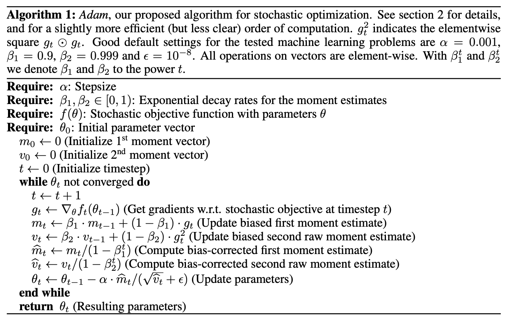

> The algorithm updates exponential moving averages of the gradient $(m_t)$ and the squared gradient $(v_t)$ where the hyper-parameters $\beta_1, \beta_2 \in [0, 1)$ control the exponential decay rates of these moving averages.

> The moving averages themselves are estimates of the 1st moment (the mean) and the 2nd raw moment (the uncentered variance) of the gradient.

**1. Adam’s Update Rule**

> An important property of Adam’s update rule is its careful choice of step-sizes.

> The effective step taken in parameter space at time-step $t$ is:
> $\Delta_t = \alpha \cdot \hat{m}_t / \sqrt{\hat{v}_t} + \hat{\epsilon}$

> The effective magnitude of the steps taken in parameter space at each time-step are approximately bounded by the step-size setting $\alpha$. This can be understood as establishing a trust region around the current parameter value, beyond which the current gradient estimate does not provide sufficient information.

The step-size, although estimated by the momentum, is effectively capped by the $alpha$ hyper-parameter.

> We often know in advance that good optima are with high probability within some set region in parameter space.

> We can often deduce the right order of magnitude of α such that optima
> can be reached from $\theta_0$ within some number of iterations.

Given that the optimal point is known to be within some sub-space, and the initial parameters can be known, it’s relatively tractable to estimate a good value of $\alpha$ for $\theta_0$ to converge within a given number of iterations.

> We will call the ratio $\hat{m}_t / \sqrt{\hat{v}_t}$ the _signal-to-noise_ ratio (SNR)

This value approximates how much the recent gradients have been pointing in the same direction/moving the same way vs. moving all over the place, which is a good approximation of how certain we can be that the current direction is the true correct gradient.

Then if it is, this should increase our step-size.

> For example, the SNR value typically becomes closer to 0 towards an optimum, leading to smaller effective steps in parameter space.

### Initialization Bias Correction

We can represent the update at time-step $t$ of the exponential moving average of the second moment as $v_t = (1 - \beta_2) \sum_{i=0}^{t} \beta_2^{t-i} \cdot g_t^2$.

However, there is an initial bias toward the initialization term (0) even though the correct moment is unlikely to actually be 0 (we just set to 0 naively). Because of this, we want to correct for the effect of this moment in the initial runs since it will be contributing $\beta_2^t$ of the moving average which is significant early on - so we want to divide by the $(1 - \beta_2^t)$ term to correct for this bias.

This means that the multiple on the other terms will be $\frac{\beta_2^{t-k}}{(1 - \beta_2^t)}$ for the $k$-th most recent term. This ratio expresses the fraction of the _remaining_ moments we want to take into account in our moving average aside from the fraction that the original (incorrect) 0 moment takes up in our calculation.

As we get farther into the future the denominator will get closer and closer to one as $B_2^t$ converges toward 0, since the effect of the original bias term becomes negligible, the bias correction will have a negligible effect.

### Related Work

**1. RMSProp**

> There are a few important differences between RMSProp with momentum and Adam: RMSProp with momentum generates its parameter updates using a momentum on the rescaled gradient, whereas Adam updates are directly estimated using a running average of first and second moment of the gradient.

**2. AdaGrad**

> AdaGrad corresponds to a version of Adam with $\beta_1 = 0$, infinitesimal $(1 - \beta_2)$ and a replacement of $\alpha$ by an annealed version $\alpha_t = \alpha \cdot t^{-1/2}$.

### Experiments

> Using large models and datasets, we demonstrate Adam can efficiently solve practical deep learning problems.

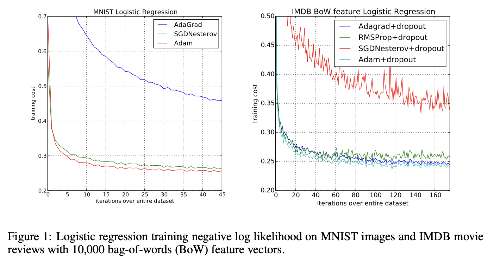

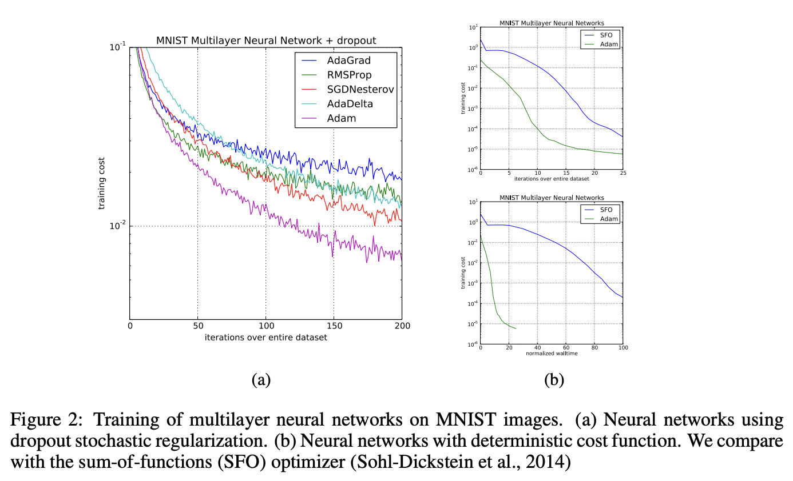

### Conclusion

> We have introduced a simple and computationally efficient algorithm for gradient-based optimization of stochastic objective functions.

> Our method is aimed towards machine learning problems with large datasets and/or high-dimensional parameter spaces.

> The method combines the advantages of two recently popular optimization methods: the ability of AdaGrad to deal with sparse gradients, and the ability of RMSProp to deal with non-stationary objectives.

# Weight Decay

📜 [A Simple Weight Decay Can Improve Generalization](https://proceedings.neurips.cc/paper/1991/file/8eefcfdf5990e441f0fb6f3fad709e21-Paper.pdf)

> It is proven that a weight decay has two effects in a linear network. First, it suppresses any irrelevant components of the weight vector by choosing the smallest vector that solves the learning problem. Second, if the size is chosen right, a weight decay can suppress some of the effects of static noise on the targets, which improves generalization quite a lot.

> Bad generalization occurs if the information [in the training set] does not match the complexity [of the network].

> A different way to constrain a network and thus decrease its complexity, is to limit the growth of the weights through some kind of weight decay.

> [This] can be realized by adding a term to the cost function that penalizes large weights.

$E(w) = E_0(w) + \frac{1}{2} \lambda \sum_i w_i^2$

> The aim of the learning is not only to learn the examples, but to learn the underlying function that produces the targets for the learning process.

> A small weight decay will pick out the point in the valley with the smallest norm among all the points in the valley.

> In general it can not be proven that picking that solution is the best strategy. But, at least from a philosophical point of view, it seems sensible, because it is (in a loose sense) the solution with the smallest complexity-the one that Ockham would probably have chosen.

Applying Ockham’s razor.

> The value of a weight decay is more evident if there are small errors in the targets.

Smaller weights means less ability to fit noise.

# RNN

📜 [A Learning Algorithm for Continually Running Fully Recurrent Neural Networks](https://gwern.net/doc/ai/nn/rnn/1989-williams-2.pdf)

> A major problem in connectionist theory is to develop learning algorithms that can tap the full computational power of neural networks.

How do we use the full potential of neural networks? Designing architectures that enables this for different problems is challenging.

> Attention has recently turned to developing algorithms for networks with recurrent connections, which have important capabilities not found in feedforward networks, including attractor dynamics and the ability to store information for later use.

> The approach we propose here enjoys the generality of the backpropagation-through-time approach while not suffering from its growing memory requirement in arbitrarily long training sequences

### The Learning Algorithm and Variations

**1. The Basic Algorithm**

We define a network with $n$ output units, with $m$ input lines. We create the $(m + n)$-tuple $z(t)$, the concatenation of the set of input signals at time $t$, $x(t)$ and the set of output signals at time $t$, $y(t)$. Let the indices $k \in I$ represent the input units and $k \in U$ represent the output units.

```math
z_k(t) =
\begin{cases}
  x_k(t) & \textrm{if } k \in I \\
  y_k(t) & \textrm{if } k \in U
\end{cases}
```

Let the activation of the $k$th unit at time $t$ for $k \in U$ be defined by

```math
y_k(t + 1) = f_k(s_k(t))
```

With $f_k$ representing the neurons activation function and $s_k$ representing the sum of the neurons weights as defined by

```math
s_k(t) = \sum_{i \in U \cup I} w_{ki} z_i(t)
```

And the notation $y_k(t+1)$ denoting that the neurons output at time-step $t$ will also be it’s contributing input to the network at time step $t + 1$.

Given $T(t)$ as the subset of neurons $k \in U$with a specific target output value $d_k(t)$ for neuron $k$ at time $t$. We can then define the error function:

```math
e_k(t) =
\begin{cases}
  d_k(t) - y_k(t) & \textrm{if } k \in T(t) \\
  0 & \textrm{otherwise}
\end{cases}
```

> Note that this formulation allows for the possibility that target values are specified for different units at different times. The set of units considered to be visible can thus be time-varying,

Now the error function to compute the total error of the network at time $t$

```math
J(t) = 1/2 \sum_{k \in U}[e_k(t)]^2
```

And the overall weight change for a weight $w_{ij}$ in the network

```math
\Delta w_{ij}(t) = -\alpha\frac{\partial J(t)}{\partial w_{ij}}
```

```math
\frac{\partial{J(t)}}{\partial{w_{ij}}} = \sum_{k \in U} e_k(t) \frac{\partial{y_k(t)}}{\partial{w_{ij}}}
```

```math
\frac{\partial{y_k(t+1)}}{\partial{w_{ij}}} = f'_k(s_k(t))[\sum_{i \in U} w_{ki} \frac{\partial{y_i(t)}}{\partial{w_{ij}}} + \delta_{ik}z_j(t)]
```

These all obtained just through simple back-propagation on the original setup of our network using the chain-rule. The last $\frac{\partial{y_k(t+1)}}{\partial{w_{ij}}}$ representing the partial of the output neurons of the _current_ time-step with respect to the weights and outputs of the _previous_ time-step, thus enabling back-propagation recursively through time.

Then for convenience we define $p_{ij}^k$ where $k \in U$, $i \in U$, $j \in U \cup I$, $k$ denoting the output neuron who’s gradient to back-propagate to the _previous_ time-step, and $i$, $j$ specifying the weight between an input and output neuron in the previous time-step.

```math
p_{ij}^k(t+1) = f'_k(s_k(t))[\sum_{l \in U} w_{kl} p_{ij}^l(t) + \delta_{ik} z_j(t)]
```

Thus, the gradient recursively back-propagates through previous time-steps via the recursive use of $p_{ij}^l$ in it’s own definition, hitting a base case at $t = 0$ where we define the the value to be 0 since the output neuron values at this point are un-tethered to any previous time-step.

```math
p_{ij}^k(t_0) = 0
```

Then, we have the final weight update algorithm at a given time-step $t$

```math
\Delta w_{ij}(t) = \alpha \sum_{k \in U} e_k(t) p_{ij}^k (t)
```

**2. Real-Time Recurrent Learning**

> In order to allow real-time training of behaviors of indefinite duration, however, it is useful to relax this assumption and actually make the weight changes while the network is running.

In practice, we update weights at every time-step, rather than accumulating gradients and then changing them at epochs.

> While the resulting algorithm is no longer guaranteed to follow the gradient of total error, the practical differences are often slight, with the two versions becoming more nearly identical as the learning rate is made smaller.

**3. Teacher-Forced Real-Time Recurrent Learning**

> An interesting technique that is frequently used in dynamical supervised learning tasks is to replace the actual output $y_k(t)$ of a unit by the teacher signal $d_k(t)$ in subsequent computation of the behavior of the network, whenever such a value exists. We call this technique _teacher forcing_.

### Discussion

> Our primary goal here has been to derive a learning algorithm to train completely recurrent, continually updated networks to learn temporal tasks.

> Our emphasis has been on using uniform starting configurations that contain no a priori information about the temporal nature of the task.

> The solutions found by the algorithm are often dauntingly obscure, particularly for complex tasks involving internal state. This observation is already familiar in work with feedforward networks. This obscurity has often limited our ability to analyze the solutions in sufficient detail.

Interpretability has been near impossible, even from the beginning.

# LSTM

📜 [Long Short-Term Memory](https://deeplearning.cs.cmu.edu/F23/document/readings/LSTM.pdf)

> Learning to store information over extended time intervals by recurrent backpropagation takes a very long time, mostly because of insufficient, decaying error back-flow.

> [We] address it by introducing a novel, efficient, gradient-based method called long short-term memory (LSTM).

> LSTM is local in space and time; its computational complexity per time step and weight is O(1).

> In comparisons with real-time recurrent learning, back propagation through time, recurrent cascade correlation, Elman nets, and neural sequence chunking, LSTM leads to many more successful runs, and learns much faster.

> LSTM also solves complex, artificial long-time-lag tasks that have never been solved by previous recurrent network algorithms.

LSTM is a far more efficient and effective learning algorithm than all previous approaches to RNNs.

> In principle, recurrent networks can use their feedback connections to store representations of recent input events in the form of activations (short-term memory, as opposed to long-term memory embodied by slowly changing weights).

> With conventional backpropagation through time (BPTT) or real-time recurrent learning (RTRL), error signals flowing backward in time tend to (1) blow up or (2) vanish; the temporal evolution of the back-propagated error exponentially depends on the size of the weights.

The central problem - gradients explode or vanish as they get back-propagated through time because the same weights are contributing multiple times to the output through each time-step.

> This article presents long short-term memory (LSTM), a novel recurrent network architecture in conjunction with an appropriate gradient-based learning algorithm.

> LSTM is designed to overcome these error back-flow problems.

The LSTM is an architecture built specifically to fix the gradient back-flow errors (vanish/exploding gradients) faced by previous RNN architectures.

> It can learn to bridge time intervals in excess of 1000 steps even in case of noisy, incompressible input sequences, without loss of short-time-lag capabilities.

### Previous Work

This section is a good indicator of how much work happens at the frontiers of research and on problems before a correct and effective solution is discovered. We see 9 different attempts at long-term memory modeling to improve RNNs before the LSTM emerges.

### Constant Error Backpropagation

**1. Exponentially Decaying Error**

We see from analyzing the error flow occurring at a unit $u$ at time step $t$ propagated back into time for $q$ time steps to a unit $v$ (indicated by the quantity $\frac{\partial{\vartheta_v(t-q)}}{\partial{\vartheta_u(t)}})$, we get the following term:

```math
\prod_{m=1}^q f'_{l_m}(\textrm{net}_{l_m}(t - m))w_{l_ml_{m-1}}
```

And we can see that if

```math
|f'_{l_m}(\textrm{net}_{l_m}(t - m))w_{l_ml_{m-1}}| > 1.0
```

then the largest product increase exponentially with $q$, meaning that the error blows up. Meanwhile, if the quantity is less than 1.0, the error converges to 0.

**2. Constant Error Flow: A Naive Approach**

> To avoid vanishing error signals, how can we achieve constant error flow through a single unit j with a single connection to itself?

We want a way to back-propagate error through previous time-steps without the errors vanishing or exploding.

We know (confirmed from the RNN paper) that we can define the back-propagated error signal to unit j as:

```math
\vartheta_j(t) = f'_j(\textrm{net}_j(t)) \sum_i w_{ij} \vartheta_i(t+1)
```

Where the error pathway flows backward via the recursive $\vartheta(t+1)$ pipeline all the way from the most recent time-step where the original error originates.

Thus, we can simplify a unit j’s local error back-flow if it has only a single connection to itself in the previous time-step (for the sake of simplicity) as

```math
\vartheta_j(t) = f'_j(\textrm{net}_j(t)) \vartheta_j(t+1) w_{jj}
```

And to make sure that we have constant error flow backward through this pathway without vanishing/exploding gradients, we know that $f_j(x) = x$ as the activation function and $w_{jj}$ as the weight value are satisfactory.

There are two obvious challenges with this setup.

First is **input weight conflict**.

We can examine this neuron and add a single input weight to it $w_{ji}$ to demonstrate some additional challenges.

> Assume that the total error can be reduced by switching on unit j in response to a certain input and keeping it active for a long time.

In other words, we want this cell to respond to an input by storing it in the cell $j$, and then use this cell $j$ to persist that value across future time-steps, meaning it should ignore future values to $i$.

> $w_{ji}$ will often receive conflicting weight update signals during this time (recall that j is linear).

In our example, on one time-step, the loss may suggest that $w_{ji}$ should be increased (too allow $i$ to propagate to $j$) as a function of the input, since the neuron is a linear mapping, whereas $w_{ji}$ should be at 0 for the remaining time-steps to prevent intervention. Thus, these needs each contribute separate, inconsistent updates to $w_{ji}$

The next is **output weight conflict**.

> Assume j is switched on and currently stores some previous input. For simplicity, let us focus on a single additional outgoing weight $w_{kj}$. The same $w_{kj}$ has to be used for both retrieving $j$’s content at certain times and preventing $j$ from disturbing $k$ at other times.

This is the same problem, mirrored to outputs. Sometimes we want this pathway to contribute it’s value, whereas at other times we want the value to be able to be ignored.

> As the time lag increases, stored information must be protected against perturbation for longer and longer periods, and, especially in advanced stages of learning, more and more already correct outputs also require protection against perturbation.

This reflects the primary challenge of storing and maintaining long-term memories. Over time, you’re faced with the challenge of storing correct long-term memories, and then ensuring that important memories aren’t distributed.

This is the reasoning behind the LSTM.

### The Concept of Long Short-Term Memory

**1. Memory Cells and Gate Units**

In order to construct an architecture that allows for constant error flow, while mitigating the errors discussed above, the CEC is extended with additional features.

> A multiplicative input gate unit is introduced to protect the memory contents stored in $j$ from perturbation by irrelevant inputs, and a multiplicative output gate unit is introduced to protect other units from perturbation by currently irrelevant memory contents stored in $j$.

> The resulting, more complex unit is called a memory cell.

> Each memory cell is built around a central linear unit with a fixed self-connection.

This linear unit represents the CEC which persists the cell state (long-term memory).

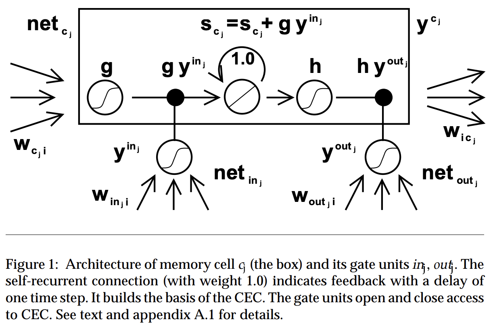

Here, most importantly, we have the linear long-term error pathway through the middle with the recurrence, where we have

```math
s_{c_j}(0) = 0 \\
s_{c_j}(t) = s_{c_j}(t-1) + y^{\textrm{in}_j}(t)g(\textrm{net}_{c_j}(t))
```

Indicating that the linear CEC pathway is just the sum of it’s value in the previous time-step, plus the value computed by the multiple of the activation of the current cells input, and the activation of the previous cells output (short-term memory).

Intuitively, the activation of the cells input can be thought of as the “value” to add to long-term memory, and the activation of the previous cell (short-term memory) can be thought of as multiplying by it’s “relevance” to determine how much to add to the long-term memory pathway.

Similarly, the output can be calculated as

```math
y^{c_j}(t) = y^{\textrm{out}_j}(t)h(s_{c_j}(t))
```

Which can be thought of as the multiple of the output gate activation to this cell which is the “relevance” of the long-term memory in this case, as well as the actual activation on the current long-term memory pathway, which is the “value” of long-term memory to pull from as the output of this cell.

In-terms of actual weight and bias connections to other cells, there are a few relevant distinctions.

First, the actual “input” value to the cell, contributing the input gate is a function of the weights and outputs of other cells (coming from their short-term memory outputs) in the previous time-step.

```math
y^{\textrm{in}_j}(t) = f_{\textrm{in}_j}(\textrm{net}_{\textrm{in}_j}(t)) \\
\textrm{net}_{\textrm{in}_j} = \sum_u w_{\textrm{in}_ju}y^u(t-1)
```

And similarly, the actual “output” value contributing to the “relevance” of the long-term memory pathway for the cell is influenced by the weights and outputs of other cells in the previous time-step

```math
y^{\textrm{out}_j}(t) = f_{\textrm{out}_j}(\textrm{net}_{\textrm{out}_j}(t)) \\
\textrm{net}_{\textrm{out}_j} = \sum_u w_{\textrm{out}_ju}y^u(t-1)
```

And finally, that the actual previous short-term memory coming from this cell specifically in the previous time step is considered via

```math
\textrm{net}_{c_j}(t) = \sum_u w_{c_ju} y^u (t-1)
```

**2. Why Gate Units?**

> In other words, the net can use $\textrm{in}_j$ to decide when to keep or override information in memory cell $c_j$ and $\textrm{out}_j$ to decide when to access memory cell $c_j$ and when to prevent other units from being perturbed by $c_j$.

> Error signals trapped within a memory cell’s CEC cannot change, but
> different error signals flowing into the cell (at different times) via its output gate may get superimposed.

Sometime’s the error signal at the most recent time-step will suggest that the CEC should have held an increased memory value, sometimes decreased. These will be different at different time-steps.

The gate values are what determines how much different time-steps should affect the gates of an individual cell, and how much the gradients should be back-propagated in time.

For example, a single cell may only be active given the presence of a specific type of concept, and hold memory about that concept in context - then in periods where the concept is presented, the in gate is turned on, then when it needs to be used as context, the output gate’s are on.

Hence, only in these type steps where the input or output gates should be active are the gradients from the CEC back-propagated through to actually update the weights from this cell, otherwise the gates close out the gradients.

> The output gate will have to learn which errors to trap in its CEC by appropriately scaling them.

When an error is particularly relevant to a cell, the output gate needs to be scaling the CEC pathway to have a high impact on the cells output.

In reverse, this means that the gradient will be back-propagated through the CEC pathway since it had a high influence, allowing previous time-steps to get the error.

So in the context of back-propagation, the output gate can be thought of as “trapping” the error within the CEC pathway _only_ when the error is one relevant to the learned function of a cell.

> The input gate will have to learn when to release errors, again by appropriately scaling them.

Conversely, the input gate captures the errors coming through the CEC pathway (as trapped by an output cell in the current or later time-step), and “releases” the errors to be back-propagated through the parameters of the cell, only when relevant (when there is something important to contribute to the long-term memory pathway).

> Essentially the multiplicative gate units open and close access to constant error flow through CEC.

This is the core intuition behind the gates of the LSTMs, and is critical. This explains how back-propagation using the continuous error pathway is distributed properly to cells that need it, but not where it’s irrelevant.

**4. Memory Cell Blocks**

> S memory cells sharing the same input gate and the same output gate form a structure called a memory cell block of size S. Memory cell blocks facilitate information storage

Memory cell blocks still only have two gates (which means they will learn about a single representation and it’s input/output relevance) but they are able to store more complex memories than just a single CEC pathway is capable of.

**5. Learning**

> To ensure non-decaying error backpropagation through internal states of memory cells, as with truncated BPTT, errors arriving at memory cell net inputs do not get propagated back further in time (although they do serve to change the incoming weights).

This answer my question about how the same vanishing/exploding gradients don’t get back-propagated through time just like in RNNs. We clip the gradients and explicitly prevent back-propagation in time through the short-term memory pathway.

> Only within memory cells, are errors propagated back through previous internal states $s_{c_j}$.

Back-propagation through time only occurs through the CEC pathway.

**6. Computation Complexity**

> Only the derivatives $\partial{s_{c_j}}/\partial{w_{il}}$ need to be stored and updated. Hence the LSTM algorithm is very efficient, with an excellent update complexity of $O(W)$

> Unlike full BPTT, however, LSTM is local in space and time: there
> is no need to store activation values observed during sequence processing in a stack with potentially unlimited size.

Back-propagation in LSTMs is local in space and time - units don’t need to store activations of all previous units since the gradient flows just through the CEC pathway.

**7. Abuse Problem and Solutions**

> In the beginning of the learning phase, error reduction may be possible without storing information over time. The network will thus tend to abuse memory cells, for example, as bias cells.

In the early phase, there isn’t much use for long-term memory, so the network can abuse the utility of the long-term memory cells.

**8. Internal State Drift and Remedies**

> If memory cell $c_j$’s inputs are mostly positive or mostly negative, then its internal state $s_j$ will tend to drift away over time.

### Experiments

> Which tasks are appropriate to demonstrate the quality of a novel longtime-lag algorithm? First, minimal time lags between relevant input signals and corresponding teacher signals must be long for all training sequences.

> Recently we discovered that many long-time-lag tasks used in previous
> work can be solved more quickly by simple random weight guessing than by the proposed algorithms.

> All our experiments involve long minimal time lags.

For the sake of testing, experiments use examples where information must be retained for a long time and then used later on.

**6. Experiment 6: Temporal Order**

> In this subsection, LSTM solves other difficult (but artificial) tasks that have never been solved by previous recurrent net algorithms. The experiment shows that LSTM is able to extract information conveyed by the temporal order of widely separated inputs.

This experiment really shows the superiority of LSTMs over RNNs in being able to solve problems that RNNs never could.

### Discussion

**1. Limitations of LSTM**

> Each memory cell block needs two addition units. In comparison to standard recurrent nets, however, this does not increase the number of weights by more than a factor of 9.

> LSTM does not have any problems with the notion of recency that go beyond those of other approaches. All gradient-based approaches, however, suffer from a practical inability to count discrete time steps precisely.

**2. Advantages of LSTM**

> The constant error backpropagation within memory cells results in LSTM’s ability to bridge very long time lags.

> For long-time-lag problems such as those discussed in this article,
> LSTM can handle noise, distributed representations, and continuous
> values.

> There appears to be no need for parameter fine tuning. LSTM works
> well over a broad range of parameters such as learning rate, input gate
> bias, and output gate bias.

> The LSTM algorithm’s update complexity per weight and time step is
> essentially that of BPTT, namely, $O(1)$.

### Conclusion

> Each memory cell’s internal architecture guarantees constant error flow
> within its CEC, provided that truncated backpropagation cuts off error flow trying to leak out of memory cells. This represents the basis for bridging very long time lags.

> Two gate units learn to open and close access to error flow within each memory cell’s CEC. The multiplicative input gate affords protection of the CEC from perturbation by irrelevant inputs. Similarly, the multiplicative output gate protects other units from perturbation by currently irrelevant memory contents.

💬 **Comments**
In some ways, it seems like the LSTM is also about context and attention, just like the Transformer, but it’s just far less efficient in training due to it’s lack of parallelization.

Having individual cell blocks let’s the network learn about the relevance between different types of important information across time.

Really, what a memory cell is learning to do over time is recognize some important piece of information, store it over time and don’t modify it while it is irrelevant/nothing contributes useful information to it, and then release that information when it becomes relevant. In many ways, this is like attention and context where words can store their values over time, waiting to contribute their values to other relevant words.

# Learning to Forget

📜 [Learning to Forget: Continual Prediction with LSTM](https://www.researchgate.net/profile/Felix-Gers/publication/12292425_Learning_to_Forget_Continual_Prediction_with_LSTM/links/5759414608ae9a9c954e84c5/Learning-to-Forget-Continual-Prediction-with-LSTM.pdf)

> We identify a weakness of LSTM networks processing continual input streams that are not _a priori_ segmented into subsequences with explicitly marked ends at which the network's internal state could be reset.

> Without resets, the state may grow indefinitely and eventually cause the network to break down.

As they were initially designed, the CEC pathway of an LSTM cell would infinitely increase, causing it to become useless after a while.

> Our remedy is a novel, adaptive \forget gate" that enables an LSTM cell to learn to reset itself at appropriate times, thus releasing internal resources.

Instead, by adding a forget gate, the LSTM can recycle it’s resource over time. For example, it can learn to have a trigger to “store” some context with the input gate, a trigger to “use” the context with some output gate, and then subsequently “reset” to be able to pick up new context.

> We review illustrative benchmark problems on which standard LSTM outperforms other RNN algorithms. All algorithms (including LSTM) fail to solve continual versions of these problems. LSTM with forget gates, however, easily solves them in an elegant way.

If you extend the problems to require continuous inputs and thinking without obvious stopping points, even LSTMs fail to solve the problems - but after adding forget gates, everything works!

> Standard RNNs fail to learn in the presence of time lags greater than 5-10 discrete time steps between relevant input events and target signals.

An empirical measure of how much long-term memory standard RNNs were actually capable of handling.

> The vanishing error problem casts doubt on whether standard RNNs can indeed exhibit significant practical advantages over time window-based feedforward networks.

Cool to see doubts cast on things that worked in hindsight. People didn’t believe RNNs could be useful until the LSTM was introduced.

> In this paper, however, we will show that even LSTM fails to learn to correctly process certain very long or continual time series. […] The problem is that a continual input stream eventually may cause the internal values of the cells to grow without bound, even if the repetitive
> nature of the problem suggests they should be reset occasionally.

Some problems motivate that a cell should be able to reset itself.

> We recognize that any training procedure for RNNs which is powerful enough to span long time lags must also address the issue of forgetting in short term memory (unit activations). We know of no other
> current training method for RNNs which is suciently powerful to have encountered this problem.

They also point out that forgetting is an essential job of any RNN, and so the indication that LSTMs have finally hit this problem is an indication of how far ahead they are.

### Standard LSTM

**1. Limits of standard LSTM**

> [LSTM’s ability to store data across time lags] can contribute to a weakness in some situations: the cell states $s_c$ often tend to grow linearly during the presentation of a time series.

Importantly, if the long-term memory grows linearly over time, this will cause saturation of the output squashing function $h$, causing the gradient to vanish and preventing learning over time.

> Of course, we might try to “teacher force” the internal states $s_c$ by resetting them once a new training sequence starts. But this requires an external teacher that knows how to segment the input stream into training subsequences. We are precisely interested, however, in those situations where there is no a priori knowledge of this kind.

They want to create a solution that doesn’t require any previous knowledge, and can learn on it’s own when to discard irrelevant information.

### Solution: Forget Gates

**1. Forward Pass of Extended LSTM with Forget Gates**

> Our solution to the problem above are adaptive \forget gates" designed to learn to reset memory blocks once their contents are out of date and hence useless.

The forget gate has a similar activation as the other gates.

```math
y^{\varphi_j}(t) = f_{\varphi_j}(\textrm{net}_{\varphi_j}(t)) \\
\textrm{net}_{\varphi_j}(t) = \sum_m w_{\varphi_jm}y^m(t-1)
```

> We use the logistic sigmoid as squashing function, hence the forget gate’s activation $y^\varphi$ ranges between 0 and 1.

> Bias weights for LSTM gates are initialized with negative values for input and output gates, positive values for forget gates.

Given the activation functions, this means that the input and output gates of each cell will be initialized to never activate (storing and using no context), whereas the forget gate will be set to always remember (as the activation will be almost 1.0) and will have to learn what to forget.

> It will not explicitly forget anything until it has learned to forget.

**2. Backward Pass of Extended LSTM with Forget Gates**

> Truncation means that all errors are cut o once they leak out of a memory cell or gate, although they do serve to change the incoming weights. The effect is that the CECs are the only part of the system through which errors can ow back forever. This makes LSTM's updates efficient without significantly affecting learning power: error flow outside of cells tends to decay exponentially anyway.

Just like the other gates, error flow past forget gates is not back-propagated and is truncating, allowing the CEC pathway to be the only back-propagated path for gradients to flow.

**3. Complexity**

> To calculate the computational complexity of extended LSTM we take into account that weights to input gates and forget gates cause more expensive updates than others, because each such weight directly affects all the cells in its memory block.

> Extended LSTM is local in space and time, just like standard LSTM.

### Experiments

**4. Analysis of CERG Results**

We can see the constant growth of typical unmodified LSTM states below.

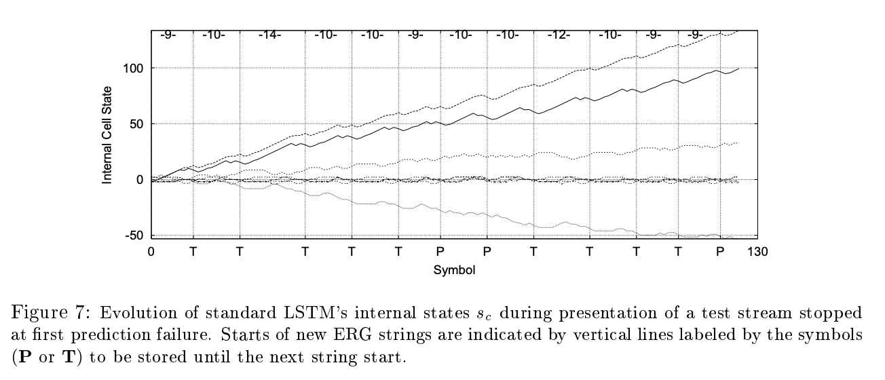

Whereas with the forget gate, we can see the activation of the forget gate and the subsequent resets and adjustments of internal states, making memory cells usable again.

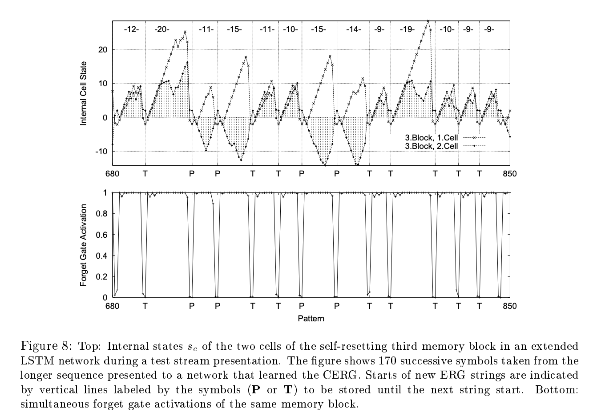

> Common to all memory blocks is that they learned to reset themselves in an appropriate fashion.

**6. Continual Noisy Temporal Order Problem**

> Can standard LSTM solve problems which extended LSTM cannot? We tested extended LSTM on one of the most difficult nonlinear long time lag tasks ever solved by an RNN: “Noisy Temporal Order”

> Now we take the next obvious step and transform the NTO into a continual problem that does require forgetting.

They create the CNTO problem that tests the ability of the LSTM to forget.

### Conclusion

> Continual input streams generally require occasional resets of the stream-processing network.

> Partial resets are also desirable for tasks with hierarchical decomposition.

> Since typical real-world input streams are not a priori decomposed into training subsequences, and since typical sequential tasks are not a priori decomposed into appropriate subproblems, RNNs should be able to learn to achieve appropriate decompositions.

> LSTM's gates (and forget gates in particular) provide an example of local, efficient information processing through adaptive, multiplicative units, which are, due to their biological plausibility, attracting attention in the field of neuroscience

Interesting how the appeal to neuroscience seems to be something that researches wanted to make their work align with, especially in older papers.

# Word2Vec

📜 [Efficient Estimation of Word Representations in Vector Space](https://arxiv.org/pdf/1301.3781)

> We propose two novel model architectures for computing continuous vector representations of words from very large data sets

> We show that these vectors provide state-of-the-art performance on our test set for measuring syntactic and semantic word similarities.

> Many current NLP systems and techniques treat words as atomic units - there is no notion of similarity between words, as these are represented as indices in a vocabulary.

> This choice has several good reasons - simplicity, robustness and the observation that simple models trained on huge amounts of data outperform complex systems trained on less data.

> However, the simple techniques are at their limits in many tasks.

In many domains, like transcribed speech data, there isn’t much high quality data, so more complex models may be necessary to represent the available.

> Somewhat surprisingly, it was found that similarity of word representations goes beyond simple syntactic regularities.

> It was shown for example that _vector(”King”) - vector(”Man”) + vector(”Woman”)_ results in a vector that is closest to the vector representation of the word _Queen_

> In this paper, we try to maximize accuracy of these vector operations by developing new model architectures that preserve the linear regularities among words.

> We design a new comprehensive test set for measuring both syntactic and semantic regularities, and show that many such regularities can be learned with high accuracy.

This paper tries to focus on creating word representations that preserve syntactic and semantic regularities between different words (the representations contain meeting, and arithmetic can be performed).

> Moreover, we discuss how training time and accuracy depends
> on the dimensionality of the word vectors and on the amount of the training data.

### Model Architectures

> In this paper, we focus on distributed representations of words learned by neural networks.

Neural networks have been shown to be far more effective and computationally efficient than previous approaches like LSA and LDA.

> We will try to maximize the accuracy, while minimizing the computational complexity.

Minimize the the number of parameters needed for the model to fully train while making sure it’s still accurate.

**1. Feedforward Neural Net Language Model (NNLM)**

> The probabilistic feedforward neural network language model has been proposed in. It consists of input, projection, hidden and output layers.

> At the input layer, N previous words are encoded using 1-of-V coding, where V is size of the vocabulary.

> The input layer is then projected to a projection layer P that has dimensionality N × D, using a shared projection matrix.

> Moreover, the hidden layer is used to compute probability distribution over all the words in the
> vocabulary, resulting in an output layer with dimensionality V .

The model consists of:

(1) An input layer of N (often N=10) of the previous words in a one-hot-encoded 1-of-V encoding style for the vocabulary V

(2) There’s a projection layer with dimensionality N × D that maps each vector in the input layer linearly onto a learned representation. This projection layer is the **embedding layer**.

(3) Then, there’s a hidden layer which computes based on the projection layer and has some non-linearities.

(4) Finally, there’s an output layer of dimension V, corresponding with the prediction of the next word.

**2. Recurrent Neural Net Language Model (RNNLM)**

> Recurrent neural network based language model has been proposed to overcome certain limitations of the feedforward NNLM, such as the need to specify the context length, and because theoretically RNNs can efficiently represent more complex patterns than the shallow neural networks.

RNN used for this representation task since they’re theoretically better at word modeling.

> The RNN model does not have a projection layer; only input, hidden and output layer. What is special for this type of model is the recurrent matrix that connects hidden layer to itself, using time-delayed connections.

The embedding layer in this model is not a projection layer but is instead the layer passing information forward in time since it has to form short term memory of the past hidden state.

**3. Parallel Training of Neural Networks**

> To train models on huge data sets, we have implemented several models on top of a large-scale distributed framework called DistBelief, including the feedforward NNLM and the new models proposed in this paper.

### New Log-Linear Models

> In this section, we propose two new model architectures for learning distributed representations of words that try to minimize computational complexity.

> The main observation from the previous section was that most of the complexity is caused by the non-linear hidden layer in the model.

Building models optimized for simplicity. While they may not be able to have as complex representations as neural networks for the task, their computational efficiency is a big benefit.

**1. Continuous Bag-of-Words Model**

> The first proposed architecture is similar to the feedforward NNLM, where the non-linear hidden layer is removed and the projection layer is shared for all words (not just the projection matrix); thus, all words get projected into the same position (their vectors are averaged).

> We call this architecture a bag-of-words model as the order of words in the history does not influence the projection.

> Furthermore, we also use words from the future; we have obtained the best performance on the task introduced in the next section by building a log-linear classifier with four future and four history words at the input, where the training criterion is to correctly classify the current (middle) word.

In this model, we remove the non-linear layer for the sake of removing complexity, and each word uses the same projection matrix, rather than have it’s own matrix in the projection layer, meaning that there is no information about word position.

**2. Continuous Skip-gram Model**

> The second architecture is similar to CBOW, but instead of predicting the current word based on the context, it tries to maximize classification of a word based on another word in the same sentence.

> More precisely, we use each current word as an input to a log-linear classifier with continuous projection layer, and predict words within a certain range before and after the current word.

> We found that increasing the range improves quality of the resulting word vectors, but it also increases the computational complexity.

This model just tries to predict which words are nearby based on the current word and a certain range.

### Results

> ”What is the word that is similar to small in the same sense as biggest is similar to big?”

> Somewhat surprisingly, these questions can be answered by performing simple algebraic operations with the vector representation of words.

> Finally, we found that when we train high dimensional word vectors on a large amount of data, the resulting vectors can be used to answer very subtle semantic relationships between words, such as a city and the country it belongs to, e.g. France is to Paris as Germany is to Berlin.

**1. Task Description**

> To measure quality of the word vectors, we define a comprehensive test set that contains five types of semantic questions, and nine types of syntactic questions.

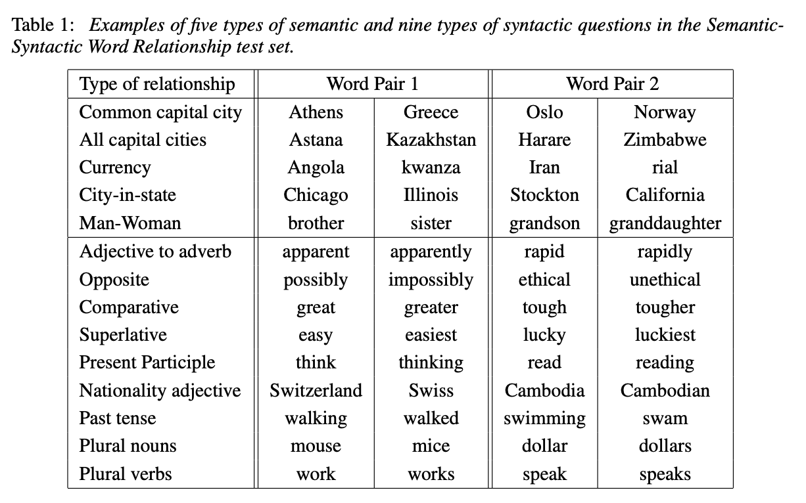

> Question is assumed to be correctly answered only if the closest word to the. vector computed using the above method is exactly the same as the correct word in the question; synonyms are thus counted as mistakes.

> We believe that usefulness of the word vectors for certain applications should be positively correlated with this accuracy metric.

**2. Maximization of Accuracy**

> We have used a Google News corpus for training the word vectors. This corpus contains about 6B tokens. We have restricted the vocabulary size to 1 million most frequent words.

> Increasing amount of training data twice results in about the same increase of computational complexity as increasing vector size twice.

Increasing the vector size of word representations has the same effect as a larger training set.

**3. Comparison of Model Architectures**

The skip-gram model performs best overall.

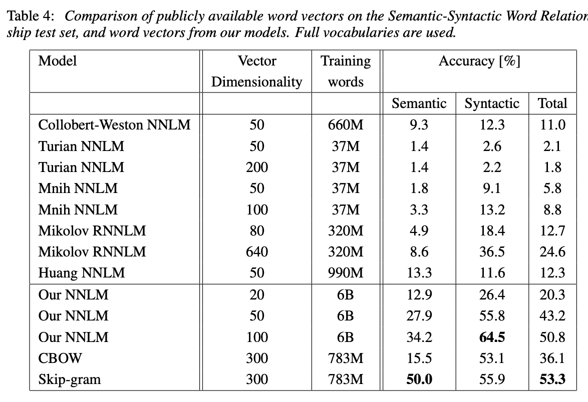

### Examples of the Learned Relationships

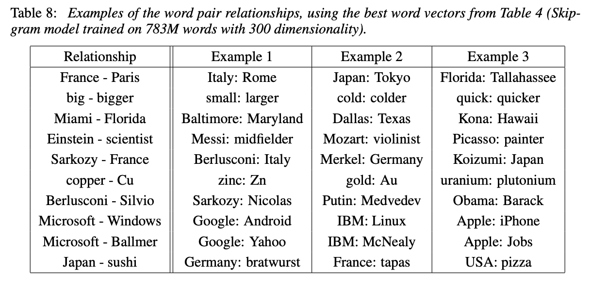

> It is also possible to apply the vector operations to solve different tasks. For example, we have observed good accuracy for selecting out-of-the-list words, by computing average vector for a list of words, and finding the most distant word vector.

### Conclusion

> In this paper we studied the quality of vector representations of words derived by various models on a collection of syntactic and semantic language tasks.

> We observed that it is possible to train high quality word vectors using very simple model architectures.

> Using the DistBelief distributed framework, it should be possible to train the CBOW and Skip-gram models even on corpora with one trillion words, for basically unlimited size of the vocabulary.

💬 **Comments**
This paper introduces the intuition for embeddings - it’s actually not a model trained to produce embeddings, but a model trained for a task, and created in a way so that the model is forced to create embeddings somewhere in order to accomplish it’s goal.

Each different model proposed in this paper takes a different approach to language modeling that forces the model to build it’s own embeddings, and the tradeoffs taken are for the sake of computational complexity.

In general, as a model is forced to model certain relationships between words & tokens more accurately to accomplish some task, words that appear together or are contextually similar will be adjusted in the representation space to cluster more closely together, and hopefully, to model relevant syntactic and semantic relationships.

It’s actually very surprising that this happens naturally in the way that the models learn.

The intuition of embeddings is to isolate the available representation space models have to learn so that when they optimize their model of language in their representation space, that space can then be used practically.

# Phrase2Vec

📜 [Distributed Representations of Words and Phrases and their Compositionality](https://arxiv.org/pdf/1310.4546)

> The recently introduced continuous Skip-gram model is an efficient method for learning high-quality distributed vector representations that capture a large number of precise syntactic and semantic word relationships.

> In this paper we present several extensions that improve both the quality of the vectors and the training speed.

This paper adds many optimizations to the skip-gram model introduced in the word2vec paper.

> An inherent limitation of word representations is their indifference to word order and their inability to represent idiomatic phrases.

> We present a simple method for finding phrases in text, and show
> that learning good vector representations for millions of phrases is possible.

Given the limitations on individual word representations, it also focused on how more complex phrases can be represented by embeddings.

> Distributed representations of words in a vector space help learning algorithms to achieve better performance in natural language processing tasks by grouping similar words.

This is the core intuition behind why embeddings are useful to models, and why they have the properties they do after training.

> Unlike most of the previously used neural network architectures for learning word vectors, training of the Skip-gram model does not involve dense matrix multiplications.

> This makes the training extremely efficient: an optimized single-machine implementation can train on more than 100 billion words in one day.

> We show that subsampling of frequent words during training results in a significant speedup (around 2x - 10x), and improves accuracy of the representations of less frequent words.

> In addition, we present a simplified variant of Noise Contrastive Estimation (NCE) for training the Skip-gram model that results
> in faster training and better vector representations for frequent words.

One major focus of this paper is to improve the performance and training efficiency of the existing skip-gram model.

> Using vectors to represent the whole phrases makes the Skip-gram model considerably more expressive.

The other major focus is in using vectors to represent phrases rather than words, which enables the embeddings to represent much more.

> The extension from word based to phrase based models is relatively simple. First we identify a large number of phrases using a data-driven approach, and then we treat the phrases as individual tokens during the training.

> To evaluate the quality of the phrase vectors, we developed a test set of analogical reasoning tasks that contains both words and phrases.

### The Skip-gram Model

> The training objective of the Skip-gram model is to find word representations that are useful for predicting the surrounding words in a sentence or a document.

This task is especially conducive to creating useful context in the word embeddings - you need to very clearly be able to derive different types of related words from the embedding of each word.

> Formally, given a sequence of training words $w_1, w_2, w_3, …, w_T$, the objective of the Skip-gram model is to maximize the average log probability

```math
\frac{1}{T}\sum_{t=1}^{T} \sum_{-c \leq j \leq c, j \neq 0} \log p(w_{t+j}|w_t)
```

Meaning, for each word (summation over $T$ terms), we want to increase the total chance that the model predicts the presence of all surrounding words within context window $c$ (summation over $j$ terms, bounded by $c$).

This can be framed as a minimization by changing the main term to a $- \log$ probability.

> The basic Skip-gram formulation defines $p(w_{t+j}|w_t)$ using the softmax function:

```math
p(w_O|w_I) = \frac{\exp({v'_{w_O}}^Tv_{w_I})}{\sum_{w=1}^W \exp{{v'_w}^Tv_{w_I}}}
```

> This formulation is impractical because the cost of computing $\nabla \log p(w_O|w_I)$ is proportional to $W$.

The Skip-gram cost function is meant to maximize the models predicted probability of the presence of each of the words that’s in the actual $2c$ word context window.

The model stores an embedding vector for each word in the vocabulary, and each output is computed by multiplying the dot product of the target word’s embedding vector with the embedding vector for each other word in the vocabulary.

The model works as follows:

(1) The input layer is a 1-of-V one hot encoded vector with V inputs ($V$ being the vocabulary size)

(2) The projection layer directly maps each word in the input to an $D$ dimensional embedding (linear mapping). Thus this layer has dimension $V$by $D$. Since only one input neuron is active at a time, only one embedding row (the embedding of the target word) is active at once.

(3) The output layer then computes the dot products of the embedding vectors of all other words with the target word, and then these scores are passed through the softmax function, indicating the probability of each word appearing in the context window of the target word

Through this optimization, the cost function forces words that appear in similar contexts to be pushed into closer regions (increasing similarity) in the embedding space. This is the core intuition behind how embeddings spaces actually develop the emergent representations that they have.

This probability is technically calculated using a softmax on the entire set of probabilities calculated by the model on the $W$ outputs (corresponding with each word in the vocabulary), which is a very computationally expensive calculation.

Instead, approximation methods are used to calculate this probability more efficiently.

**1. Hierarchical Softmax**

> A computationally efficient approximation of the full softmax is the hierarchical softmax.

> The main advantage is that instead of evaluating $W$ output nodes in the neural network to obtain the probability distribution, it is needed to evaluate only about $\log_2(W)$ nodes.

This method works by creating a binary tree representing the $W$ outputs where higher nodes summarize the joint probabilities of all of its child nodes. Then, only a subset of these nodes need to be traversed (low probability branches can be completely cut off), making the sampling far more efficient.

**2. Negative Sampling**

> An alternative to the hierarchical softmax is Noise Contrastive Estimation (NCE). […] NCE posits that a good model should be able to differentiate data from noise by means of logistic regression.

NCE is a method to approximate the value of softmax. Instead of taking a softmax across a large number of logits to compute scores for each output, instead, each output becomes a sigmoid activated score computation, meant to indicate whether a word is a “context” word that is actually associated with the input word, or a “noise” word.

All the words that are context words should converge toward being predicted as noise words. However, for efficiency, the noise words are randomly selected by a noise distribution.

> While NCE can be shown to approximately maximize the log probability of the softmax, the Skip-gram model is only concerned with learning high-quality vector representations, so we are free to simplify NCE as long as the vector representations retain their quality.

Instead of NCE, we use a simplified version called NEG

```math
\log \sigma({v'_{w_O}}^Tv_{w_I}) + \sum_{i=1}^k \mathbb{E}_{w_i \sim P_n(w)}[\log \sigma({-v'_{w_i}}^Tv_{w_I})]
```

Here, we want to maximize the probability $\log \sigma({v'_{w_O}}^Tv_{w_I})$, meaning we want to maximize the dot products (similarities) of the target word embedding vector with the embedding vectors of the correct context words.

Additionally, for $k$ randomly sampled words from the noise distribution $P_n(w)$, we want to maximize the average $\log \sigma({-v'{w_i}}^Tv{w_I})$ of these $k$ words corresponding embedding vectors with the target words embedding vectors. This quantity tries to maximize the similarity between the _opposite_ of the noise words embedding vectors and target words embedding vector, or effectively minimizes the similarity of the two embedding vectors.

> The main difference between the Negative sampling and NCE is that NCE needs both samples and the numerical probabilities of the noise distribution, while Negative sampling uses only samples. And while NCE approximately maximizes the log probability of the softmax, this property is not important for our application.

In order for NCE to effectively mirror the probability distribution that would be learned if the softmax function were used, we would have to use correct numerical probabilities from the noise distribution, but since we don’t need this level of accuracy for this case (since the goal is just to create good embedding vector representations), the NEG function is sufficient.

> Both NCE and NEG have the noise distribution $P_n(w)$ as a free parameter. We investigated a number of chocies for $P_n(w)$ and found that the unigram distribution […] $U(w)^{3/4}/Z$ outperformed significantly […] on every task we tried.

**3. Subsampling of Frequent Words**

> In very large corpora, the most frequent words can easily occur hundreds of millions of times. […] Such words usually provide less information value than the rare words.

> While the skip-gram model benefits from observing the co-occurrences of “France” and “Paris”, it benefits much less from observing the frequent co-occurrences of “France” and “the”, as nearly every word co-occurs frequently within a sentence with “the.”

> The vector representations of frequent words do not change significantly after training on several million examples.

Frequent words in the corpus don’t add much information to the embeddings of other words, and they don’t soak up context from all the variety of words that surround them.

> To counter the imbalance between the rare and frequent words, we used a simple subsampling approach: each word in the training set is discarded with probability computed by the formula

```math
P(w_i) = 1 - \sqrt{\frac{t}{f(w_i)}}
```

> where $f(w_i)$ is the frequency of word $w_i$ and $t$ is a chosen threshold, typically around $10^{-5}$

The most frequent words beyond the threshold are highly likely to be sampled out of the data set, and the order of word frequencies is still preserved.

This effectively compresses the frequencies in the dataset to maintain the same order but have much smaller variance.

> It accelerates learning and even significantly improves the accuracy of the learned vectors of the rare words, as will be shown in the following sections.

### Empirical Results

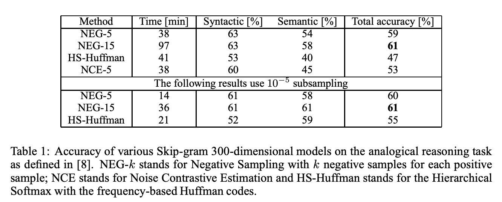

> The table shows that Negative Sampling outperforms the Hierarchical Softmax on the analogical reasoning task, and has even slightly better performance than the Noise Contrastive Estimation.

> The subsampling of the frequent words improves the training speed several times and makes the word representations significantly more accurate.

### Learning Phrases

> As discussed earlier, many phrases have a meaning that is not a simple composition of the meanings of its individual words. To learn vector representation for phrases, we first find words that appear frequently together, and infrequently in other contexts.

> Phrases are formed based on the unigram and bigram counts. The $\delta$ is used as a discounting coefficient and prevents too many phrases consisting of very infrequent words to be formed.

```math
\textrm{score}(w_i, w_j) = \frac{\textrm{count}(w_iw_j) - \delta}{\textrm{count}(w_i) \times \textrm{count}(w_j)}
```

> The bigrams with score above the chosen threshold are then used as
> phrases.

Each phrase is then replaced with it’s own (new) token in the dataset.

**1. Phrase Skip-Gram Results**

> Surprisingly, while we found the Hierarchical Softmax to achieve lower performance when trained without subsampling, it became the best
> performing method when we downsampled the frequent words.

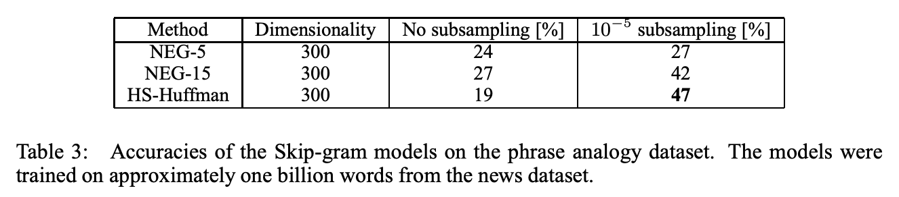

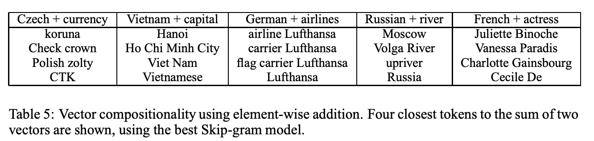

### Additive Compositionality

> We demonstrated that the word and phrase representations learned by the Skip-gram model exhibit a linear structure that makes it possible to perform precise analogical reasoning using simple vector arithmetics.

> Interestingly, we found that the Skip-gram representations exhibit another kind of linear structure that makes it possible to meaningfully combine words by an element-wise addition of their vector representations.

The created model also allows words to be added together.

> The additive property of the vectors can be explained by inspecting the training objective.

The training objectives in the creation of embedding models are heavily responsible for the resulting behaviors that are viable in the representation space.

### Comparison to Published Word Representations

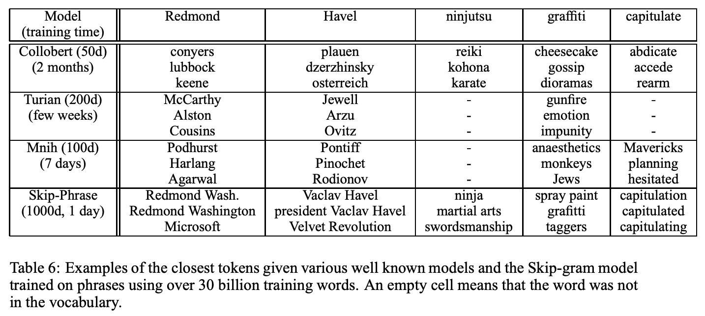

### Conclusion

> This work has several key contributions. We show how to train distributed representations of words and phrases with the Skip-gram model and demonstrate that these representations exhibit linear structure that makes precise analogical reasoning possible.

> A very interesting result of this work is that the word vectors can be somewhat meaningfully combined using just simple vector addition.

> Another approach for learning representations of phrases presented in this paper is to simply represent the phrases with a single token. Combination of these two approaches gives a powerful yet simple way how to represent longer pieces of text, while having minimal computational complexity

💬 **Comments**
The quality and properties of the embedding model is a result of the specific training methods and objective functions used for the model. The relationships between words are enforced by the types of representations learned to model the training problem.

This paper mainly introduces the technical details of the skip-gram model and how it’s design is conducive to learning good word embeddings.

It also shows us how to add the ability to embed complex phrases into the embeddings model.

# Encoder-Decoder

📜 [Learning Phrase Representations using RNN Encoder–Decoder for Statistical Machine Translation](https://arxiv.org/pdf/1406.1078)

> In this paper, we propose a novel neural network model called RNN Encoder–Decoder that consists of two recurrent neural networks.

> One RNN encodes a sequence of symbols into a fixed length vector representation, and the other decodes the representation into another sequence of symbols.

> The encoder and decoder of the proposed model are jointly trained to maximize the conditional probability of a target sequence given a source sequence.

> Qualitatively, we show that the proposed model learns a semantically and syntactically meaningful representation of linguistic phrases.

Similar to the embeddings papers - it appears that this model creates a constraint to create a good sentence embedding model at the point where representations are created by the encoder, where these embeddings are forced to contain information about the meaning of a sentence, and then these embeddings are re-expressed in the target language with the decoder.

> Along this line of research on using neural networks for SMT, this paper focuses on a novel neural network architecture that can be used as a part of the conventional phrase-based SMT system.

> Additionally, we propose to use a rather sophisticated hidden
> unit in order to improve both the memory capacity
> and the ease of training.

### RNN Encoder-Decoder

**2. RNN Encoder-Decoder**

> The encoder is an RNN that reads each symbol of an input sequence x sequential. […] After reading the end of the sequence, the hidden state of the RNN is a summary $c$ of the whole input sequence.

> The decoder of the proposed model is another RNN which is trained to generate the output sequence by predicting the next symbol $y_t$ given the hidden state $h_{(t)}$. […] Both $y_t$ and $h_{(t)}$ are also conditioned on $y_{t-1}$ and on the summary $c$ of the input sequence.

> The two components of the proposed RNN Encoder–Decoder are jointly trained to maximize the conditional log-likelihood.

```math
\max_\theta \frac{1}{N}\sum_{n=1}^N \log p_\theta(y_n|x_n)
```

> Once the RNN Encoder–Decoder is trained, the model can be used in two ways. One way is to use the model to generate a target sequence given an input sequence. On the other hand, the model can be used to score a given pair of input and output sequences, where the score is simply a probability $p_\theta(y|x)$.

The model can be used to do actual generations, and also to score the likelihood that one sequence is the translation of another (used later in the Seq2Seq paper).

**3. Hidden Unit that Adaptively Remembers and Forgets**

> In addition to a novel model architecture, we also propose a new type of hidden unit that has been motivated by the LSTM unit but is much simpler to compute and implement.

They add a reset and update gate to a new unit in the RNN.

### Statistical Machine Translation

> In a commonly used statistical machine translation system (SMT), the goal of the system (decoder, specifically) is to find a translation $f$ given a source sentence $e$, which maximizes

```math
p(f|e) \propto p(e|f)p(f)
```

The $p(e|f)$ term is known as the _translation model_ and determines whether a given translation is likely to be equivalent to the source sentence.

The $p(f)$ term is the _language model_ and determines how grammatically and syntactically correct a sentence is in the target language.

> Most SMT systems model $\log p(f | e)$ as a log-linear model with addition features and corresponding weights

```math
\log p(f|e) = \sum_{n=1}^N w_nf_n(f,e) + \log Z(e)
```

> Recently, […] there has been interest in training neural networks to score the translated sentence (or phrase pairs) using a representation of the source sentence as an additional input.

**1. Scoring Phrase Pairs with RNN Encoder-Decoder**

> Here we propose to train the RNN Encoder–Decoder on a table of phrase pairs and use its scores as additional features in the log-linear model when tuning the SMT decoder.

In this section, they propose using the RNN Encoder-Decoder’s ability to produce scores for different translations as another factor to contribute to the broader structure of a more traditional SMT model.

> With a fixed capacity of the RNN Encoder–Decoder, we try to ensure that most of the capacity of the model is focused toward learning linguistic regularities.

### Experiments

**4. Word and Phrase Representations**

> It has been known for some time that continuous space language models using neural networks are able to learn semantically meaningful embeddings.

> From the visualization, it is clear that the RNN Encoder–Decoder captures both semantic and syntactic structures of the phrases.

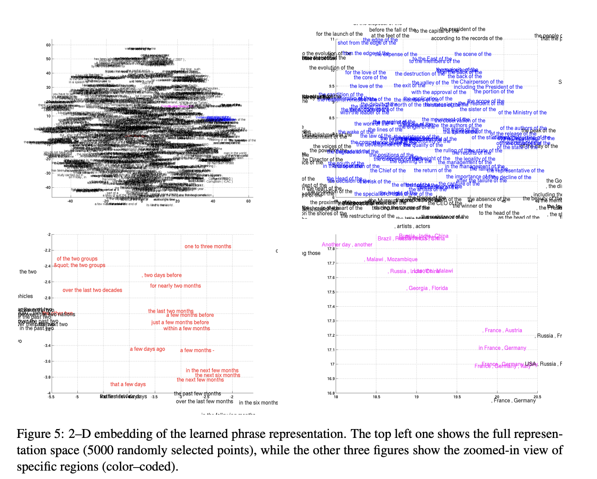

### Conclusion

> The proposed RNN Encoder–Decoder is able to either score a pair of sequences (in terms of a conditional probability) or generate a target sequence given a source sequence.

> Our qualitative analysis of the trained model shows that it indeed captures the linguistic regularities in multiple levels i.e. at the word level as well as phrase level.

# Seq2Seq

📜 [Sequence to Sequence Learning with Neural Networks](https://arxiv.org/pdf/1409.3215)

> In this paper, we present a general end-to-end approach to sequence learning that makes minimal assumptions on the sequence structure.

> Our method uses a multilayered Long Short-Term Memory (LSTM) to map the input sequence to a vector of a fixed dimensionality, and then another deep LSTM to decode the target sequence from the vector.

This uses the encoder-decoder architecture with LSTMs for sequence-to-sequence tasks.

> Given that translations tend to be paraphrases of the source sentences, the translation objective encourages the LSTM to find sentence representations that capture their meaning, as sentences with similar meanings are close to each other while different sentences meanings will be far. A qualitative evaluation supports this claim, showing that our model is aware of word order and is fairly invariant to the active and passive voice.

### The Model

The three main changes from the default LSTM formulation.

> First, we used two different LSTMs: one for the input sequence and another for the output sequence, because doing so increases the number model parameters at negligible computational cost and makes it natural to train the LSTM on multiple language pairs simultaneously.

> Second, we found that deep LSTMs significantly outperformed shallow LSTMs, so we chose an LSTM with four layers.

> Third, we found it extremely valuable to reverse the order of the words of the input sentence.

### Experiments

**1. Dataset Details**

> We used the WMT’14 English to French dataset. We trained our models on a subset of 12M sentences consisting of 348M French words and 304M English words.

**2. Decoding and Rescoring**

> Once training is complete, we produce translation by finding the most likely translation according to the LSTM

```math
\hat{T} = \arg \max_T p(T|S)
```

> We search for the most likely translation using a simple left-to-right beam search decoder which maintains a small number $B$ of partial hypotheses, where a partial hypothesis is a prefix of some translation.

> As soon as the “<EOS>” symbol is appended to a hypothesis, it is removed from the beam and is added to the set of complete hypotheses.

Beam search is used to traverse the tree of sequence predictions to create a number of hypotheses, and then the available hypotheses that get created can get scored and selected from.

**3. Reversing the Source Sentences**

> We discovered that the LSTM learns much better when the source sentences are reversed.

> While we do not have a complete explanation to this phenomenon, we believe that it is caused by the introduction of many short term dependencies to the dataset.

As with all attempts at interpretability in deep learning research, there are results that are empirically definitive, but the explanations are not clear. Attempts at rationalization are made post-hoc.

> Normally, when we concatenate a source sentence with a target sentence, each word in the source sentence is far from its corresponding. word in the target sentence. As a result, the problem has a large “minimal time lag.”

By reversing the sentence order, this “minimal time lag” is reduced, which could impact backpropagation.

> Backpropagation has an easier time “establishing communication” between the source sentence and the target sentence, which in turn results in substantially improved overall performance.

**6. Experimental Results**

> While the decoded translations of the LSTM ensemble do not outperform the best WMT’14 system, it is the first time that a pure neural translation system outperforms a phrase-based SMT baseline on a large scale MT task by a sizeable margin, despite its inability to handle out-of-vocabulary words.

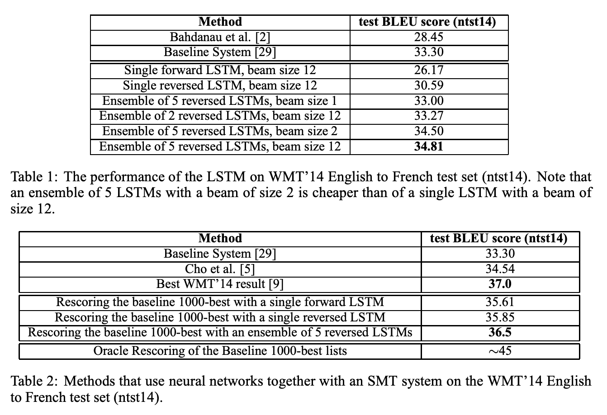

**8. Model Analysis**

> One of the attractive features of our model is its ability to turn a sequence of words into a vector of fixed dimensionality.

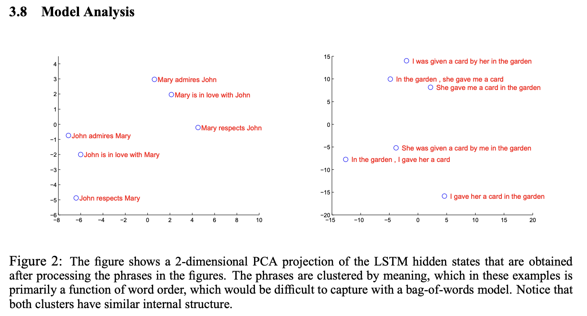

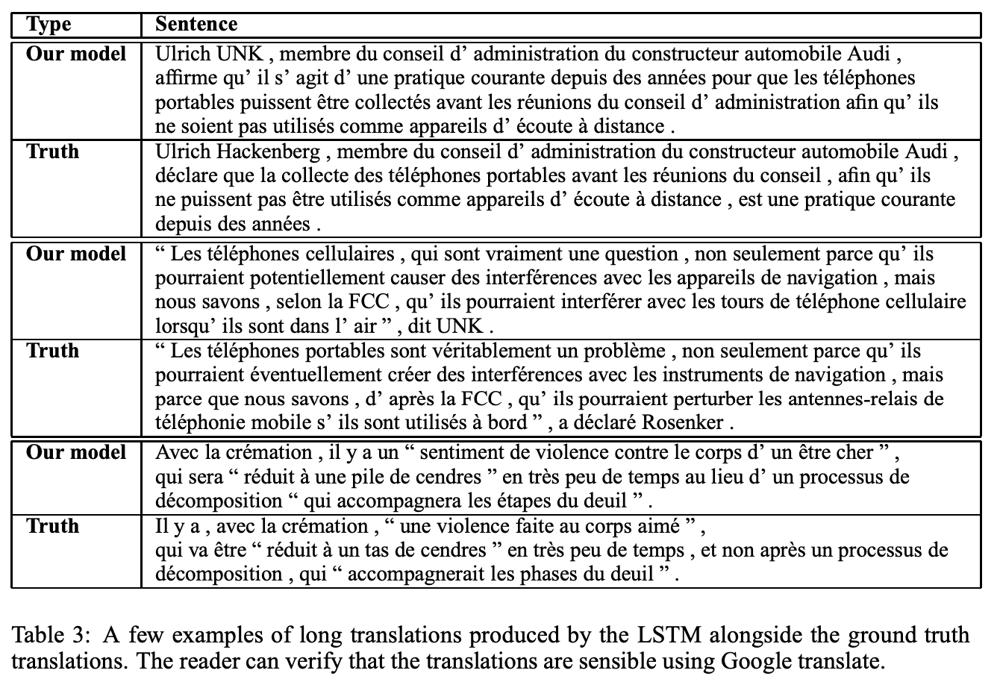

### Conclusion

> In this work, we showed that a large deep LSTM, that has a limited vocabulary and that makes almost no assumption about problem structure can outperform a standard SMT-based system whose vocabulary is unlimited on a large-scale MT task.

> We were surprised by the extent of the improvement obtained by reversing the words in the source sentences. We conclude that it is important to find a problem encoding that has the greatest number of short term dependencies, as they make the learning problem much simpler.

> We were also surprised by the ability of the LSTM to correctly translate very long sentences.

> Most importantly, we demonstrated that a simple, straightforward and a relatively unoptimized approach can outperform an SMT system, so further work will likely lead to even greater translation accuracies.

# Attention

📜 [Neural Machine Translation By Jointly Learning To Align And Translate](https://arxiv.org/pdf/1409.0473)

> The models proposed recently for neural machine translation often belong to a family of encoder–decoders and encode a source sentence into a fixed-length vector from which a decoder generates a translation.

> In this paper, we conjecture that the use of a fixed-length vector is a
> bottleneck in improving the performance of this basic encoder–decoder architecture, and propose to extend this by allowing a model to automatically (soft-)search for parts of a source sentence that are relevant to predicting a target word, without having to form these parts as a hard segment explicitly.

We introduce the attention mechanism to enable a word to search in previous context for information related to it.

> Furthermore, qualitative analysis reveals that the (soft-)alignments found by the model agree well with our intuition.

The attention mechanism appears to be discovering intuitive relationships between words.

> A potential issue with this encoder–decoder approach is that a neural network needs to be able to compress all the necessary information of a source sentence into a fixed-length vector.

This limits the length of sentences and context that the encoder can actually represent effectively in it’s output representation.

> In order to address this issue, we introduce an extension to the encoder–decoder model which learns to align and translate jointly.

> The most important distinguishing feature of this approach from the basic encoder–decoder is that it does not attempt to encode a whole input sentence into a single fixed-length vector. Instead, it encodes the input sentence into a sequence of vectors and chooses a subset of these vectors adaptively while decoding the translation.

Instead of just using a single vector in the encoded representation, the model splits up different segments into their own encoding vectors, and then individual words can request context from previous phrases.

### Learning to Align and Translate

> The new architecture consists of a bidirectional RNN as an encoder and a decoder that emulates searching through a source sentence during decoding a translation.

**1. Decoder: General Description**

The conditional probability of the next word given the previous words

```math
p(y_i|y_1,...y_{i-1},x) = g(y_{i-1}, s_i, c_i)
```

Where it represents activation of $g$ on a function of the last word $y_{i-1}$, some RNN hidden states $s_i$, and a distinct context vector $c_i$ for each word.

> The context vector $c_i$ depends on a sequence of _annotations_ $(h_1, ..., h_{T_x})$ to which an encoder maps the input sequence. Each annotation $h_i$ contains information about the whole input sequence with a strong focus on the parts surrounding the $i$-th word of the input sequence.

> The context vector $c_i$ is, then, computed as a weighted sum of these annotations $h_i$

```math
c_i = \sum_{j=1}^{T_x} a_{ij}h_j
```

Here, the context vector is a weighted sum of annotations and their respective weights. The annotations then represent the “values” for each previous segment of the sequence, and the weights $a_{ij}$ represent the “relevance” of these values to predicting the current next word.

```math
a_{ij} = \frac{\exp(e_{ij})}{\sum_{k=1}^{T_x} \exp(e_{ik})} \\

e_{ij} = a(s_{i-1}, h_j)
```

Here, the model for all $e_{ij}$ use the _alignment model_ $a$ which computes the relevance of the inputs at position $j$ to the output at position $i$, all using a single model. This model is then used to calculate the relative weights by getting the absolute weights for each input and taking the softmax of everything to calculate the relative importance of each input.

> Note than unlike in traditional machine translation, the alignment is not considered to be a latent variable. Instead, the alignment model directly computes a soft alignment, which allows the gradient of the cost function to be back-propagated through.

Providing relevant context from the past for the next word prediction (aligning context) is done implicitly by all functional language models, but this pattern makes it an explicit and optimizable process in this architecture.

> By letting the decoder have an attention mechanism, we relieve the
> encoder from the burden of having to encode all information in the source sentence into a fixed length vector. With this new approach the information can be spread throughout the sequence of annotations, which can be selectively retrieved by the decoder accordingly.

This is the key intuition behind the improvement of attention over previous architectures. Rather than force all relevant context to be compressed into a single fixed length vector by the encoder, the encoder instead creates a number of information bearing vectors for different segments of the previous sentences, and the decoder is able to selectively use relevant information to predict the next word.

**2. Encoder: Bidirectional RNN For Annotating Sequences**

> In the proposed scheme, we would like the annotation of each word to summarize not only the preceding words, but also the following words. Hence, we propose to use a bidirectional RNN. A BiRNN consists of forward and backward RNN’s.

Here, we use two RNN’s - one storing the aggregated contexts by reading the words forward (calculating the _forward hidden states_), and the other the aggregated context coming from reading the words backward (calculating the _backward hidden states_).

These two hidden states are then concatenated to come up with the final annotation for the word.

> In this way, the annotation $h_j$ contains the summaries of both the preceding words and the following words.

### Results

**1. Quantitative Results**

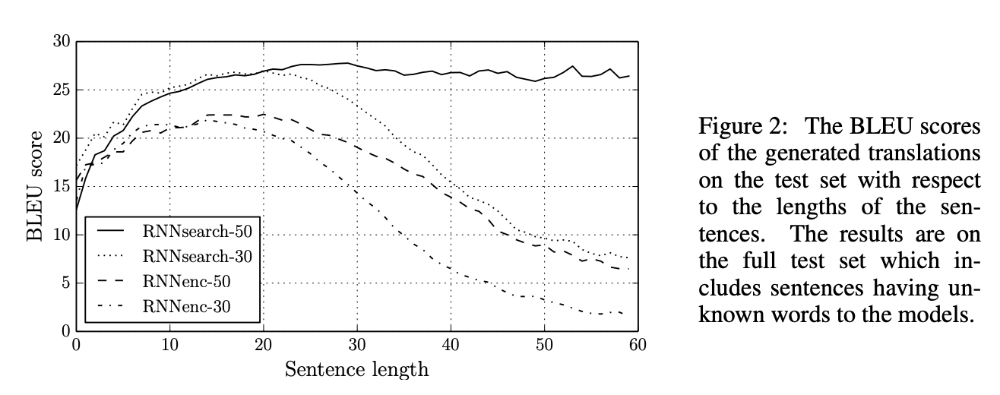

> One of the motivations behind the proposed approach was the use of a fixed-length context vector in the basic encoder–decoder approach. We conjectured that this limitation may make the basic encoder–decoder approach to underperform with long sentences.

**2. Qualitative Analysis**

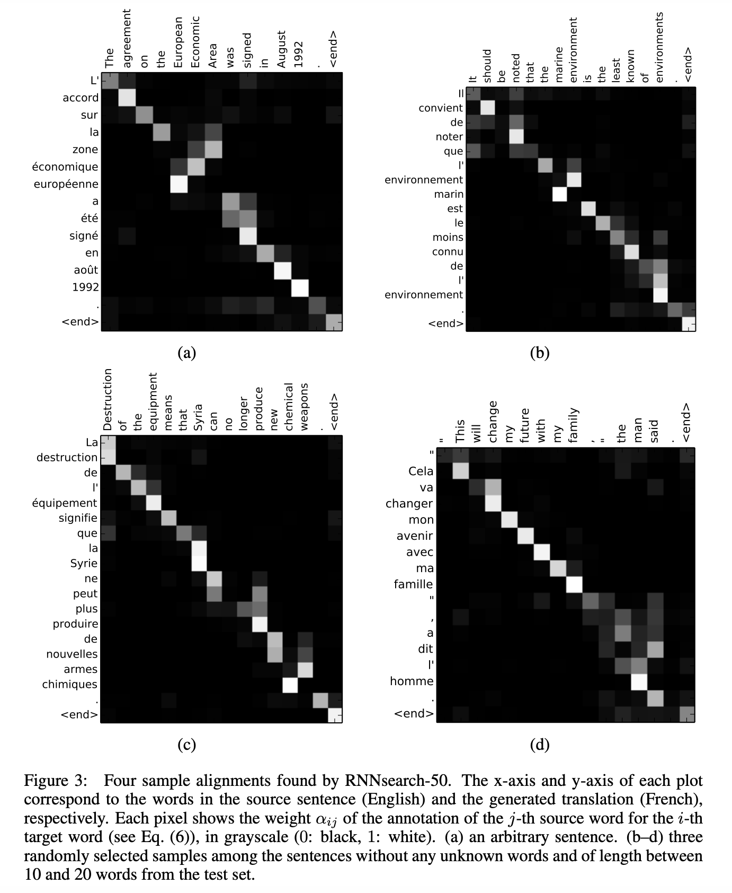

> The proposed approach provides an intuitive way to inspect the (soft-)alignment between the words in a generated translation and those in a source sentence.

> The strength of the soft-alignment, opposed to a hard-alignment, is evident.

Soft-alignment meaning the ability for the model to align across multiple of the different input vectors and take some information from all of them, rather than explicitly mapping input words to output words directly (hard alignment).

> An additional benefit of the soft alignment is that it naturally deals with source and target phrases of different lengths, without requiring a
> counter-intuitive way of mapping some words to or from nowhere

> The proposed model is much better than the conventional at translating long sentences. This is likely due to the fact that [it] does not require encoding a long sentence into a fixed-length vector perfectly, but only accurately encoding the parts of the input sentence that surround a particular word.

### Conclusion

> The conventional approach to neural machine translation, called an encoder–decoder approach, encodes a whole input sentence into a fixed-length vector from which a translation will be decoded. We conjectured that the use of a fixed-length context vector is problematic for translating long sentences.

> In this paper, we proposed a novel architecture that addresses this issue. We extended the basic encoder–decoder by letting a model (soft-)search for a set of input words, or their annotations computed by an encoder, when generating each target word.

> We were able to conclude that the model can correctly align each target word with the relevant words, or their annotations, in the source sentence as it generated a correct translation.

> Perhaps more importantly, the proposed approach achieved a translation performance comparable to the existing phrase-based statistical machine translation. It is a striking result, considering that the proposed architecture, or the whole family of neural machine translation, has only been proposed as recently as this year.

# Transformer

📜 [Attention Is All You Need](https://arxiv.org/pdf/1706.03762)

> We propose a new simple network architecture, the Transformer, based solely on attention mechanisms, dispensing with recurrence and convolutions entirely.

Building on the state of encoder-decoder architectures, the Transformer removes all the complexities and uses attention as the only source of computation.

> On the WMT 2014 English-to-French translation task, our model establishes a new single-model state-of-the-art BLEU score of 41.8 after training for 3.5 days on eight GPUs, a small fraction of the training costs of the best models from the literature.

This is an insane result showing the huge efficiency jump due to parallelization that the transformer offers - better performance in a fraction of the time.

> Recurrent models typically factor computation along the symbol positions of the input and output sequences. […] The fundamental constraint of sequential computation, however, remains.

The fundamental computational constraints of recurrent models makes them inefficient, despite optimization attempts.

> In all but a few cases, however, such attention mechanisms are used in conjunction with a recurrent network. In this work we propose the Transformer, a model architecture eschewing recurrence and instead relying entirely on an attention mechanism to draw global dependencies between input and output.

Motivated by the inefficiency of recurrence, this paper completely gets rid of recurrence and uses only attention to form representations.

> The Transformer allows for significantly more parallelization and can reach a new state of the art in translation quality after being trained for as little as twelve hours on eight P100 GPUs.

> In the Transformer [the number of operations required to relate signals from two arbitrary input or output positions] is reduced to a constant number of operations, albeit at the cost of reduced effective resolution due to averaging attention-weighted positions, an effect we counteract with Multi-Head Attention

In the Transformer, attention in a single head takes an average of the relevant information at all positions to compute the context to update individual word embedding vectors with, which can have the effect of reduce resolution. To counter-act this, multi-headed attention creates another way for the transformer to focus on multiple different important types of information for each word.

> Self-attention, sometimes called intra-attention is an attention mechanism relating different positions of a single sequence in order to compute a representation of the sequence.

Individual words in a sequence can soak up context from each other to enrich their own meanings.

### Model Architecture

> The Transformer follows this overall architecture [of an encoder-decoder model] using stacked self-attention and point-wise, fully connected layers for both the encoder and decoder.

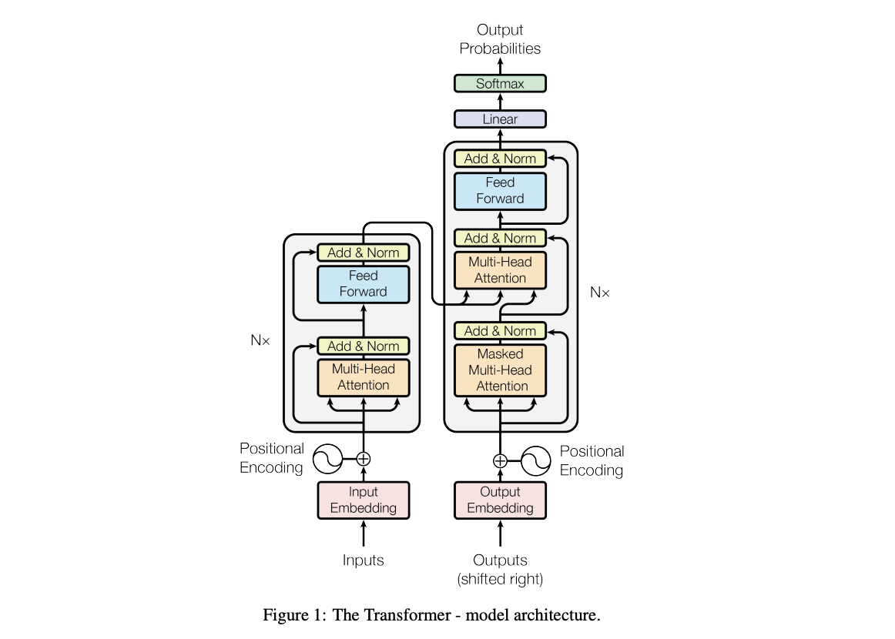

**1. Encoder and Decoder Stacks**

> The encoder is composed of a stack of N = 6 identical layers. Each layer has two sub-layers. The first is a multi-head self-attention mechanism, and the second is a simple, position-wise fully connected feed-forward network.

Each of the $N$ layers contains a multi-headed attention block for the words in the input sequence to self-attend to each other and soak up meanings from each other, as well as a feed forward network to use and interpret those meanings.

Additionally, each sub-layer uses layer normalization and residuals for optimization purposes.

> The decoder is also composed of a stack of N = 6 identical layers. In addition to the two sub-layers in each encoder layer, the decoder inserts a third sub-layer, which performs multi-head attention over the output of the encoder stack.

Masked multi-head attention is used in the decoder to ensure that output words can’t attend to words that follow them

**2. Attention**

> An attention function can be described as mapping a query and a set of key-value pairs to an output, where the query, keys, values, and output are all vectors.

**2.1. Scaled Dot-Product Attention**

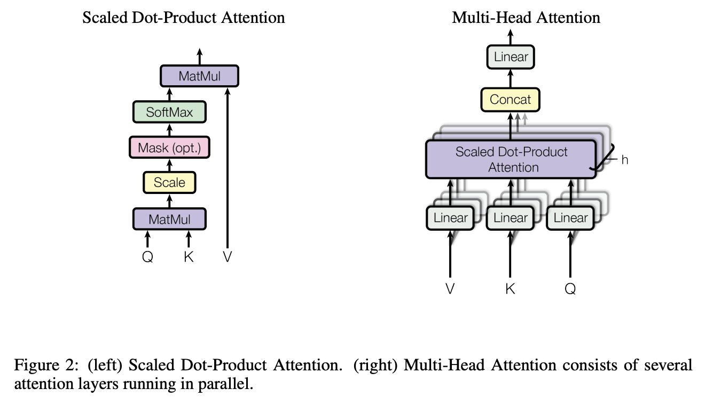

```math
\textrm{Attention}(Q,K,V) = \textrm{softmax}(\frac{QK^T}{\sqrt{d_k}})V
```

Both dot-product and additive attention were viable choices. However:

> Dot-product attention is much faster and more space-efficient in practice, since it can be implemented using highly optimized matrix multiplication code.

> We suspect that for large values of $d_k$, the dot products grow large in magnitude, pushing the softmax function into regions where it has
> extremely small gradients. To counteract this effect, we scale the dot products by $\frac{1}{\sqrt{d_k}}$.

The scaling factor is just to keep the outputs of the softmax function in the regime where it’s gradient doesn’t vanish, regardless of the dimensions size (by minimizing the differences between values).

**2.2. Multi-Head Attention**

> Multi-head attention allows the model to jointly attend to information from different representation subspaces at different positions. With a single attention head, averaging inhibits this.

The primary affect of multi-headed attention is to enable the model to soak up context from multiple distinct potential information sources for each word - something that couldn’t happen as easily with just a single head due to the fact that individual heads take weighted averages of the

```math
\textrm{MultiHead}(Q,K,V) = \textrm{Concat}(\textrm{head}_1,...,\textrm{head}_h)W^O \\
\textrm{where head}_i = \textrm{Attention}(QW_i^Q, KW_i^K, VW_i^V)
```

Each multi-headed attention block concatenates the results of each of its head into the final vector that’s passed to the feed-forward layer.

This means that the feed-forward layer is actually not just receiving a single opinion about the words enriched context, but actually a completely different perspective about the words meaning for each head.

In this case, that means that the feed-forward layer is actually receiving 8 different perspectives on the enriched meaning of each token.

> Due to the reduced dimension of each head, the total computational cost is similar to that of single-head attention with full dimensionality.

**2.3. Applications of Attention in our Model**

> In addition to attention sub-layers, each of the layers in our encoder and decoder contains a fully connected feed-forward network, which is applied to each position separately and identically. This consists of two linear transformations with a ReLU activation in between.

```math
\textrm{FFN}(x) = \max(0, xW_1 + b_1)W_2 + b_2
```

> While the linear transformations are the same across different positions, they use different parameters from layer to layer. Another way of describing this is as two convolutions with kernel size 1.

Because the same weight matrix is applied to each enhanced token outputted from the multi-headed attention layer, this can be thought of as a convolution being applied to each position.

**4. Embeddings and Softmax**

> We also use the usual learned linear transformation and softmax function to convert the decoder output to predicted next-token probabilities.

**5. Positional Encodings**

> Since our model contains no recurrence and no convolution, in order for the model to make use of the order of the sequence, we must inject some information about the relative or absolute position of the tokens in the sequence. To this end, we add "positional encodings" to the input embeddings at the bottoms of the encoder and decoder stacks.

This is what enables Transformers to still maintain information about word positions without explicit recurrence.

> In this work, we use sine and cosine functions of different frequencies:

```math
PE_{(pos,  2i)} = \sin(pos/1000^{2i/d_{\textrm{model}}}) \\
PE_{(pos,  2i+1)} = \cos(pos/1000^{2i/d_{\textrm{model}}})
```

### Why Self-Attention

> Motivating our use of self-attention we consider three desiderata. One is the total computational complexity per layer. Another is the amount of computation that can be parallelized, as measured by the minimum number of sequential operations required. The third is the path length between long-range dependencies in the network.

> Learning long-range dependencies is a key challenge in many sequence transduction tasks. One key factor affecting the ability to learn such dependencies is the length of the paths forward and backward signals have to traverse in the network. The shorter these paths between any combination of positions in the input and output sequences, the easier it is to learn long-range dependencies.

Transformers make it far easier for the network to learn long-range dependencies between words since there’s no recurrence to make path lengths across time long.

> To improve computational performance for tasks involving very long sequences, self-attention could be restricted to considering only a neighborhood of size $r$ in the input sequence centered around the respective output position.

This is the motivation behind limited context windows.

> As side benefit, self-attention could yield more interpretable models. Not only do individual attention heads clearly learn to perform different tasks, many appear to exhibit behavior related to the syntactic and semantic structure of the sentences.

Multi-headed attention appears to model highly interpretable behaviors, something uncharacteristic of most models.

### Training

> We trained on the standard WMT 2014 English-German dataset consisting of about 4.5 million sentence pairs.

> Sentences were encoded using byte-pair encoding, which has a shared source-target vocabulary of about 37000 tokens.

> We trained our models on one machine with 8 NVIDIA P100 GPUs. […] Each training step took about 0.4 seconds.

> We used the Adam optimizer with $\beta_1 = 0.9$, $\beta_2 = 0.98$ and $\epsilon = 10^{−9}$.

> We apply dropout to the output of each sub-layer before it is added to the sub-layer input and normalized. In addition, we apply dropout to the sums of the embeddings and the positional encodings in both the encoder and decoder stacks.

> During training, we employed label smoothing of value $\epsilon_{l_s} = 0.1$.

### Results

> Training took 3.5 days on 8 P100 GPUs. Even our base model surpasses all previously published models and ensembles, at a fraction of the training cost of any of the competitive models.

> To evaluate if the Transformer can generalize to other tasks we performed experiments on English constituency parsing. This task presents specific challenges: the output is subject to strong structural constraints and is significantly longer than the input. Furthermore, RNN sequence-to-sequence models have not been able to attain state-of-the-art results in small-data regimes.

> Despite the lack of task-specific tuning our model performs surprisingly well, yielding better results than all previously reported models with the exception of the Recurrent Neural Network Grammar.

### Conclusion

> In this work, we presented the Transformer, the first sequence transduction model based entirely on attention, replacing the recurrent layers most commonly used in encoder-decoder architectures with multi-headed self-attention.

> For translation tasks, the Transformer can be trained significantly faster than architectures based on recurrent or convolutional layers.

# BERT

📜 [BERT: Pre-training of Deep Bidirectional Transformers for Language Understanding](https://arxiv.org/pdf/1810.04805)

> We introduce a new language representation model called BERT, which stands for Bidirectional Encoder Representations from Transformers.

> BERT is designed to pre-train deep bidirectional representations from
> unlabeled text by jointly conditioning on both
> left and right context in all layers.

> As a result, the pre-trained BERT model can be fine-tuned with just one additional output layer to create state-of-the-art models for a wide range of tasks, […] without substantial task-specific architecture modifications.

BERT is built specifically for fine-tuning. It makes it easy to train a single base model and then use it to create a number of task specific models.

> BERT is conceptually simple and empirically powerful. It obtains new state-of-the-art results on eleven natural language processing tasks.

> There are two existing strategies for applying pre-trained language representations to downstream tasks: _feature-based_ and _fine-tuning._

> We argue that current techniques restrict the power of the pre-trained representations, especially for the fine-tuning approaches.

> The major limitation is that standard language models are unidirectional, and this limits the choice of architectures that can be used during pre-training. For example, in OpenAI GPT, the authors use a left-to-right architecture, where every token can only attend to previous tokens in the self-attention layers of the Transformer.

> Such restrictions are sub-optimal for sentence-level tasks, and could be very harmful when applying fine-tuning based approaches to token-level tasks such as question answering, where it is crucial to incorporate context from both directions.

The main problem of the original transformer design is that the left-to-right architecture during training means that words learn to soak up context from words on their left, but not on their right, whereas in understanding sentences, soaking up context from all directions is critical.

> BERT alleviates the previously mentioned unidirectionality constraint by using a “masked language model” (MLM) pre-training objective.

> The masked language model randomly masks some of the tokens from the input, and the objective is to predict the original vocabulary id of the masked word based only on it’s context.

Using this MLM objective, words can learn to absorb context from all other words around them, making the Transformer bidirectional.

> We demonstrate the importance of bidirectional pre-training for language representations.

> We show that pre-trained representations reduce the need for many heavily-engineered task specific architectures.

### **Related Work**

**1. Unsupervised Feature-based Approaches**

> Pre-trained word embeddings are an integral part of modern NLP systems, offering significant improvements over embeddings learned from scratch.

**2. Unsupervised Fine-tuning Approaches**

> Sentence or document encoders which produce contextual token representations have been pre-trained from unlabeled text and fine-tuned for a supervised downstream task.

**3. Transfer Learning from Supervised Data**

> There has also been work showing effective transfer from supervised tasks with large datasets, such as natural language inference and machine translation.

### BERT

> During pre-training, the model is trained on unlabeled data over different pre-training tasks. For fine-tuning, the BERT model is first initialized with the pre-trained parameters, and all of the parameters are fine-tuned using labeled data from the downstream tasks.

> A distinctive feature of BERT is its unified architecture across different tasks.

BERT is built specifically for easy fine-tuning for a number of different tasks, and the architecture of the model stays exactly the same after fine-tuning.

**1. Pre-training BERT**

> In order to train a deep bidirectional representation, we simply mask some percentage of the input tokens at random, and then predict those masked tokens.

> In order to train a model that understands sentence relationships, we pre-train for a binarized next sentence prediction task.

**Next sentence prediction (NSP)** is an essential addition of BERT. The model is trained with some classification problems - and it’s initial token for every predicted sequence is the `[CLS]` token, meant to classify if the two sentences it was fed follow each other or not.

Adding this task into the model forces the model to learn whether two sentences are actually related or not, rather than just assuming that the text it’s fed is all correctly related.

**2. Fine-tuning BERT**

> For each task, we simply plug in the task specific inputs and outputs into BERT and fine-tune all the parameters end-to-end.

> Compared to pre-training, fine-tuning is relatively inexpensive.

### Ablation Studies

**1. Effect of Pre-training Tasks**

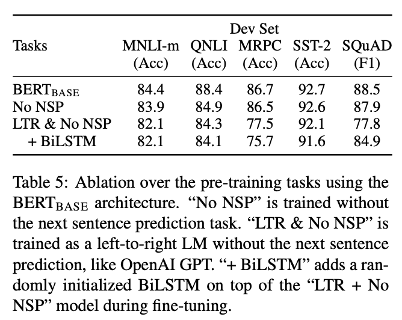

**2. Effect of Model Size**

> It has long been known that increasing the model size will lead to continual improvements on large-scale tasks such as machine translation and language modeling, which is demonstrated by the LM perplexity of held-out training data.

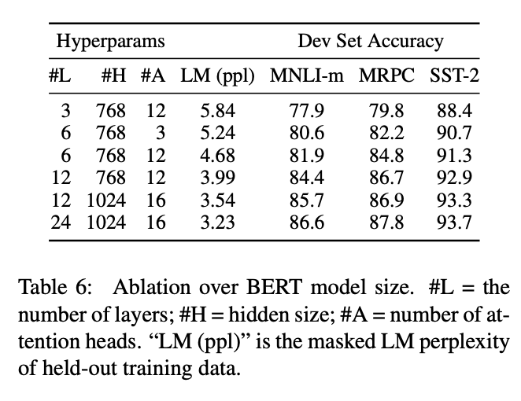

### Conclusion

> Recent empirical improvements due to transfer learning with language models have demonstrated that rich, unsupervised pre-training is an integral part of many language understanding systems.

> Our major contribution is further generalizing these findings to deep bidirectional architectures, allowing the same pre-trained model to successfully tackle a broad set of NLP tasks.

# RoBERTa

📜 [RoBERTa: A Robustly Optimized BERT Pre-training Approach](https://arxiv.org/pdf/1907.11692)

> We find that BERT was significantly undertrained, and can match or exceed the performance of every model published after it.

> These results highlight the importance of previously overlooked design choices, and raise questions about the source of recently reported improvements.

> Our modifications are simple, they include:
> (1) training the model longer, with bigger batches, over more data
> (2) removing the next sentence prediction objective
> (3) training on longer sequences
> (4) dynamically changing the masking pattern applied to the training data

> Our training improvements show that masked language model pre-training, under the right design choices, is competitive with all other recently published methods.

RoBERTa is about showing that the BERT architecture is actually capable of achieving state-of-the-art results, and questioning it’s design choices.

### Training Procedure Analysis

**1. Static vs. Dynamic Masking**

BERT uses static token masking where the masks are determined in advance. Instead, RoBERTa tries dynamic token masking which leads to slight improvements.

**2. Model Input Format and Next Sentence Prediction**

BERT uses next sentence prediction. RoBERTa finds that you can actually do better by eliminating this and just training on sequences of sentences from a single document.

**3. Training with Larger Batches**

RoBERTa uses a larger mini-batch size for training.

**4. Text Encoding**

> Using bytes [instead of unicode characters] makes it possible to learn a subword vocabulary of a modest size (50K units) that can still encode any input text without introducing any “unknown” tokens.

> Nevertheless, we believe the advantages of a universal encoding scheme outweighs the minor degradation in performance and use this encoding in
> the remainder of our experiments.

### RoBERTa

> Specifically, RoBERTa is trained with dynamic masking, FULL SENTENCES without NSP loss, large mini-batches and a larger byte-level BPE.

> Additionally, we investigate two other important factors that have been under-emphasized in previous work: (1) the data used for pre-training, and (2) the number of training passes through the data.


> Crucially, RoBERTa uses the same masked language modeling pre-training objective and architecture as $\textrm{BERT}_{\textrm{LARGE}}$, yet consistently outperforms both $\textrm{BERT}_{\textrm{LARGE}}$ and $\textrm{XLNet}_{\textrm{LARGE}}$.

> This raises questions about the relative importance of model architecture and pretraining objective, compared to more mundane details like dataset size and training time that we explore in this work.


### Conclusion

> These results illustrate the importance of these previously overlooked design decisions and suggest that BERT’s pre-training objective remains competitive with recently proposed alternatives.

# Adapters

📜 [Parameter-Efficient Transfer Learning for NLP](https://arxiv.org/pdf/1902.00751)

> As an alternative, we propose transfer with adapter modules. Adapter
> modules yield a compact and extensible model; they add only a few trainable parameters per task, and new tasks can be added without revisiting previous ones.

> Adapters attain near state-of-the-art performance, whilst adding only a few parameters per task.

Adapters allow a base model to fine-tune for a specific task without retraining all of it’s parameters. Instead, they just add on some additional parameters which can get fine-tuned to accomplish the task.

> A high degree of sharing between tasks is particularly useful.

> We propose a transfer learning strategy that yields _compact_ and _extensible_ downstream models.

Compact models don’t require training too many parameters. Extensible models can be continuously updated to learn more tasks.

> Adapter-based tuning requires training two orders of magnitude fewer parameters to fine-tuning, while attaining similar performance.

> Adapters are new modules added between layers of a pre-trained network.

> Consider a function (neural network) with parameters $w: \phi_w(x)$.

> Feature-based transfer composes $\phi_w$ with a new function $\chi_v$ to yield $\chi_v(\phi_w(x))$. Only the new, task-specific parameters, $v$ are then trained.

> Fine-tuning involves adjusting the original parameters, $w$ for each new task, limiting compactness.

> For adapter tuning, $\psi_{w,v_0}(x)$ is defined, where parameters $w$ are copied over from pre-training. […] During training, only $v$ are tuned.

Adapter tuning adds a new set of parameters to be trained, and they work in unison with the original unaltered parameters.

> The key innovation is to design an effective adapter module and its integration with the base model. We propose a simple yet effective, bottleneck architecture.

### Adapter Tuning for NLP

> Our strategy has three key properties: (i) it attains good performance, (ii) it permits training on tasks sequentially, that is, it does not require simultaneous access to all datasets, and (iii) it adds only a small number of additional parameters per task.

> Adapter modules have two main features: a small number of parameters, and a near-identity initialization.

**1. Instantiation for Transformer Networks**

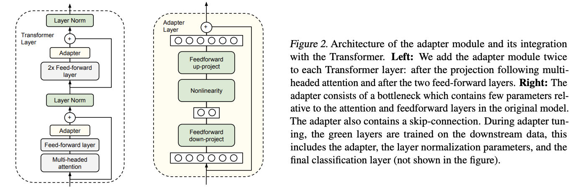

> The adapter is always applied directly to the output of the sub-layer, after the projection back to the input size, but before adding the skip connection back. The output of the adapter is then passed directly into the following layer normalization.

> To limit the number of parameters, we propose a bottleneck architecture. The adapters first project the original d-dimensional features into a smaller dimension, m, apply a nonlinearity, then project back to d dimensions. […]
>
> The bottleneck dimension, m, provides a simple means to tradeoff performance with parameter efficiency.

### Experiments

> We show that adapters achieve parameter efficient transfer for text tasks.

> The adapter size controls the parameter efficiency, smaller adapters introduce fewer parameters, at a possible cost to performance.

**6. Analysis and Discussion**

> We perform an ablation to determine which adapters are influential.

> First, we observe that removing any single layer’s adapters has only a small impact on performance.

> Adapters on the lower layers have a smaller impact than the higher-layers. […] One intuition is that the lower layers extract lower-level features that are shared among tasks, while the higher layers build features that are unique to different tasks.

> To analyze the impact of the initialization scale on the performance, we
> test standard deviations in the interval. We observe that on both datasets,
> the performance of adapters is robust for standard deviations below $10^{−2}$. However, when the initialization is too large, performance degrades.

Adapters need to be initialized to preserve the identity mapping.

# T5

📜 [Exploring the Limits of Transfer Learning with a Unified Text-to-Text Transformer](https://arxiv.org/pdf/1910.10683)

> In this paper, we explore the landscape of transfer learning techniques for NLP by introducing a unified framework that converts all text-based language problems into a text-to-text format.

The approach of this paper is to deeply understand all research approaches to something important (the transfer learning for large language models set of research), and then to use what they learn to create state of the art models.

> This can be loosely viewed as developing general-purpose knowledge that allows the model to “understand” text.

Pre-training a model on a large amount of text before fine-tuning.

> Recently, it has become increasingly common to pre-train the entire model on a data-rich task. Ideally, this pre-training causes the model to develop general-purpose abilities and knowledge that can then be transferred to downstream tasks.

> Beyond its empirical strength, unsupervised pre-training for NLP is particularly attractive because unlabeled text data is available en masse thanks to the Internet.

This is the reason the transfer learning approach with a base-model and fine-tuning is so essential - we have large quantities of unlabeled data that can be used to develop general knowledge, and then we only have to use a small amount of labeled data (expensive and inconvenient to produce) in order to create good models.

> The basic idea underlying our work is to treat every text processing problem as a “text-to-text” problem, i.e. taking text as input and producing new text as output.

By converting everything into the same problem (not specific tasks with specific formats, but just everything is about mapping text-to-text), they can generalize and evaluate different approaches against each other.

> We emphasize that our goal is not to propose new methods but instead to provide a comprehensive perspective on where the field stands.

### Setup

**1. Model**

Most things are kept similar to the original Transformer paper. They want to explore different architectures for self-attention.

> While the original Transformer used a sinusoidal position signal or learned position embeddings, it has recently become more common to use relative position embeddings.

**2. The Colossal Clean Crawled Corpus**

> In this paper, we are interested in measuring the effect of the quality, characteristics, and size of this unlabeled data.

> To address these issues, we used the following heuristics for cleaning up Common Crawl’s web extracted text:
>
> 

These heuristics are the beginning of how large internet scale datasets can be produced from web-scraping that are safe and usable, without all the random noise of most of the internet.

**3. Downstream Tasks**

> Our goal in this paper is to measure general language learning abilities.

> As such, we study downstream performance on a diverse set of benchmarks, including machine translation, question answering, abstractive summarization, and text classification.

**4. Input and Output Format**

> In order to train a single model on the diverse set of tasks described above, we cast all of the tasks we consider into a “text-to-text” format—that is, a task where the model is fed some text for context or conditioning and is then asked to produce some output text.

### Reflection

> Having completed our systematic study, we wrap up by first recapping some of our most significant findings.

**1. Takeaways**

> **Text-to-text:** Our text-to-text framework provides a simple way to train a single model on a wide variety of text tasks using the same loss function and decoding procedure.

They take a generalized approach to text-to-text tasks and show how specific evaluations can be cast onto this general approach.

> **Architectures:** While some work on transfer learning for NLP has considered architectural variants of the Transformer, we found the original encoder-decoder form worked best in our text-to-text framework.

> **Unsupervised Objectives:** We suggest using objectives that produce short target sequences so that unsupervised pre-training is more computationally efficient.

> **Datasets:** This motivates the use of a large and diverse data set like C4 for generic language understanding tasks.

> **Training Strategies:** We found that the basic approach of updating all of a pre-trained model’s parameters during fine-tuning outperformed methods that are designed to update fewer parameters, although updating all parameters is most expensive.

> **Scaling:** We also showed an ensemble of models can provide substantially better results than a single model, which provides an orthogonal means of leveraging additional computation.

> **Pushing the limits:** We combined our above insights and trained substantially larger models (up to 11 billion parameters) to achieve state-of-the-art results across many of the benchmarks we considered.

**2. Outlook**

> An unsurprising but important result from our study is that larger models tend to perform better. The fact that the hardware used for running these models is continually getting cheaper and more powerful suggests that scaling up may continue to be a promising way to achieve better performance

An explicit discussion of scaling laws starting to seem like a very attractive bet to make for a company.

> To address these issues, we are interested in further investigating language-agnostic models, i.e. models that can perform a given NLP task with good performance regardless of the text’s language.

# GPT-2

📜 [Language Models are Unsupervised Multitask Learners](https://d4mucfpksywv.cloudfront.net/better-language-models/language_models_are_unsupervised_multitask_learners.pdf)

> We demonstrate that language models begin to learn these tasks without any explicit supervision when trained on a new dataset of millions of webpages called WebText.

Language models start to learn and be able to complete tasks that typically required fine-tuning and supervised learning in an unsupervised way if they are just given enough data to train on.

> Our largest model, GPT-2, is a 1.5B parameter Transformer that achieves state of the art results on 7 out of 8 tested language modeling datasets in a zero-shot setting but still under-fits WebText.

> Our suspicion is that the prevalence of single task training on single domain datasets is a major contributor to the lack of generalization observed in current systems.

> It will be very difficult to continue to scale the creation of datasets and the design of objectives to the degree that may be required to brute force our way there with current techniques. This motivates exploring additional setups for performing multitask learning.

Multitask learning is promising for approaching general intelligence in language models, but it is expensive to create labeled datasets for it.

> We demonstrate language models can perform down-stream tasks in a zero-shot setting – without any parameter or architecture modification.

### Approach

> Language modeling is also able to, in principle, learn the tasks of without the need for explicit supervision of which symbols are the outputs to be predicted.

> The internet contains a vast amount of information that is passively available without the need for interactive communication. Our speculation is that a language model with sufficient capacity will begin to learn to infer and perform the tasks demonstrated in natural language sequences in order to better predict them, regardless of their method of procurement.

Here’s the hypothesis of OpenAI that leads to all their scaling laws research. The intuition is that the internet already has a ton of data and that providing the model with this data will make it learn more than people expect.

**1. Training Dataset**

> Our approach motivates building as large and diverse a dataset as possible in order to collect natural language demonstrations of tasks in as varied of domains and contexts as possible.
> A promising source of diverse and nearly unlimited text is web scrapes such as Common Crawl.

> Instead, we created a new web scrape which emphasizes document quality. To do this we only scraped web pages which have been curated/filtered by humans.

We see improvements in taste on the dataset (determined by humans) improving the quality of the model. And the broader trend of improving the quality of web scrapes and the model size to improve the model itself.

**2. Input Representation**

> We prevent BPE from merging across character categories for any byte sequence. We add an exception for spaces which significantly improves the compression efficiency while adding only minimal fragmentation of words across multiple vocab tokens.

### Experiments

> Our largest model, which we call GPT-2, has over an order of magnitude more parameters than GPT.

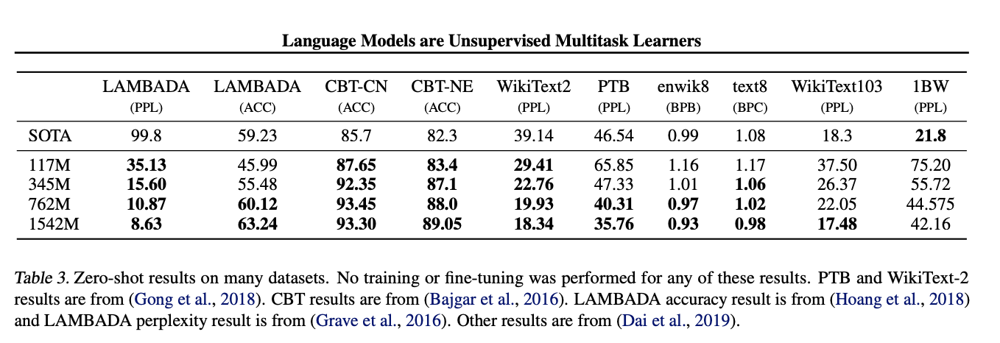

### Discussion

> Much research has been dedicated to learning, understanding, and critically evaluating the representations of both supervised and unsupervised pre-training methods. Our results suggest that unsupervised task learning is an additional promising area of research to explore.

> While zero-shot performance establishes a baseline of the potential performance of GPT-2 on many tasks, it is not clear where the ceiling is with fine-tuning.

### Conclusion

> When a large language model is trained on a sufficiently large and diverse dataset it is able to perform well across many domains and datasets.

# GPT-3

📜 [Language Models are Few-Shot Learners](https://arxiv.org/pdf/2005.14165)

> Here we show that scaling up language models greatly improves task-agnostic, few-shot performance, sometimes even reaching competitiveness with prior state-of-the-art fine-tuning approaches.

> Specifically, we train GPT-3, an autoregressive language model with 175 billion parameters, 10x more than any previous non-sparse language model, and test its performance in the few-shot setting.

Again, GPT-3, like GPT-2 is not so much an introduction of new research methods as much as it is a practical implication of the principle that has been realized earlier - scaling laws are the direction of improvement.

> We discuss broader societal impacts of this finding and of GPT-3 in general.

> First, from a practical perspective, the need for a large dataset of labeled examples for every new task limits the applicability of language models.

> Second, the potential to exploit spurious correlations in training data fundamentally grows with the expressiveness of the model and the narrowness of the training distribution.

> Third, humans do not require large supervised datasets to learn most language tasks.

> Since in-context learning involves absorbing many skills and tasks within the parameters of the model, it is plausible that in-context learning abilities might show similarly strong gains with scale.

> In this paper, we test this hypothesis by training a 175 billion parameter autoregressive language model, which we call GPT-3, and measuring its in-context learning abilities.

### Results

All you need is scale! These training curves show that increase model parameters significantly decreases cross entropy loss.

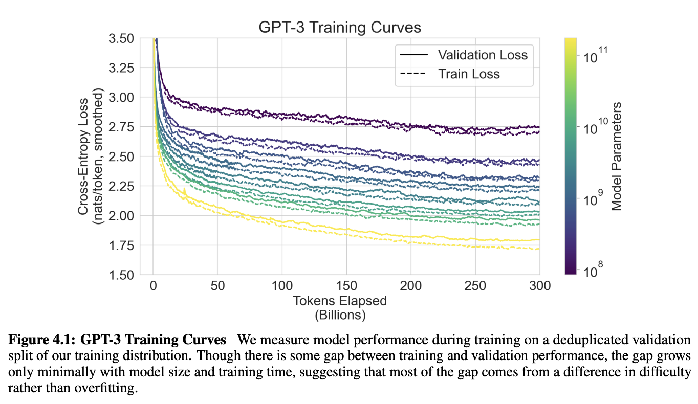

### Limitations

> First, despite the strong quantitative and qualitative improvements of GPT-3, particularly compared to its direct predecessor GPT-2, it still has notable weaknesses in text synthesis and several NLP tasks.

> A more fundamental limitation of the general approach described in this paper – scaling up any LM-like model, whether autoregressive or bidirectional – is that it may eventually run into (or could already be running into) the limits of the pre-training objective.

> Finally, GPT-3 shares some limitations common to most deep learning systems – its decisions are not easily interpretable, it is not necessarily well-calibrated in its predictions on novel inputs as observed by the much higher variance in performance than humans on standard benchmarks, and it retains the biases of the data it has been trained on.

### Broader Impacts

This section doesn’t say anything too unintuitive, but seems to be more about the optics of them having considered the safety aspects of the model now that it has reached a level that’s potentially harmful.

However, it’s interesting to see the effects of how society has quickly adjusted to it’s awareness of AI and algorithms working around it through memetics. Social media has rapidly scaled awareness of AI.

### Conclusion

> We presented a 175 billion parameter language model which shows strong performance on many NLP tasks and benchmarks in the zero-shot, one-shot, and few-shot settings, in some cases nearly matching the performance of state-of-the-art fine-tuned systems, as well as generating high-quality samples and strong qualitative performance at tasks defined on-the-fly

> Despite many limitations and weaknesses, these results suggest that very large language models may be an important ingredient in the development of adaptable, general language systems.

# LoRA

📜 [Low-Rank Adaptation of Large Language-Models](https://arxiv.org/pdf/2106.09685)

> As we pre-train larger models, full fine-tuning, which retrains all model parameters, becomes less feasible.

> We propose Low-Rank Adaptation, or LoRA, which freezes the pre-trained model weights and injects trainable rank decomposition matrices into each
> layer of the Transformer architecture, greatly reducing the number of trainable parameters for downstream tasks.

Seems to be building on adapters to make fine-tuning large models like GPT-3 feasible at scale.

> We also provide an empirical investigation into rank-deficiency in language model adaptation, which sheds light on the efficacy of LoRA.

> More importantly, these methods [of fine-tuning models by extending model depth or reducing the model’s usable sequence] often fail to match the fine-tuning baselines, posing a trade-off between efficiency and model quality.

> We hypothesize that the change in weights during model adaptation also has a low “intrinsic rank”, leading to our proposed Low-Rank Adaptation (LoRA) approach.

> LoRA allows us to train some dense layers in a neural network indirectly by optimizing rank decomposition matrices of the dense layers’ change during adaptation instead, while keeping the pre-trained weights frozen.

LoRA lets the same base model be used for different tasks, makes training more efficient, introduces no inference latency, and can be combined with many previous optimization methods like prefix-tuning.

### Problem Statement

> One of the main drawbacks for full fine-tuning is that for _each_ downstream task, we learn a _different_ set of parameters $\Delta \Phi$ whose dimension $|\Delta \Phi|$ equals $|\Phi_0|$. Thus, if the pre-trained model is large, storing and deploying many independent instances of fine-tuned models can be challenging, if at all feasible.

> In the subsequent sections, we propose to use a low-rank representation to encode $\Delta \Phi$ that is both compute- and memory-efficient.

### Aren’t Existing Solutions Good Enough?

> There is no direct ways to bypass the extra compute in adapter layers.

> We observe that prefix tuning is difficult to optimize and that its performance changes non-monotonically in trainable parameter.

### Our Method

**1. Low-Rank-Parameterized Update Matrices**

> For a pre-trained weight matrix $W_0 \in \mathbb{R}^{d \times k}$, we constrain its update by representing the latter with a low-rank de-composition $W_0 + \Delta W = W_0 + BA$, where $B \in \mathbb{R}^{d \times r}$, and the rank $r \ll \min(d, k)$.

> For $h = W_0x$, our modified forward pass yields:

```math
h = W_0x + \Delta Wx = W_0x + BAx
```

Instead of optimizing a completely new set of parameters $\Delta W$ with dimension $d \times d$ in order to adapt the parameters of the original matrix $W_0$, we can instead create a low-rank decomposition of matrix $\Delta W = BA$ where the dimensions of $B$ and $A$ are $d \times r$ and $r \times d$ respectively. Thus, if $r \ll d$, this decomposition still yields a matrix of dimension $d \times d$ while needing to optimize $2rd$ parameters instead of $d^2$ parameters, which is a massive optimization.

> LoRA takes a step further and does not require the accumulated gradient update to weight matrices to have full-rank during adaptation.

> In other words, as we increase the number of trainable parameters, training LoRA roughly converges to training the original model.

> When deployed in production, we can explicitly compute and store $W = W_0 + BA$.

> When we need to switch to another downstream task, we can recover $W_0$ by subtracting $BA$ and then adding a different $B'A'$, a quick operation with very little memory overhead.

> Critically, this guarantees that we do not introduce any additional latency during inference compared to a fine-tuned model by construction.

**2. Applying LoRA to Transformer**

> In principle, we can apply LoRA to any subset of weight matrices in a neural network to reduce the number of trainable parameters.

> We limit our study to only adapting the attention weights for downstream tasks and freeze the MLP modules (so they are not trained in downstream tasks) both for simplicity and parameter-efficiency.

> The most significant benefit comes from the reduction in memory and storage usage.

### Understanding the Low-Rank Updates

> (1) Given a parameter budget constraint, which subset of weight matrices in a pre-trained Transformer should we adapt to maximize downstream performance?
> (2) Is the “optimal” adaptation matrix $\Delta W$ _really rank-defficient?_ If so, what is a good rank to use in practice?
> (3) What is the connection between $\Delta W$ and W? Does $\Delta W$ highly correlate with W? How large is $\Delta W$ comparing to W?

**1. Which Weight Matrices in Transformer Should We Apply LoRA To?**


**2. What is the Optimal Rank $r$ for LoRA**


> We argue that increasing r does not cover a more meaningful subspace, which suggests that a low-rank adaptation matrix is sufficient.

**3. How Does the Adaptation Matrix $\Delta W$ Compare to W**

> This suggests that the low-rank adaptation matrix potentially _amplifies the important features for specific downstream tasks that were learned but not emphasized in the general pre-training model._

This is the core intuition behind why LoRA works. It’s an attempt at understanding why the transformation done by fine-tuning is inherently low rank.

In practice, when looking at the SVD of $W$, it appears that LoRA’s effect is to amplify the directions that are not already emphasized in $W$, potentially augmenting existing representations that already existed in $W$ which are particularly relevant to specific tasks but not emphasized in the original matrix.

### Conclusion

> We propose LoRA, an efficient adaptation strategy that neither introduces inference latency nor reduces input sequence length while retaining high model quality. Importantly, it allows for quick task-switching when deployed as a service by sharing the vast majority of the model parameters.

> While we focused on Transformer language models, the proposed principles are generally applicable to any neural networks with dense layers.

This discovery is actually generally valuable for all fine-tuning and transfer learning cases with neural networks.

# Image Transformers

📜 [An Image Is Worth 16x16 Words: Transformers for Image Recognition at Scale](https://arxiv.org/pdf/2010.11929)

> When trained on mid-sized datasets such as ImageNet without strong regularization, these [transformer] models yield modest accuracies of a few percentage points below ResNets of comparable size

> Transformers lack some of the inductive biases inherent to CNNs, such as translation equivariance and locality, and therefore do not generalize well when trained on insufficient amounts of data.

> However, the picture changes if the models are trained on larger datasets (14M-300M images). We find that large scale training trumps inductive bias.

Another huge statement again showing the scale is all you need. The constraint is really how much is a model architecture conducive to scale (which is constrained by optimization & regularization with large number of parameters, compute, and time to convergence).

The inductive bias of CNNs actually doesn’t get you as far as training transformers on more data.

> Naive application of self-attention to images would require that each pixel attends to every other pixel. With quadratic cost in the number of pixels, this does not scale to realistic input sizes. Thus, to apply Transformers in the context of image processing, several approximations have been tried in the past.

### Method

**1. Vision Transformer**

> In model design we follow the original Transformer as closely as possible. An advantage of this intentionally simple setup is that scalable NLP Transformer architectures – and their efficient implementations – can be used almost out of the box

Don’t reinvent the wheel. Do as little work as possible to verify just your core thesis and not build everything from scratch.

The image is divided into patches of dimension $(P, P)$ where there are $N = HW/P^2$ total patches, which is also the number of inputs to the transformer.

The transformer uses constant latent vector size $D$ for every layer, so we create a projection from the $P^2$ length flattened patches to the size $D$ embedding vector for each patch. This projection is trained with the network.

Positional encodings are also included with each token, although they include no information about the patches 2D position.

**2. Inductive Bias**

> We note that Vision Transformer has much less image-specific inductive bias than CNNs.

Transformers has almost no inductive bias compared with what the CNNs have, but they still perform better. Needing inductive bias is a sign that you haven’t scaled far enough.

### Conclusion

> Unlike prior works using self-attention in computer vision, we do not introduce image-specific inductive biases into the architecture apart from the initial patch extraction step. Instead, we interpret an image as a sequence of patches and process it by a standard Transformer encoder as used in NLP.

> This simple, yet scalable, strategy works surprisingly well when coupled with pre-training on large datasets. Thus, Vision Transformer matches or exceeds the state of the art on many image classification datasets, whilst being relatively cheap to pre-train.

> Finally, further scaling of ViT would likely lead to improved performance.

# DALL E

📜 [Zero-Shot Text-to-Image Generation](https://arxiv.org/pdf/2102.12092)

> Text-to-image generation has traditionally focused on finding better modeling assumptions for training on a fixed dataset.

> We describe a simple approach for this task based on a transformer that auto-regressively models the text and image tokens as a single stream of data. With sufficient data and scale, our approach is competitive with previous domain-specific models when evaluated in a zero-shot fashion.

Instead of focusing on inductive bias to improve image modeling, they instead focus on data and scale - and as usual, it works!

> Recent advances fueled by large-scale generative models suggest a possible route for further improvements [in text-to-image modeling]. Specifically, when compute, model size, and data are scaled carefully, auto-regressive transformers have achieved impressive results in several domains such as text, images, and audio.

> Could dataset size and model size be the limiting factor of current approaches?

> In this work, we demonstrate that training a 12-billion parameter autoregressive transformer on 250 million image-text pairs collected from the internet results in a flexible, high fidelity generative model of images controllable through natural language.

> The resulting system achieves high quality image generation on the popular MS-COCO dataset zero-shot, without using any of the training labels.

They apply the same scaling hypothesis here to text-to-image models, and once again, get SoTA results with this hypothesis, creating a model that can perform well on previous datasets zero-shot without even training on them.

### Method

> Our goal is to train a transformer to auto-regressively model the text and image tokens as a single stream of data.

> However, using pixels directly as image tokens would require an inordinate amount of memory for high-resolution images.

> We address these issues by using a two-stage training procedure:

**Stage 1:** We train a discrete variational auto-encoder (dVAE) to compress each 256×256 RGB image into a 32 × 32 grid of image tokens, each element of which can assume 8192 possible values. This reduces the context size of the transformer.

**Stage 2:** We concatenate up to 256 BPE-encoded text tokens with the $32 \times 32$ image tokens, and train an autoregressive transformer to model the joint distribution over the text and image tokens.

>

They’re getting creative here. Using the strategies from VQ-VAE to compress the image farther so the context is smaller, and then use this to create image patch tokens like with ViT to send to the transformer - where the word and image tokens can all attend to each other!

> We can model the overall procedure as maximizing the evidence lower bound (ELB) on the joint likelihood of the model distribution over images $x$, captions $y$ and the tokens $z$ for the encoded RGB image.

```math
\ln p_{\theta,\psi}(x,y) \geqslant \mathbb{E}_{z \sim q_{\phi}(z | x)} (\ln p_\theta(x|y,z) - \beta D_{KL} (q_\phi(y, z|x), p_{\psi}(y, z))
```

Here, we model the ELB with $p_{\theta,\psi}(x,y)$ representing the target probability to minimize - the probability of a given image $x$ given that we’re provided with the caption $y$.

This can be minimized by taking the KL divergence between the probability of caption $y$ and the tokens $z$ from the auto-encoder given the original image $x$ (this is the probability we have in training runs) - $q_\phi(y, z|x)$, with the joint probability of a specific caption and image tokens appearing together over the distribution of the model $p_\psi(y,z)$ (in the transformer?).

In other words, we want the probability of given image tokens appearing with a caption given a specific image to be the same probability as just the tokens and caption appearing together (since the tokens should be a lossless representation of the image).

The second term with the KL divergence allows us to minimize the difference between these distributions, zeroing out the term, which will contribute to maximizing the ELB.

Similarly the $\ln p_\theta (x|y,z)$ term allows the model to maximize the probability of generating the correct image $x$ given the caption $y$ and compressed image representation $z$.

Critically, the expectation is sampling $z \sim q_\phi(z, x)$ indicating the distribution over the most probable $z$ values given $x$ - so this entire ELB allows the VAE to improve the sampling of $z$ via this distribution, such that the KL divergence is minimized.

**1. Stage One: Learning the Visual Codebook**

> In the first stage of training, we maximize the ELB with respect to $\phi$ and $\theta$, which corresponds to training a dVAE on the images alone.

They first focused just on the distributions $q_\phi$ of $32 \times 32$ image tokens generated by the dVAE given the image $x^2$, and the distribution $p_\theta$ which is the distribution over the RGB images generated by the dVAE decoder given the image tokens.

In practice, this means focusing on optimizing the encoder & decoder stages to compress down and then re-generate the original images.

> The ELB now becomes difficult to optimize: as $q_\psi$ is a discrete distribution, and we cannot use the re-parameterization gradient to maximize it.

Because DALL E represents images with discrete rather than continuous data (it uses a grid of values which can assume exactly 8192 values), sampling from a continuous distribution between the encoder and the decoder as customarily done no longer works.

This is because using $\sigma$ and $\mu$ in this space would result in sampling jumps to different tokens, since variance in this subspace just implies skipping to different tokens (since values are discrete).

Given that this space is discrete, it’s also not differentiable, as fractional gradients have no meaning here.

> We instead use the gumbel-softmax relation, replacing the expectation over $q_\phi$ with one over $q_\phi^\tau$, where the relaxation becomes tight as the temperature $\tau \rarr 0$.

Instead of outputting a $\sigma$ and $\mu$ from the encoder to sample with, the model instead outputs a set of logits of the scores for each of the 8192 possible tokens at each position.

Then, gumbel noise is added to these scores to simulate the randomness effect, and the softmax of these scores is taken with a temperature value $\tau$ to control the softnening of this function.

This process, called the gumbel-softmax relation, creates a continuous and differentiable function simulating sampling for our discrete tokens, which can be used in the VAE.

> The likelihood for $p_\theta$ is evaluated using the log-laplace distribution.

> We also found that increasing the KL weight to β = 6.6 promotes better codebook usage and ultimately leads to a _smaller_ reconstruction error at the end of training.

They maximize the weight of the KL divergence term in the ELB, which allows the auto-encoder to ensure that each mapping of image → image tokens is relatively unique, so it maintains all the important information in the compression.

**2. Stage 2: Learning the Prior**

> In the second stage, we fix $\phi$ and $\theta$, and learn the prior distribution over the text and image tokens by maximizing the ELB with respect to $\psi$.

Now we fix the distributions of the image to image token compression, and the image tokens back to the image, and we focus on the joint distribution of image tokens with text.

> Given a text-image pair, we BPE-encode the lowercased caption using at most 256 tokens with vocabulary size $16,384$, and encode the image using $32 \times 32 = 1024$ tokens with vocabulary size $8192$.

> The image tokens are obtained using argmax sampling from the dVAE encoder logits, without adding any gumbel noise.

The gumbel noise was used during training, but is not actually needed during usage of the dVAE - the logits can just be used directly by picking the most likely token for each part of the image.

> The transformer is a decoder-only model in which each image token can attend to all text tokens in any one of its 64 self-attention layers.

> Instead, we opt to learn a special padding token separately for each of the 256 text positions.

They use a padding token (which should carry no information) to fill out the remaining spots in the max 256 length image description, since each input should have the same number of text and image tokens.

**3. Data Collection**

> To scale up to 12-billion parameters, we created a dataset of a similar scale to JFT-300M by collecting 250 million text-images pairs from the internet.

**4. Mixed-Precision Training**

> To save GPU memory and increase throughput, most parameters, Adam moments, and activations are stored in 16-bit precision.

First mention I’ve seen of low-level compute details including floating point precisions used.

> Getting the model to train in 16-bit precision past one billion parameters, without diverging, was the most challenging part of this project. We believe the root cause of this instability to be underflow in the 16-bit gradients.

Here we hit an actual engineering challenge discussed in the paper.

**5. Distributed Optimization**

> Our 12-billion parameter model consumes about 24 GB of memory when stored in 16-bit precision, which exceeds the memory of a 16 GB NVIDIA V100 GPU. We address this using parameter sharding.

> Parameter sharding allows us to almost completely hide the latency of the intra-machine communication by overlapping it with compute-intensive operations.

**6. Sample Generation**

> We rerank the samples drawn from the transformer using a pre-trained contrastive model. Given a caption and a candidate image, the contrastive model assigns a score based on how well the image matches the caption.

> Training the transformer on the tokens from the dVAE encoder allows us to allocate its modeling capacity to the low-frequency information that makes images visually recognizable to us.

> However, it also disadvantages the model, since the heavy compression renders it unable to produce high-frequency details.

### Experiments

**1. Quantitative Results**

> Given a caption, the sample from our model receives the majority vote for better matching the caption 93% of the time. It also receives the majority vote for being more realistic 90% of the time.

**2. Qualitative Results**

> We found that our model has the ability to generalize in ways that we did not originally anticipate. […] It has developed a rudimentary ability to compose unusual concepts at high levels of abstraction.

> Our model also appears to be capable of combinatorial generalization, such as when rendering text or when probed on sentences like “an illustration of a baby hedgehog in a Christmas sweater walking a dog.”

> To a limited degree of reliability, we also find our model to be capable of zero-shot image-to-image translation controllable by natural language.

Here’s the beginning of editing images with text - the model can update existing images/complete them with captions.

> This works with several other kinds of transformations.

### Conclusion

> We investigate a simple approach for text-to-image generation based on an autoregressive transformer, when it is executed at scale.

> Our findings suggest that improving generalization as a function of scale may be a useful driver for progress on this task.

# CLIP

📜 [Learning Transferable Visual Models From Natural Language Supervision](https://arxiv.org/pdf/2103.00020)

> We demonstrate that the simple pre-training task of predicting which caption goes with which image is an efficient and scalable way to learn SOTA image representations from scratch on a dataset of 400 million (image, text) pairs collected from the internet.

> After pre-training, natural language is used to reference learned visual concepts (or describe new ones) enabling zero-shot transfer of the model to downstream tasks.

> For instance, we match the accuracy of the original ResNet-50 on ImageNet zero-shot without needing to use any of the 1.28 million training examples it was trained on.

> Could scalable pre-training methods which learn directly from web text result in a similar breakthrough in computer vision?

Could a pre-training approach used by models like GPT-3 capture high-level knowledge just like it does with language modeling, except for images?

> In this work, we close this gap and study the behaviors of image classifiers trained with natural language supervision at large scale.

> Enabled by the large amounts of publicly available data of this form
> on the internet, we create a new dataset of 400 million (image, text) pairs and demonstrate that a simplified version of ConVIRT trained from scratch, which we call CLIP, for Contrastive Language-Image Pre-training, is an efficient method of learning from natural language supervision.

They train 8 different CLIP models with different orders of magnitude of compute, and again find a linearly scaling quality curve.

> We find that CLIP, similar to the GPT family, learns to perform a wide set of tasks during pre-training including OCR, geo-localization, action recognition, and many others.

> We also […] show that CLIP outperforms the best publicly available ImageNet model while also being more computationally efficient.

### Approach

**1. Natural Language Supervision**

> At the core of our approach is the idea of learning perception from supervision contained in natural language.

> It’s much easier to scale natural language supervision compared to standard crowd-sourced labeling for image classification since it does not require annotations to be in a classic “machine learning compatible format” such as the canonical 1-of-N majority vote “gold label”.

Natural language supervision is far easier to scale because text labels for images are abundant on the internet. Meanwhile, using labeling methods for classifiers makes the data collection process much longer since people need to manually fit images into 1-of-N classification labels.

> Learning from natural language also has an important advantage over most unsupervised or self-supervised learning approaches in that it doesn’t “just” learn a representation but also connects that representation to language which enables flexible zero-shot transfer.

Learning from natural language also means the model connects images to language with sufficient scale, rather than just being able to classify broadly what an image represents.

**2. Creating a Sufficiently Large Dataset**

> A major motivation for natural language supervision is the large quantities of data of this form available publicly on the internet.

Unlike previous datasets which are far smaller, the internet offers a huge amount of data available that could be used for natural language supervision

> To address this, we constructed a new dataset of 400 million (image, text) pairs collected form a variety of publicly available sources on the Internet.

They balance the dataset by searching for image, text pairs where the text contains specific queries (500,000) and then including 20,000 examples per query.

**3. Selecting an Efficient Pre-Training Method**

> State-of-the-art computer vision systems use very large amounts of compute. […] The task of learning an open set of visual concepts from
> natural language seems daunting.

Previous image models took many years of core compute time to train, and were only trained to predict 1000 ImageNet classes - this suggest the challenge of training image models.

> [Our initial approach tried] to predict the exact words of the text accompanying each image. This is a difficult task due to the wide variety of descriptions, comments, and related text that co-occur with images.

> Recent work in contrastive representation learning for images has found that contrastive objectives can learn better representations than their equivalent predictive objective.

> Noting these findings, we explored training a system to solve the potentially easier proxy task of predicting only which text as a whole is paired with which image and not the exact words of that text.

Because of how many ways to describe an image there are (a picture is worth a thousand words), creating a model specifically to predict the exact words that describe an image in the training set is extremely difficult. The training task itself would not even be possible for humans, which is a good proxy to understanding its difficulty.

> Given a batch of $N$ (image, text) pairs, CLIP is trained to predict which of the $N \times N$ possible (image, text) pairings across a batch actually occurred.

Instead, they train the model with batches of $N$ images and $N$ text pairings, and the model has to match up the correct images to the correct text.

> To do this, CLIP learns a multi-modal embedding space by jointly training an image encoder and text encoder to maximize the cosine similarity of the image and text embeddings of the $N$ real pairs in the batch, while minimizing the cosine similarity of the embeddings of the $N^2 - N$ incorrect pairings.

> [This] objective was first introduced […] as the _multi-class N-pair loss_.

This objective function is the entire reason why CLIP works as an text-to-image embedding that understands both!

The model is built with two encoders, where one learns to compress text into an embedding space, and the other which learns to compress images into the same embedding space.

It’s ability to minimize it’s objective function comes from it’s ability to compress the correct text labels for each image and the image themselves into similar places in the embedding space while making different images farther apart.

> Due to the large size of our pre-training dataset, over-fitting is not a major concern and the details of training CLIP are simplified.

The dataset is so big and the data so complex that overfitting to the noise of the dataset is unlikely.

**4. Choosing and Scaling a Model**

For the image encoder, they try both the Vision Transformer (ViT) and the most recent ResNet-50 model (with an attention pooling mechanism instead of the global average pooling layer)

> The attention pooling is implemented as a single layer of “transformer-style” QKV attention where the query is conditioned on the global average-pooled representation of the image.

For the text encoder, they use a Transformer similar in structure to GPT-2

> Masked self-attention was used in the text encoder to preserve the ability to initialize with a pre-trained language model or add language modeling as an auxiliary objective, though exploration of this is left as future work.

They keep the architecture similar just for convenience/keeping the possibility of potential weight initialization.

**5. Training**

They trained 5 ResNets and 3 Vision Transformers of different scales.

> We use the Adam optimizer with decoupled weight decay regularization applied to all weights that are not gains or biases, and decay the learning rate using a cosine scheduler. Initial hyper-parameters were set using a combination of grid searches, random search, and a manual tuning.

> We use a very large mini-batch size of 32,768

This helps to make the (image,text) pairing task far more robust as the model has to distinguish pairs from a very large set (but still makes it far easier than guessing the words from nothing)

### Experiments

**1. Zero-Shot Transfer**

> In computer vision, zero-shot learning usually refers to the study of generalizing to unseen object categories in image classification. We instead use the term in a broader sense and study generalization to unseen datasets. We motivate this as a proxy for performing unseen tasks.

> While much research in the field of unsupervised learning focuses on the _representation learning_ capabilities of machine learning systems, we motivate studying zero-shot transfer as a way of measuring the _task learning_ capabilities of machine learning systems.

> Our focus on studying zero-shot transfer as an evaluation of task learning is inspired by work demonstrating task learning in the field of NLP.

This focus on task learning as transfer learning is meant to mirror the effects of GPT-1 and GPT-2 in language modeling where they showed that training on a large Wikipedia dataset made the model capable of doing other tasks.

> CLIP is pre-trained to predict if an image and a text snippet are paired together in its dataset. To perform zero-shot classification, we reuse this capability. For each dataset, we use the names of all the classes in the dataset as the set of potential text pairings and predict the most probable (image, text) pair according to CLIP.

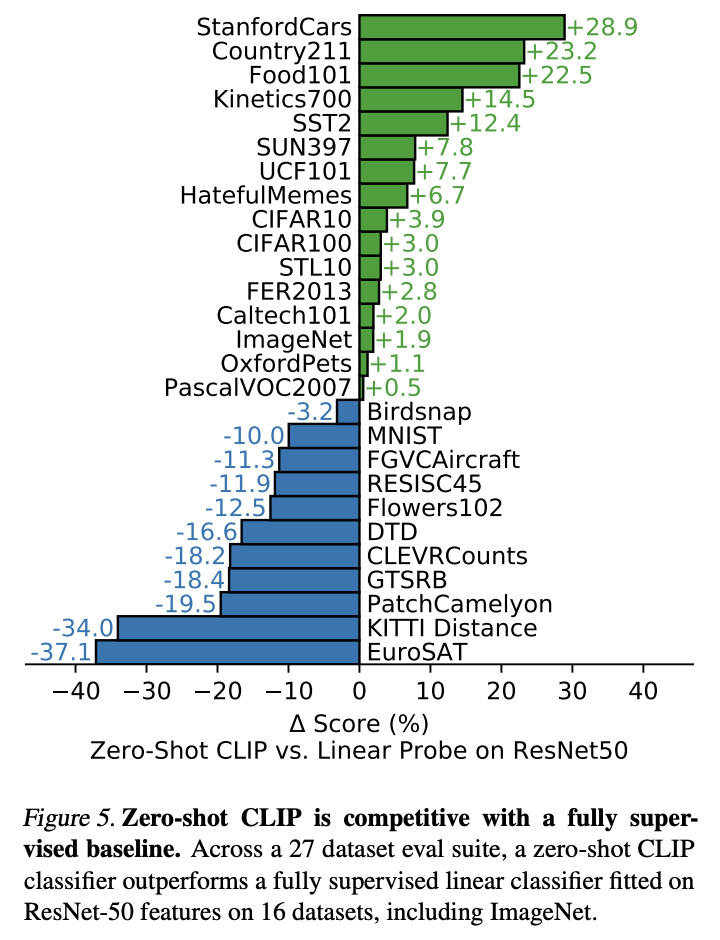

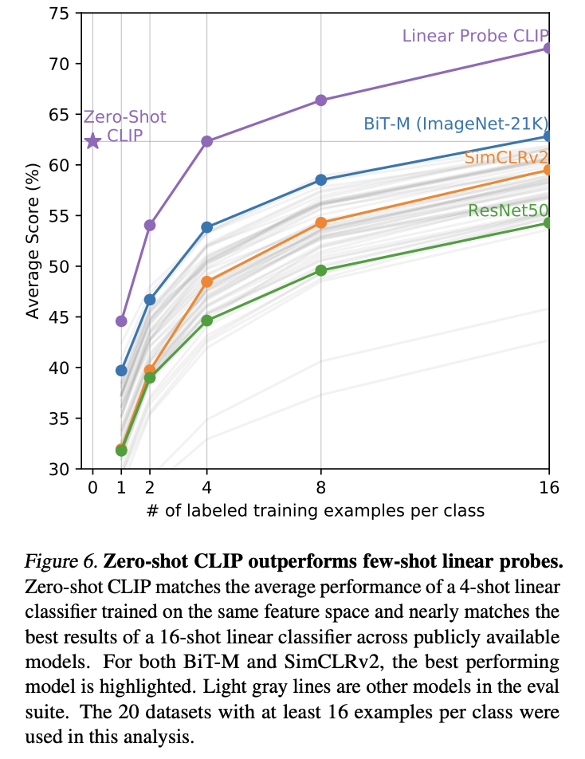

> Over the past few years, empirical studies of deep learning systems have documented that performance is predictable as a function of important quantities such as training compute and dataset size.

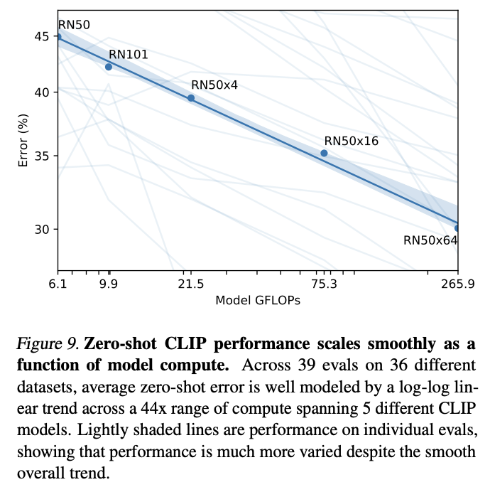

> While the overall trend is smooth, we found that performance on individual evaluations can be much noisier.

CLIPs performance on a variety of tasks actually has a noisy progression curve with more compute (although it is steadily improving).

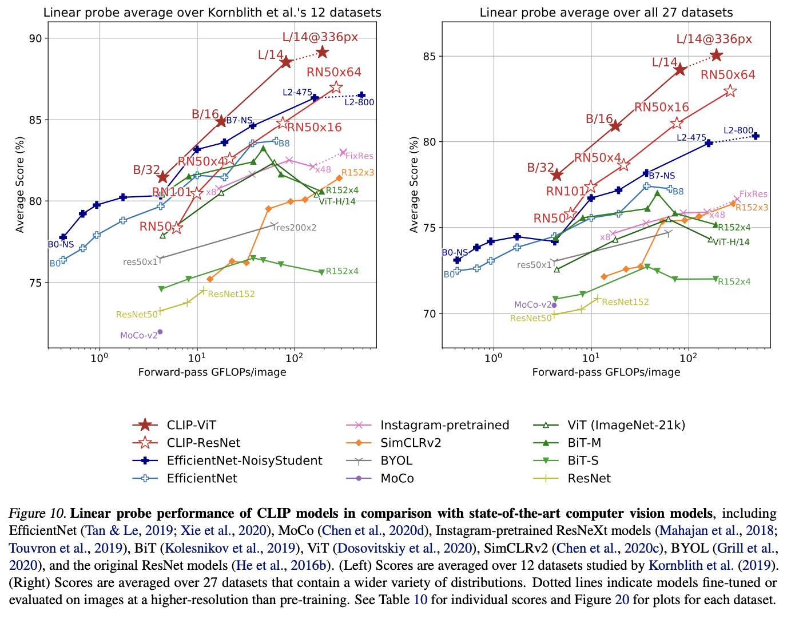

> On this broader evaluation suite, the benefits of CLIP are more clear. All CLIP models, regardless of scale, outperform all evaluated systems in terms of compute efficiency.

CLIP is far more data efficient that previously trained image classifiers

**3. Robustness to Natural Distribution Shift**

> Recent research has repeatedly found that [SoTA image classifier models] still make many simple mistakes, and new benchmarks testing these systems has often found their performance to be much lower than both their ImageNet accuracy and human accuracy.

> To what degree are these failures attributable to deep learning, ImageNet, or some combination of the two?

> CLIP models, which are trained via natural language supervision on a very large dataset and are capable of high zero-shot performance, are an opportunity to investigate this question from a different angle.

> Intuitively, a zero-shot model should not be able to exploit spurious correlations or patterns that hold only on a specific distribution, since it is not trained on that distribution. Thus it is reasonable to expect zero-shot models to have much higher effective robustness.

One theory to explain the inaccuracies of some image classifiers was that they identified spurious consistencies in the ImageNet dataset or their respective datasets that work to make predictions there, but not in real datasets. CLIP could not have such problems given how it’s trained.

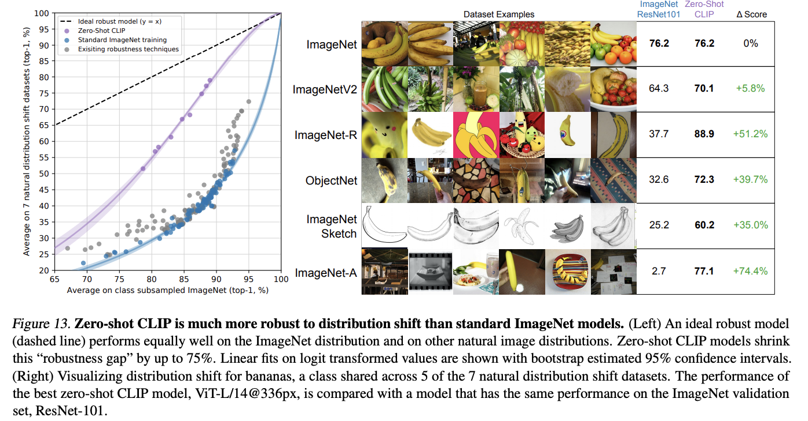

### Limitations

> While zero-shot CLIP generalizes well to many natural image distributions […], we’ve observed that zero-shot CLIP still generalizes poorly to data that is truly out-of-distribution for it.

> However, CLIP only achieves 88% accuracy on the handwritten digits of MNIST. An embarrassingly simple baseline of logistic regression on raw pixels outperforms zero-shot CLIP.

Just because MNIST data was out of distribution, CLIP just completely does not understand it.

> Although CLIP can flexibly generate zero-shot classifiers for a wide variety of tasks and datasets, CLIP is still limited to choosing from only those concepts in a given zero-shot classifier. This is a significant restriction compared to a truly flexible approach like image captioning which could generate novel outputs.

CLIP can’t generate it’s own captions, and can only do classification with it’s embedding space (which text & image are the closest?)

### Broader Impacts

> CLIP makes it possible to easily create your own classes for categorization (to ‘roll your own classifier’) without a need for re-training.

### Conclusion

> We have investigated whether it is possible to transfer the success of task-agnostic web-scale pre-training in NLP to another domain.

> We find that adopting this formula results in similar behaviors emerging in the field of computer vision and discuss the social implications of this line of research.

> In order to optimize their training objective, CLIP models learn to perform a wide variety of tasks during pre-training.

The trend continues - large-scale pre-trained models with transfer learning can perform a variety of tasks.

# DALL E 2

📜 [Hierarchical Text-Conditional Image Generation with CLIP Latents](https://arxiv.org/pdf/2204.06125)

> We propose a two-stage model: a prior that generates a CLIP image embedding given a text caption, and a decoder that generates an image conditioned on the image embedding.

> Our decoders conditioned on image representations can also produce variations of an image that preserve both its semantics and style, while varying the non-essential details absent from the image representation.

> Moreover, the joint embedding space of CLIP enables language-guided image manipulations in a zero-shot fashion.

The creation of CLIP has enabled far more robust text-to-image models by adding an image decoder that can convert from CLIP embeddings to an image.

> We use diffusion models for the decoder and experiment with both autoregressive and diffusion models for the prior, finding that the latter are computationally more efficient and produce higher-quality samples.

Using diffusion models for both parts of the model appears to be the best approach.

> In this work, we combine these two approaches [CLIP and diffusion models] for the problem of text-conditional image generation. We first train a diffusion _decoder_ to invert the CLIP image _encoder_.

> One notable advantage of using the CLIP latent space (over GANs) is the ability to semantically modify images by moving in the direction of any encoded text vector, whereas discovering these directions in GAN latent space involves luck and diligent manual examination.

Because of the syntactically and semantically consistent embeddings of the CLIP latent space, manipulating images is possible using text, whereas this is intractable with GANs.

> To obtain a full generative model of images, we combine the CLIP image embedding decoder with a prior model, which generates possible CLIP image embeddings from a given text caption.

The prior model is meant to enhance the CLIP image embeddings from the original text caption to make them more conducive to generating good images (which may mean enriching them with more description, etc.)

### Method

We can model the combined action of the _prior_ and _decoder_ as follows

```math
P(x|y) = P(x, z_i|y) = P(x|z_i, y)P(z_i|y)
```

Here, we model the distribution of the probability of an image $x$ given the caption $y$ by splitting it into the prior, which models the probability of a given image embedding $z_i$ given the caption $y$, and then the probability of an image $x$ given the image embedding $z_i$, and optionally, the caption $y$ as well.

**1. Decoder**

> We use diffusion models to produce images conditioned on CLIP image embeddings.

> Specifically, we modify the architecture […] by projecting and adding CLIP embeddings to the existing time-step embedding, and by projecting CLIP embeddings into four extra tokens of context that are concatenated to the sequence of outputs from the GLIDE text encoder.

**2. Prior**

> For the diffusion prior, we train a decoder-only Transformer with a causal attention mask on a sequence consisting of, in order: the encoded text, the CLIP text embedding, an embedding for the diffusion time-step, the noised CLIP image embedding, and a final embedding whose output from the Transformer is used to predict the un-noised CLIP image embedding.

### Image Manipulations

> Our approach allows us to encode any given image $x$ into a bipartite latent representation $(z_i, x_T)$ that is sufficient for the decoder to produce an accurate reconstruction.

**1. Variations**

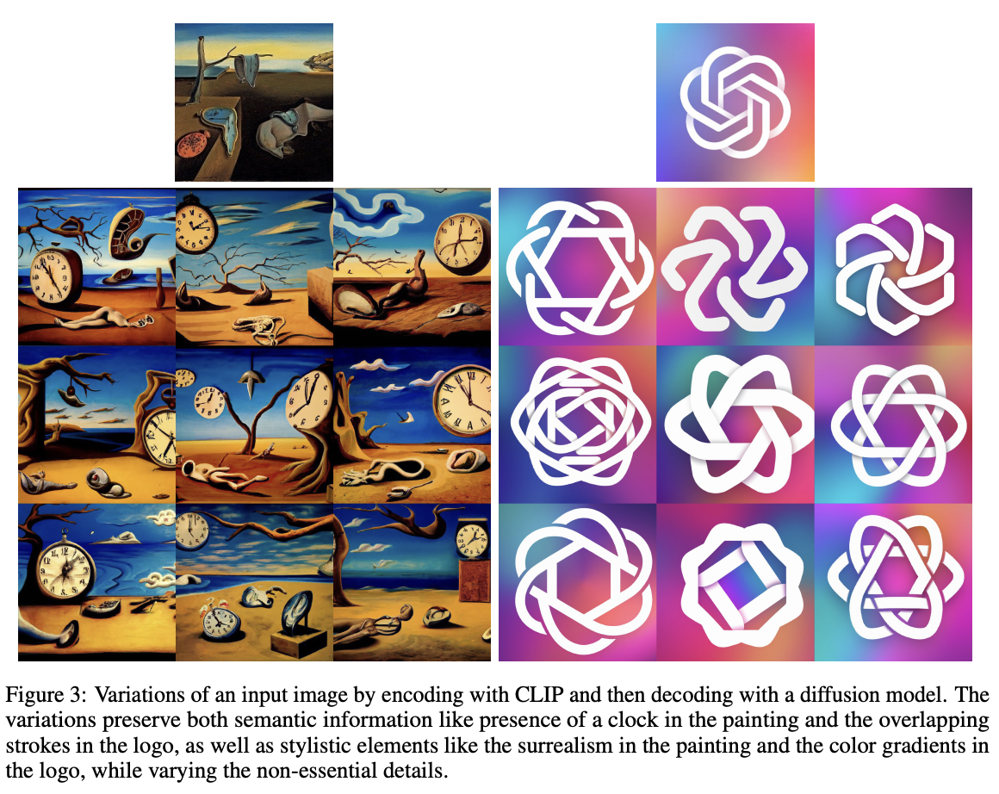

> Given an image $x$, we can produce related images that share the same essential content but vary in other aspects, such as shape and orientation.

**2. Interpolations**

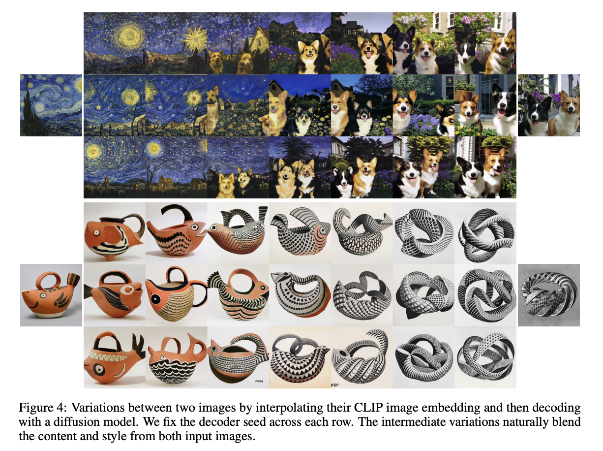

> It is also possible to blend two images $x_1$ and $x_2$ for variations, traversing all of the concepts in CLIP’s embedding space that occur between them.

**3. Text Diffs**

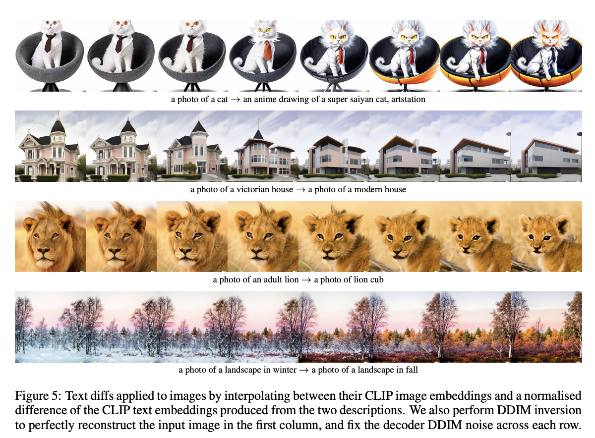

> A key advantage of using CLIP compared to other models for image representations is that it embeds images and text to the same latent space, thus allowing us to apply language-guided image manipulations (text-diffs).

# InstructGPT

📜 [Training language models to follow instructions with human feedback](https://arxiv.org/pdf/2203.02155)

> Making language models bigger does not inherently make them better at following a user’s intent.

> In this paper, we show an avenue for aligning language models with user intent on a wide range of tasks by fine-tuning with human feedback.

> In human evaluations on our prompt distribution, outputs from the 1.3B parameter InstructGPT model are preferred to outputs from the 175B GPT-3, despite having 100x fewer parameters. Moreover, InstructGPT models show improvements in truthfulness and reductions in toxic output generation.

> Our results show that fine-tuning with human feedback is a promising direction for aligning language models with human intent.

> We want language models to be _helpful_, _honest_, and _harmless_.

> We focus on fine-tuning approaches to aligning language models. Specifically, we use reinforcement learning from human feedback (RLHF) to fine-tune GPT-3 to follow a broad class of written instructions. This technique uses human preferences as a reward signal to fine-tune our models.

Using RLHF to align the model with human preferences via fine-tuning.

> We first hire a team of 40 contractors to label our data, based on their performance on a screening test.

This is still an extremely manual and human involved process.

The procedure is:
(1) collect a dataset of human-written desired output behaviors and some labeler written prompts and use this to train GPT-3.
(2) next, collect a dataset of human-labeled comparisons between outputs, then train a reward model (RM) to predict which outputs labelers prefer.
(3) then use the RM as a reward function to maximize reward for the model using PPO.

> This procedure aligns the behavior of GPT-3 to the stated preferences of a specific group of people (mostly our labelers and researchers), rather than any broader notion of “human values”. We call the resulting models InstructGPT.

### Methods and experimental details

> Step 1: Collect demonstration data, and train a supervised policy
> Step 2: Collect comparison data, and train a reward model
> Step 3: Optimize a policy against the reward model using PPO

### Results

**1. Results on the API distribution**

> Labelers significantly prefer InstructGPT outputs over outputs from GPT-3

> Our models generalize to the preferences of “held-out” labelers that did not produce any training data.

> Public NLP datasets are not reflective of how our language models are used.

**2. Results on public NLP datasets**

> InstructGPT models show improvements in truthfulness over GPT-3

> We can minimize performance regressions on public NLP datasets by modifying our fine-tuning procedure.

**3. Qualitative Results**

> InstructGPT models show promising generalization to instructions outside of the RLHF fine-tuning distribution.

> InstructGPT still makes simple mistakes.

### Discussion

**1. Implications for alignment research**

> The cost of increasing model alignment is modest relative to pre-training.

> We’ve seen some evidence that InstructGPT generalizes ‘following instructions’ to settings that we don’t supervise it in.

> We were able to mitigate most of the performance degradations introduced by our fine-tuning.

> We’ve validated alignment techniques from research in the real world.

# Mixture of Experts

📜 [Outrageously Large Neural Networks: The Sparsely-Gated Mixture-of-Experts Layer](https://arxiv.org/pdf/1701.06538)

> The capacity of a neural network to absorb information is limited by its number of parameters.

> Conditional computation, where parts of the network are active on a per-example basis, has been proposed in theory as a way of dramatically increasing model capacity without a proportional increase in computation.

> In this work, we […] finally realize the promise of conditional
> computation, achieving greater than 1000x improvements in model capacity with only minor losses in computational efficiency.

> We introduce a Sparsely-Gated Mixture-of-Experts layer (MoE), consisting of up to thousands of feed-forward sub-networks. A trainable gating network determines a sparse combination of these experts to use for each example.

> Various forms of conditional computation have been proposed as a way to increase model capacity without a proportional increase in computational costs.

> In these schemes, large parts of a network are active or inactive on a per-example basis.

> Our approach to conditional computation is to introduce a new type of general purpose neural network component: a Sparsely-Gated Mixture-of-Experts Layer (MoE). The MoE consists of a number of experts, each a simple feed-forward neural network, and a trainable gating network which selects a sparse combination of the experts to process each input.

### The Structure of the Mixture-of-Experts Layer

> The Mixture-of-Experts (MoE) layer consists of a set of $n$ “expert networks” $E_1, …, E_n$ and a “gating network” $G$ whos output is a sparse $n$-dimensional vector.


> Let us denote by $G(x)$ and $E_i(x)$ the output of the gating network and the output of the $i$-th expert network for a given input $x$. The output $y$ of the MoE module can be written as follows:

```math
y = \sum_{i=1}^n G(x)_i E_i(x)
```

> We save computation based on the sparsity of the output of $G(x)$. Wherever $G(x)_i$ = 0, we need not compute $E_i(x)$. In our experiments, we have up to thousands of experts, but only need to evaluate a handful of them for every example.

Because of the gating mechanism, only a fraction of experts are actually used in each training run, meaning that while the total network may have $N \times P$ total parameters, only $n \times P$ need to be optimized on every training run where $n$ is the number of active experts at once, meaning setting $n \ll N$ saves significant compute, while maintaining model size.

Hierarchical MoE also exists, further improving compute.

**1. Gating Network**

A simple approach for gating would be to use a trainable weight matrix $W_g$ for gating with the softmax function

```math
G_\sigma(x) = Softmax(x \cdot W_g)
```

> We add two components to the Softmax gating network: sparsity and noise. Before taking the softmax function, we add tunable Gaussian noise, then keep only the top k values, setting the rest to $-\infty$.

```math
G(x) = Softmax(KeepTopK(H(x), k)) \\

H(x)_i = (x \cdot W_g)_i + Gaussian() \cdot Softplus((x \cdot W_{noise})_i)
```

### Addressing Performance Challenges

**1. The Shrinking Batch Problem**

> If the gating network chooses $k$ out of $n$ experts for each example, then for a batch of $b$ examples, each expert receives a much smaller batch of approximately $\frac{kb}{n} \ll b$ examples. This causes a naive MoE implementation to become very inefficient as the number of experts increases.

> The solution to this shrinking batch problem is to make the original batch size as large as possible. However, batch size tends to be limited by the memory necessary to store activations between the forwards and backwards passes.

This mixture-of-experts implementation uses a form of data-parallelism where each expert lives on every device, meaning that it gets trained on the batches of data sent to each device, synchronously.

This adds a $d$ term, making the total amount of batch data training each expert $\frac{kbd}{n}$.

**2. Network Bandwidth**

> Another major performance concern in distributed computing is network bandwidth.

> To maintain computational efficiency, the ratio of an expert’s computation to the size of its input and output must exceed the ratio of computational to network capacity of the computing device.

### Balancing Expert Utilization

> We have observed that the gating network tends to converge to a state where it always produces large weights for the same few experts.

If left unattended, expert networks will naturally prioritize certain experts, and will keep training and improving the same ones.

To ensure equal importance of all experts across the batch, we introduce an additional importance term to the loss function.

```math
Importance(X) = \sum_{x \in X} G(x) \\

L_{importance}(X) = w_{importance} \cdot CV(Importance(X))^2
```

This function calculates the total importance of each expert across a batch by summing the gates for that expert for each training example, taking the square of the coefficient of variation, and multiplying it by a scaling factor $w_{importance}$.

### Experiments

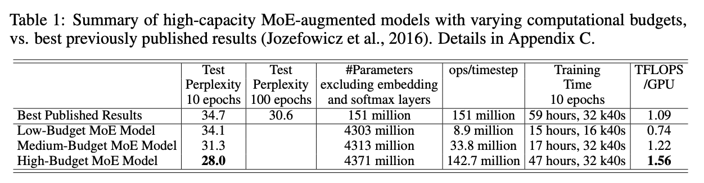

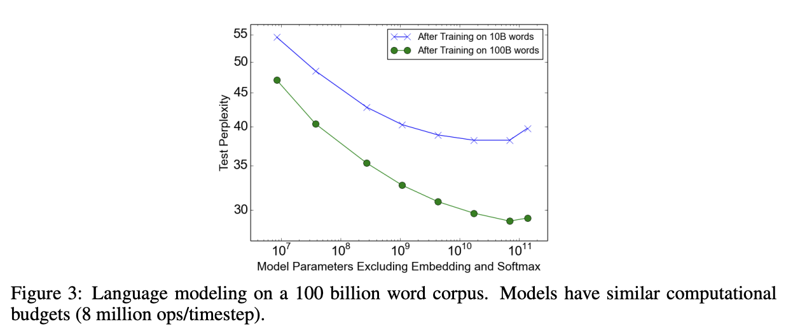

### Conclusion

> This work is the first to demonstrate major wins from conditional computation in deep networks.

# GAN

📜 [Generative Adversarial Nets](https://arxiv.org/pdf/1406.2661v1)

> We propose a new framework for estimating generative models via an adversarial process, in which we simultaneously train two models: a generative model $G$ that captures the data distribution, and a discriminative model $D$ that estimates the probability that a sample came from the training data rather than $G$.

> This framework corresponds to a minimax two-player game.

> Deep generative models have had less of an impact, due to the difficulty of approximating many intractable probabilistic computations that arise in maximum likelihood estimation and related strategies, and due to difficulty of leveraging the benefits of piecewise linear units in the generative context.

### Adversarial Nets

> We train $D$ to maximize the probability of assigning the correct label to both training examples and samples from $G$. We simultaneously train $G$ to minimize $\log(1 − D(G(z)))$

> In other words, $D$ and $G$ play the following two-player minimax game with value function $V(G,D)$

```math
\underset{G}{\textrm{min}} \, \underset{D}{\textrm{max}} \,
V(D,G) = \mathbb{E}_{x \sim p_{\textrm{data}}(x)} [\log D(x)] + \mathbb{E}_{z \sim p_x(z)} [\log(1 - D(G(z))]
```

> Rather than training G to minimize $\log(1 − D(G(z)))$ we can train $G$ to maximize $\log D(G(z))$. This objective function results in the
> same fixed point of the dynamics of $G$ and $D$ but provides much stronger gradients early in learning.

Allowing the generator to maximize the probability of fooling the discriminator, rather than minimize the probability of getting discovered by the discriminator, provides a better optimization since it’s very easy for the discriminator to vote against the generator early on.

### Experiments

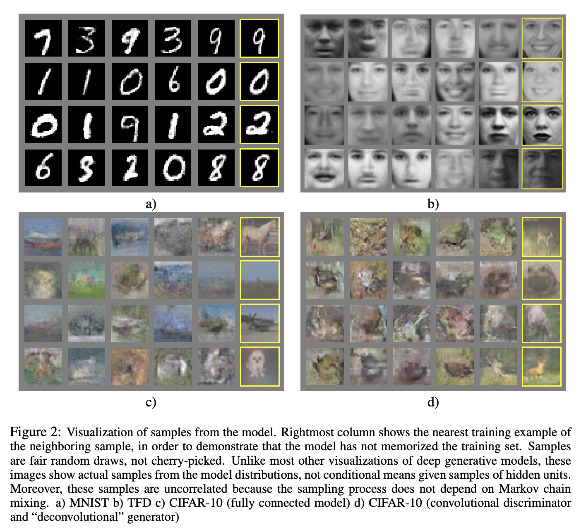

### Advantages and Disadvantages

> The disadvantages are primarily that there is no explicit representation of $p_g(x)$, and that $D$ must be synchronized well with $G$ during training (in particular, G must not be trained too much without updating D).

> The advantages are that Markov chains are never needed, only back-prop is used to obtain gradients, no inference is needed during learning, and a wide variety of functions can be incorporated into the model.

Generative adversarial models are far more computationally efficient than the previous Markov chain based models.

# VAE

📜 [Auto-Encoding Variational Bayes](https://arxiv.org/pdf/1312.6114)

> How can we perform efficient inference and learning in directed probabilistic models, in the presence of continuous latent variables with intractable posterior distributions, and large datasets?

How do we make probabilistic models (where parts of the feed-forward process come from sampling from a distribution, rather than all being deterministic) on large datasets where the apparent data generating distribution is continuous an intractable?

An example of this is large image datasets, where the actual distribution producing each image is extremely complex, as lots of noise is permitted and image content will still remain the same (this is an indicator of the complexity of the distribution - you have to account for so many possibilities, which are all continuous in terms of pixel values and positions).

> We introduce a stochastic variational inference and learning algorithm that scales to large datasets and, under some mild differentiability conditions, even works in the intractable case.

**variational inference algorithm** - an algorithm that models the true (intractable) distribution of the data with a much simpler variational distribution, like the Gaussian distribution, which allows simpler inference

Importantly, modeling the true distribution with a simpler and differentiable distributions means we can actually compute gradients

> We show that a re-parameterization of the variational lower bound
> yields a lower bound estimator that can be straightforwardly optimized using standard stochastic gradient methods.

One of the most important contributions of the paper - they provide a way to alter the random sampling component (from a Gaussian) usually present in the variational lower bound optimization (explained later) that makes the random sampling actually differentiable.

This is critical - this innovation makes it actually possible to use stochastic gradient descent and deep neural networks with back-propagation to optimize probabilistic models.

> Second, we show that for i.i.d. datasets with continuous latent variables per datapoint, posterior inference can be made especially efficient by fitting an approximate inference model (also called a recognition model) to the intractable posterior using the proposed lower bound estimator.

Another key innovation - they show that you can model the extremely complex and unknown posterior distribution with a separate internal distribution in the model, which can be tuned, and then used to run inference.

This recognition model can be optimized using the lower bound estimator.

> The variational Bayesian (VB) approach involves the optimization of an approximation to the intractable posterior.

The inspiration behind the VAE approach from statistics. The variational Bayesian approach, which models a more complex distribution with a simpler one (like the Gaussian).

> Unfortunately, the common mean-field approach requires analytical solutions of expectations w.r.t. the approximate posterior, which are also intractable in the general case.

The usual approach to VB is the “mean-field” approach which involves calculating an expectation of conditional probabilities based on random variables sampled from a distribution - and as a result often involves integrating over CDFs which takes “analytical solutions” that are often intractable.

> We show how a re-parameterization of the variational lower bound yields a simple differentiable unbiased estimator of the lower bound; this SGVB (Stochastic Gradient Variational Bayes) estimator can be used for efficient approximate posterior inference in almost any model with continuous latent variables and/or parameters, and is straightforward to optimize using standard stochastic gradient ascent techniques.

They introduce a new method that updates on this VB method to make it usable in stochastic gradient descent by addressing the problems brought up above.

> We propose the AutoEncoding VB (AEVB) algorithm. In the AEVB algorithm we make inference and learning especially efficient by using the SGVB estimator to optimize a recognition model that allows us to perform very efficient approximate posterior inference using simple ancestral sampling

They create a joint model where one part learns to form a recognition model that approximates the more complex data generating distribution, and then an inference model that samples from this distribution to reproduce the original values.

> Which in turn allows us to efficiently learn the model parameters, without the need of expensive iterative inference schemes (such as MCMC) per datapoint.

This architecture with both a recognition model and an inference model forces the recognition model to encode useful representations that can be reinterpreted back to the original data.

This method is far more efficient than previous methods that require long chains of compute like Markov Chain Monte Carlo to accomplish the same thing.

> When a neural network is used for the recognition model, we arrive at the variational auto-encoder.

### Method

> We will restrict ourselves […] to […] where we like to perform maximum likelihood (ML) or maximum a posteriori (MAP) inference on the (global) parameters, and variational inference on the latent variables.

**1. Problem Scenario**

We deal with situations where we have some dataset $X = \{ x^{(i)} \}_{i=1}^N$ that consists of a process of values where (1) some values $z^{(i)}$ are generated from some distribution $p_{\theta^*}(z)$ and (2) the values $x^{(i)}$ are drawn from $p_{\theta^*}(x|z)$, and that their PDFs are tractable, but that calculating the integral of the marginal likelihood $\int p_\theta(z) p\theta(x|z) dz$ (necessary to calculate the evidence lower bound) is intractable.

> We are interested in, and propose a solution to, three related problems in the above scenario:

1. Efficient approximate ML or MAP estimation for the parameters $\theta$. The parameters […] allow us to mimic the hidden random process and generate artifical data that resembles the real data.

2. Efficient approximate posterior inference of the latent variable $z$ given an observed value $x$ for a choice of parameters $\theta$. This is useful for coding or data representation tasks.

3. Efficient approximate marginal inference of the variable $x$. This allows us to perform all kinds of inference tasks where a prior over $x$ is required. Common applications in computer vision include image denoising, in-painting and super-resolution.
   >

Each of these 3 objectives provides real value that will become important. The representation space created by the encoder becomes very valuable (and can even be used for embeddings).

Additionally, the inference part can be used for many image generation and manipulation applications.

We introduce a “recognition model” $q_\phi(z|x)$ meant to model the true posterior distribution, which will be called the _encoder_. Then, the distribution $p_\theta(x|z)$ will be called the _decoder_.

**1. The Variational Bound**

> The marginal likelihood is composed of a sum over the marginal likelihoods of individual datapoints $\log p_\theta(x^{(1)}, …, x^{(N)}) = \sum_{i=1}^N \log p_\theta(x^{(i)})$, which can be rewritten as:

```math
\log p_\theta(x^{(i)}) = D_{KL}(q_\phi(z|x^{(i)}), p_\theta(z|x^{(i)})) + \mathcal{L}(\theta, \phi; x^{(i)})
```

The KL divergence models the difference between our approximate distribution and the true distribution of the latent variables $z$ given the actual sampled value $x^{(i)}$.

The second term $\mathcal{L}$, known as the _variation lower bound_, marks the lower bound of the probability of any observed data-point appearing in our distribution:

```math
\log p_\theta(x^{(i)}) \geq \mathcal{L}(\theta, \phi; x^{(i)}) = \mathbb{E}_{q_\phi(z|x)}[-\log q_\phi(z|x) + \log p_\theta(x,z)]
```

This term re presents the evidence lower bound. We take the expectation of values sampled over our approximate distribution $q_\phi$ for all values $z$ sampled given $x$, weighted by their relative probabilities.

For each, we want to maximize the first term (the entropy) $- \log q_\phi(z|x)$, which means minimizing the probability of $z$ being sampled given $x$ generally. This spreads out the distribution more, preventing $z$ from concentrating around too few values.

The second term $\log p_\theta(x,z)$ ensures that our model learns useful representations for $z$ that allow the decoder to actually reconstruct $x$.

These two terms work together to make the ELBO effective. The first term can be thought of as saying “explore a broad range of possibilities for $z$ for each $x$, instead of narrowing down” forcing the distribution to be very spread out (different $z$ values should not be highly used across the model).

Meanwhile, the second term is saying “focus on the values of $z$ that effectively help the decoder to recreate $x$.”

We can then rewrite the above equation for the ELBO using the KL divergence as follows:

```math
\mathcal{L}(\theta, \phi; x^{(i)}) = \mathbb{E}_{q_\phi(z|x)}[\log p_\theta(z) + \log p_\theta(x|z) - \log q_\phi(z|x)] \\

D_{KL}(q_\phi(z|x), p_\theta(z)) = \mathbb{E}_{q_\phi(z|x)}[\log q_\theta(z|x) - \log p_\theta(z)] \\

\mathcal{L}(\theta, \phi; x^{(i)}) = \mathbb{E}_{q_\phi(z|x)}[\log p_\theta(x|z)] - D_{KL}(q_\phi(z|x), p_\theta(z))
```

Thus, the first term of this maximizes the probability that our decoder can produce $x$ from the $z$ values sampled from the encoder, and the second term minimizes the difference between the approximate distributions condition $z|x$ and the overall sampling of $z$.

**3. The SGVB Estimator and AEVB Algorithm**

> In this section we introduce a practical estimator of the lower bound and its derivates w.r.t the parameters.

Here, we address the ability to model our evidence lower bound for maximization with an efficient estimator.

> Under certain mild conditions […] for a chosen approximate posterior $q_\phi (z|x)$ we can reparameterize random variable $\hat{z} \sim q_\phi(z|x)$ using a differentiable transformation $g_\phi(\epsilon, x)$ of an (auxiliary) noise variable $\epsilon$

```math
\hat{z} = g_\phi(\epsilon, x) \textrm{ with } \epsilon \sim p(\epsilon) \\

E_{q_\phi(z|x^{(i)})}[f(z)] = E_{p(\epsilon)}[f(g_\phi(\epsilon, x^{(i)}))] \simeq \frac{1}{L} \sum_{l=1}^L f(g_\phi(\epsilon^{(l)}, x^{(i)})) \\
```

Here, we create a re-parameterized estimator introducing some random noise through the variable $\epsilon$ which introduces noise. Then, you can take the expectation by taking the average over a number of samples influenced by this random noise, rather than calculating the integral through analytical means.

We can apply this sampling method to our calculation of $\mathcal{L}$ to create an estimator function $\mathcal{L}^A(\theta, \phi; x)$ that can be used to optimize the ELBO.

> The KL-divergence term can then be interpreted as regularizing $\phi```, encouraging the approximate posterior to be close to the prior $p_\theta(z)$.

> A connection with auto-encoders becomes clear when looking at the objective function. The first term is (the KL divergence of the approximate posterior from the prior) acts as a regularizer, while the second term is a an expected negative reconstruction error.

**4. The re-parameterization trick**

> The essential parameterization trick is quite simple. Let $z$ be a continuos random variable, and $z \sim q_\phi(z|x)$ be some conditional distribution. It is then often possible to express the random variable $z$ as a deterministic variable $z = g_\phi(\epsilon, x)$ where $\epsilon$ is an auxiliary variable with independent marginal $p(\epsilon)$ and $g_\phi(.)$ is some vector-valued function parameterized by $\phi$.

This reframing (re-parameterization) allows us to make the sampling of the random variable $z$ differentiable (via the parameters $\phi$) by isolating the noise to a separate variable $\epsilon$.

> Take, for example, the univariate Gaussian case: let $z \sim p(x|x) = \mathcal{N}(\mu, \sigma^2)$. In this case, a valid re-parameterization is $z = \mu + \sigma\epsilon$, where $\epsilon$ is an auxiliary noise variable $\epsilon \sim \mathcal{N}(0,1)$.

### Experiments

> We trained generative models of images from the MNIST and Frey Face datasets and compared learning algorithms in terms of the variational lower bound, and the estimated marginal likelihood.

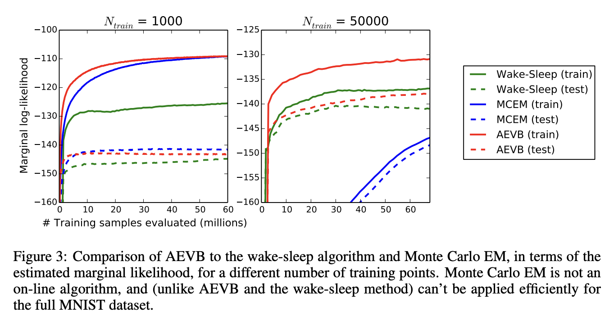

### Conclusion

> We have introduce a novel estimator of the variational lower bound, Stochastic Gradient VB (SGVB), for efficient approximate inference with continuous latent variables.

> The theoretical advantages are reflected in experimental results.

# VQ VAE

📜 [Neural Discrete Representation Learning](https://arxiv.org/pdf/1711.00937)

> In this paper, we propose a simple yet powerful generative model that learns […] discrete representations [without supervision].

> Our model, the Vector Quantized Variational Auto Encoder (VQ-VAE), differs from VAEs in two key ways: the encoder network outputs discrete, rather than continuous, codes; and the prior is learnt rather than static.

> Pairing these representations with an autoregressive prior, the model can generate high quality images, videos, and speech as well as doing high quality speaker conversion and unsupervised learning of phonemes, providing further evidence of the utility of the learnt representations.

> Our goal is to achieve a model that conserves the important features of the data in its latent space while optimizing for maximum likelihood.

> In this paper, we argue for learning discrete and useful latent variables, which we demonstrate on a variety of domains.

> Learning representations with continuous features have been the focus of many previous work, however we concentrate on discrete representations which are potentially a more natural fit for many of the modalities we are interested in.

They observe that many data distributions including text, and even images given that they can be described by text, can be represented in discrete ways.

> Our model, which relies on vector quantization (VQ), is simple to train, does not suffer from large variance, and avoids the “posterior collapse” issue which has been problematic with many VAE models that have a powerful decoder, often caused by latents being ignored.

### VQ-VAE

> VAEs consist of the following parts: an encoder network which parameterizes a posterior distribution $q(z|x)$ of discrete latent random variables $z$ given the input data $x$, a prior distribution $p(z)$, and a decoder with a distribution $p(x|z)$ over input data.

**1. Discrete Latent Variables**

> We define a latent embedding space $e \in R^{K \times D}$ where $K$ is the size of the discrete latent space, and $D$ is the dimensionality of each latent embedding vector $e_i$

This model uses an encoder producing an output $z_e(x)$ for each input $x$.

Then, this value $z_e(x)$ is passed through a posterior categoorical distribution that collapses the output value into 1-of-K embedding vectors

```math
q(z = k|x) = \begin{cases}
  1 & \textrm{for } k = \textrm{argmin}_j || z_e(x) - e_j ||_2 \\
  0 & \textrm{otherwise}
\end{cases}
```

> The representation $z_e(x)$ is passed through a discretisation bottleneck followed by mapping onto the nearest element of embedding $e$.

**2. Learning**

Since $q(z)$ has no gradient, we just copy over the gradient from decoder input $z_q(x)$ to encoder output $z_e(x)$.

> Due to the straight-through gradient estimation of mapping from $z_e(x)$ to $z_q(x)$, the embeddings $e_i$ receive no gradients from the reconstruction loss $\log p(z|z_q(x))$. Therefore, in order to learn the embedding space, we use one of the simplest dictionary learning algorithms, Vector Quantization (VQ).

> The VQ objective uses the $l_2$ error to move the embedding vectors $e_i$ towards the encoder outputs $z_e(x)$.

The actual embedding space is disconnected from the main gradient flow directly, and instead is just built to minimize the overall distance between the embedding vectors and the actual encoder outputs (maximizing the utility of each embedding to matching a variety of the outputs).

> To make sure the encoder commits to an embedding and its output does not grow, we add a commitment loss, the third term in the [loss equation]. Thus, the total training objective becomes:

```math
L = \log p(x|z_q(x)) + || \textrm{sg}[z_e(x)] - e ||_2^2 | - \beta || z_e(x) - sg[e] ||_2^2
```

> where _sg_ stands for the stop-gradient operator that is defined as identity at forward computation time and has zero partial derivatives, thus effectively constraining its operand to be a non-updated constant.

The first term (familiar from VAEs) tries to maximize the probability that $x$ is regenerated given the latents (embeddings) created by $z_q(x) = q(z_e(x))$ from the encoder and categorization.

The second term minimizes the $L_2$ distance between the embedding vectors and the encoder outputs.

The third term ensures that the encoder commits to its choice of embeddings and moves its encoded outputs closer to them so that the encoder outputs don’t slowly start to diverge from the embedding choices.

**3. Prior**

> The prior distribution over the discrete latents $p(z)$ is a categorical distribution, and can be mad autoregressive by depending on other $z$ in the feature map. Whilst training the VQ-VAE, the prior is kept constant and uniform.

> After training, we fit an autoregressive distribution over $z$, $p(z)$, so that we can generate $x$ via ancestral sampling.

### Experiments

**1. Comparison with Continuous Variables**

> Our model is the first among those using discrete latent variables which challenges the performance of continuous VAEs.

**2. Images**

> Images contain a lot of redundant information as most of the pixels are correlated and noisy, therefore learning models at the pixel level could be wasteful.

> In this experiment we show that we can model $x = 128 \times 128 \times 3$ images by compressing them to a $z = 32 \times 32 \times 1$ discrete space (with $K=512$) via a purely de-convolutional $p(x|z)$.

> We model images by learning a powerful prior (PixelCNN) over $z$.

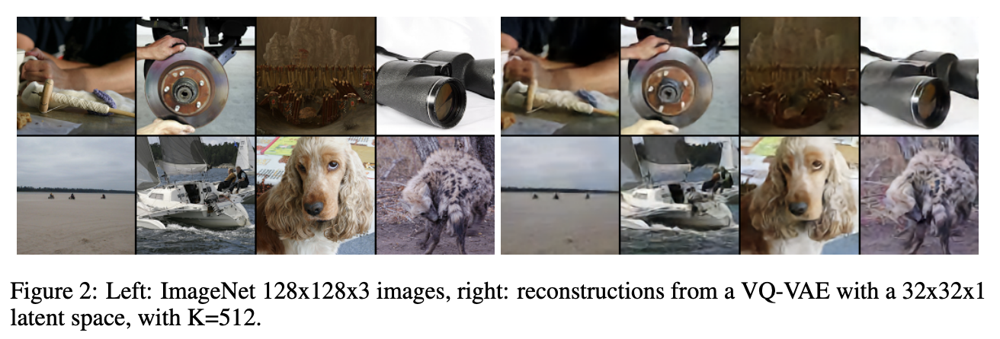

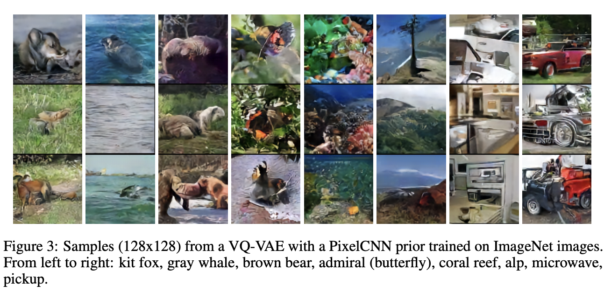

**3. Audio**

> In all our audio experiments, we train a VQ-VAE that has a dilated convolutional architecture similar to WaveNet decoder.

> This means that the VQ-VAE has, without any form of linguistic supervision, learned a high-level abstract space that is invariant to low-level features and only encodes the content of the speech.

**4. Video**

> It can be seen that the model has learnt to successfully generate a sequence of frames conditioned on given action without any degradation in the visual quality whilst keeping the local geometry correct.

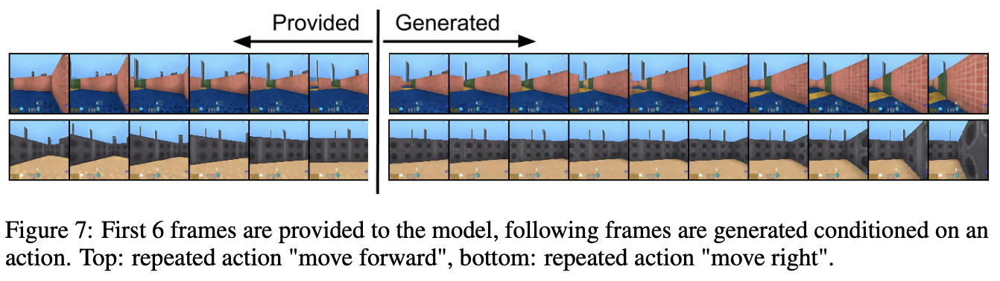

### Conclusion

> In this work we have introduced VQ-VAE, a new family of models that combine VAEs with vector quantization to obtain a discrete latent representation.

> We have shown that VQ-VAEs are capable of modeling very long term dependencies through their compressed discrete latent space which we have demonstrated by generating 128 × 128 color images, sampling action conditional video sequences and finally using audio where even an unconditional model can generate surprisingly meaningful chunks of speech and doing speaker conversion.

> All these experiments demonstrated that the discrete latent space learnt by VQ-VAEs capture important features of the data in a completely unsupervised manner.

# VQ VAE 2

> We scale and enhance the autoregressive priors used in VQ-VAE to generate synthetic samples of much higher coherence and fidelity than possible before.

> We demonstrate that a multi-scale hierarchical organization of VQ-VAE, augmented with powerful priors over the latent codes, is able to generate samples with quality that rivals that of state of the art Generative Adversarial Networks on multifaceted datasets such as ImageNet, while not suffering from GAN’s known shortcomings such as mode collapse and lack of diversity

> It is well known that samples from [GANs] do not fully capture the diversity of the true distribution.

> In contrast, likelihood based methods optimize negative log-likelihood (NLL) of the training data. This objective allows model-comparison and measuring generalization to unseen data.

> In this paper we use ideas from lossy compression to relieve the generative model from modeling negligible information.

### Background

**1. Vector Quantized Variational Auto Encoder**

> The VQ-VAE model can be better understood as a communication system. It comprises of an encoder that maps observations onto a sequence of discrete latent variables, and a decoder that reconstructs the observations from these discrete variables. Both encoder and decoder use a shared codebook.

The VQ-VAE has a _codebook_ that it uses to communicate between the encoder and the decoder.

The decoder maps the received indices of vectors in the codebook and uses it to reconstruct the original data via non-linearities. This is the “regeneration loss.”

In addition, the VQ-VAE has _codebook loss_ to make the codebook match more closely with the encoder outputs, and the _commitment loss_ to encourage the output of the decoder to stay closer to the codebook.

```math
\mathcal{L}(x, D(e)) = ||x - D(e)||_2^2 + ||sg[E(x)] - e||_2^2 + \beta || sg[e] - E(x) ||_2^2
```

**2. PixelCNN Family of Autoregressive Models**

> Deep autoregressive models are common probabilistic models that achieve state of the art results in density estimation across several data modalities.

### Method

> The proposed method follows a two-stage approach: first, we train a hierarchical VQ-VAE to encode images onto a discrete latent space, and then we fit a powerful PixelCNN prior over the discrete latent space induced by all the data.

This sets the intuition for transformer based image generation with VQ-VAEs as well - the place where PixelCNN is operating now can be replaced with a transformer with self-attention to learn the distribution.

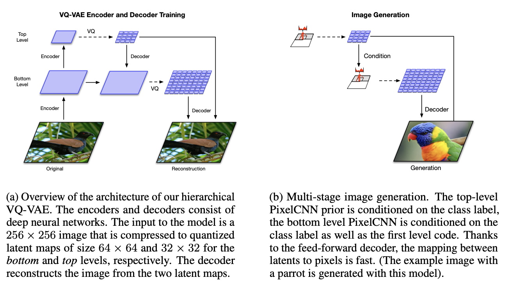

**1. Stage 1: Learning Hierarchical Latent Codes**

> As opposed to vanilla VQ-VAE, in this work we use a hierarchy of vector quantized codes to model large images. The main motivation behind this is to model local information, such as texture, separately from global information such as shape and geometry of objects.

> The prior model over each level can thus be tailored to capture the specific correlations that exist in that level.

> The structure of our multi-scale hierarchical encoder [has] a top latent code which models global information, and a bottom latent code, conditioned on the top latent, responsible for representing local details.

**2. Stage 2: Learning Priors over Latent Codes**

> In order to further compress the image, and to be able to sample from the model learned during, we learn a prior over the latent codes

This separate model takes the embedding space learned by the auto-encoder and learns a prior on it.

In this way, the auto-encoder has done the job of compressing the data in a way to get rid of less important information where it’s encoded outputs only represent important data to recreate the image.

Then, when we train a neural network to learn the prior on the encoders output distribution, it’s effectively modeling the actual data generating distribution much more efficiently than if it were observing the original data since all the noise has been removed and only important features remain.

This makes learning the prior distribution a powerful way to sample other points in the original state space that actually correspond with likely values.

> From an information theoretic point of view, the process of fitting a prior to the learned posterior can be considered as lossless compression of the latent space by re-encoding the latent variables with a distribution that is a better approximation of their true distribution, and thus results in bit rates closer to Shannon’s entropy.

The auto-encoder provides compression to a new distribution that can be modeled more effectively than the original due to the removal of noise.

> In the VQ-VAE framework, this auxiliary prior is modeled with a powerful, autoregressive neural network such as PixelCNN in a post-hoc, second stage.

**3. Trading off Diversity with Classifier Based Rejection Sampling**

> Unlike GANs, probabilistic models trained with the maximum likelihood objective are forced to model all of the training data distribution.

Because of this, having samples in the dataset that don’t match nicely with the proper underlying distribution adds a considerable challenge in actually converging to the correct data distribution.

To mitigate this, they create an automated way to classify the quality of the samples.

> In this work, we also propose an automated method for trading off diversity and quality of samples based on the intuition that the closer our samples are to the true data manifold, the more likely they
> are classified to the correct class labels by a pre-trained classifier.

Using this method, they can classify the quality of the samples by their proximity to the underlying distribution.

### Experiments

> In this section, we present quantitative and qualitative results of our model trained on ImageNet 256 × 256.


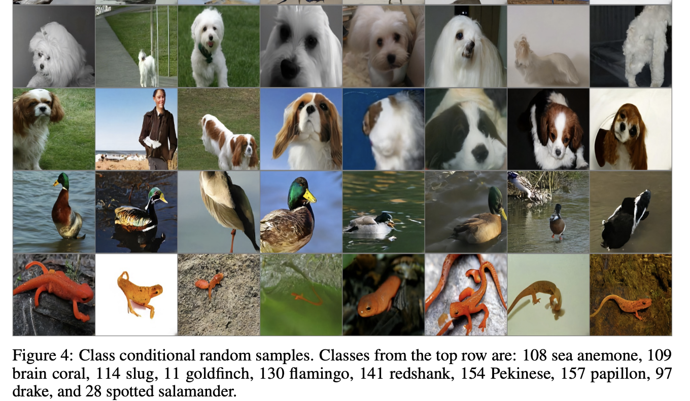

**1. Modeling High-Resolution Face Images**

> Although modeling faces is generally considered less difficult compared to ImageNet, at such a high resolution there are also unique modeling challenges that can probe generative models in interesting ways. For example, the symmetries that exist in faces require models capable of capturing long range dependencies.

### Conclusion

> We propose a simple method for generating diverse high resolution images using VQ-VAE with a powerful autoregressive model as prior.

> Our encoder and decoder architectures are kept simple and light-weight as in the original VQ-VAE, with the only difference that we use a hierarchical multi-scale latent maps for increased resolution.

> We believe our experiments vindicate autoregressive modeling in the latent space as a simple and effective objective for learning large scale generative models.

# Diffusion

📜 [Deep Unsupervised Learning Using Non-equilibrium Thermodynamics](https://arxiv.org/pdf/1503.03585)

> A central problem in machine learning involves modeling complex data-sets using highly flexible families of probability distributions in which learning, sampling, inference, and evaluation are still analytically or computationally tractable.

This captures the challenge that all the different probabilistic/generative models have to solve.

> The essential idea, inspired by non-equilibrium statistical physics, is to systematically and slowly destroy structure in a data distribution through an iterative forward diffusion process. We then learn a reverse diffusion process that restores structure in data, yielding a highly flexible and tractable generative model of the data.

> Historically, probabilistic models suffer from a tradeoff between two conflicting objectives: tractability and flexibility.

**1. Diffusion Probabilistic Models**

> We present a novel way to define probabilistic models that allows:

1. extreme flexibility in model structure
2. exact sampling
3. easy multiplication with other distributions, e.g. in order to compute a posterior, and
4. the model log likelihood, and the probability of individual states, to be cheaply evaluated
   >

> Our method uses a Markov chain to gradually convert one distribution into another, an idea used in non-equilibrium statistical physics.

The diffusion process slowly converts distributions from more noisy to more structured forms.

> Since a diffusion process exists for any smooth target distribution, this method can capture data distributions of arbitrary form.

### Algorithm

> Our goal is to define a forward (or inference) diffusion process which converts any complex data distribution into a simple, tractable, distribution, and then learn a finite-time reversal of this diffusion process which defines our generative model distribution.

**1. Forward Trajectory**

> The data distribution is gradually converted into a well behaved distribution $\pi (y)$ by repeated application of a Markov diffusion kernel $T_\pi(y|y’; \beta)$ for $\pi(y)$ where $\beta$ is the diffusion rate.

```math
\pi(y) = \int dy' T_\pi(y|y';\beta)\pi(y') \\

q(x^{(t)}|x^{(t-1)}) = T_\pi(x^{(t)}|x^{(t-1)}; \beta_t)
```

> The forward trajectory corresponding to starting at the data distribution and performing $T$ steps of diffusion is thus

```math
q(x^{(0...T)}) = q(x^{(0)}) \prod_{t=1}^T q(x^{(t)}|x^{(t-1)})
```

**2. Reverse Trajectory**

> The generative distribution will be trained to describe the same trajectory, but in reverse.

```math
p(x^{(T)}) = \pi(x^{(T)}) \\
p(x^{(0...T)} = p(x^{(T)}) \prod_{t=1}^T p(x^{(t-1)}|x^{(t)})
```

**3. Model Probability**

> The probability the generative model assigns to the data is

```math
p(x^{(0)}) = \int dx^{(1...T)} p(x^{(0...T)})
```

In order to actually be able to calculate this integral

> We can instead evaluate the relative probability of the forward and reverse trajectories, averaged over forward trajectories.

```math
p(x^{(0)}) = \int dx^{(1...T)}q(x^{(1...T)}|x^{(0)}) \cdot p(x^{(T)}) \prod_{t=1}^T \frac{p(x^{(t-1)}|x^{(t)})}{q(x^{(t)}|x^{(t-1)})}
```

**4. Training**

Training amounts to maximizing the model log likelihood

```math
L = \int dx^{(0)} q(x^{(0)}) \log p(x^{(0)})
```

Here, we maximize the likelihood that the model $p$ generates the state $x^{(0)}$ from some noisy state, conditioned by the weight of the actual sample in the dataset $q(x^{(0)})$.

> The derivation of this bound parallels the derivation of the log likelihood bound in variational Bayesian methods.

### Experiments

> We train diffusion probabilistic models on a variety of continuous datasets, and a binary dataset. We then demonstrate sampling from the trained model and in-painting of missing data, and compare model performance against.

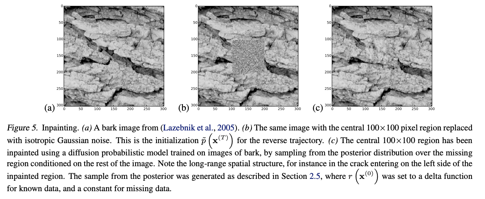

### Conclusion

> We have introduced a novel algorithm for modeling probability distributions that enables exact sampling and evaluation of probabilities and demonstrated its effectiveness on a variety of toy and real datasets, including challenging natural image datasets.

> The result is an algorithm that can learn a fit to any data distribution, but which remains tractable to train, exactly sample from, and evaluate, and under which it is straightforward to manipulate conditional and posterior distributions.

# Denoising Diffusion

📜 [Denoising Diffusion Probabilistic Models](https://arxiv.org/pdf/2006.11239)

> We present high quality image synthesis results using diffusion probabilistic models, a class of latent variable models inspired by considerations from non-equilibrium thermodynamics.

> Our best results are obtained by training on a weighted variational
> bound designed according to a novel connection between diffusion probabilistic models and denoising score matching with Langevin dynamics.

> And our models naturally admit a progressive lossy decompression scheme that can be interpreted as a generalization of autoregressive decoding.

> We show that diffusion models actually are capable of generating high quality samples, sometimes better than the published results on other types of generative models.

> We find that the majority of our models’ lossless code-lengths are consumed to describe imperceptible image details.

> We show that the sampling procedure of diffusion models is a type of progressive decoding that resembles autoregressive decoding along a bit ordering that vastly generalizes what is normally possible with autoregressive models.

### Background

…

### Diffusion Models and Denoising Autoencoders

> To guide our choices, we establish a new explicit connection between diffusion models and denoising score matching that leads to a simplified, weighted variational bound objective for diffusion models.

**1. Forward Process and $L_T$**

> In our implementation, the approximate posterior $q$ has no learnable parameters, so $L_T$ is a constant during training and can be ignored.

…

### Conclusion

> We have presented high quality image samples using diffusion models, and we have found connections among diffusion models and variational inference for training Markov chains, denoising score matching and annealed Langevin dynamics (and energy-based models by extension), autoregressive models, and progressive lossy compression.
